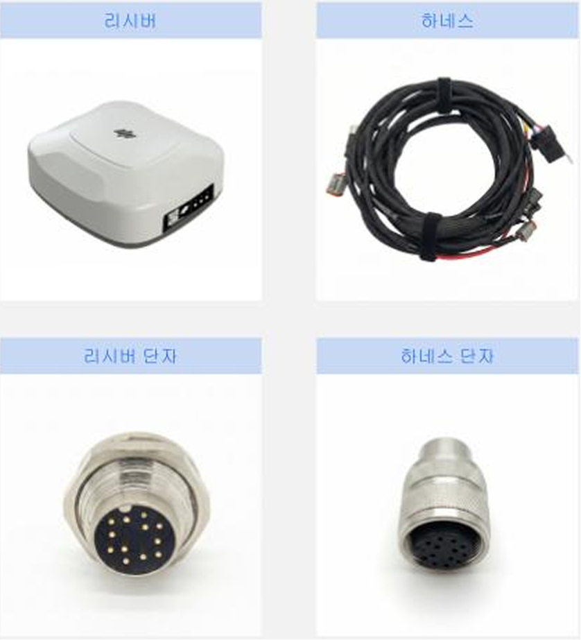
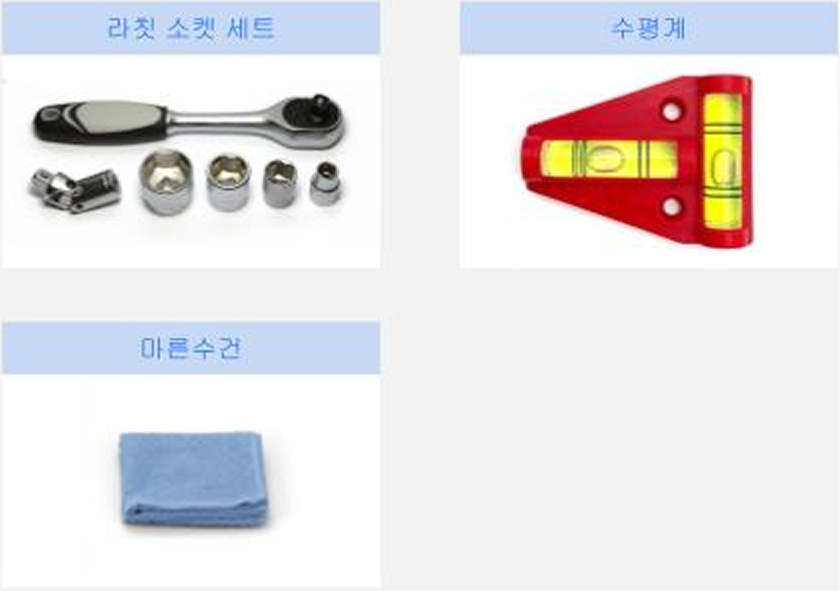
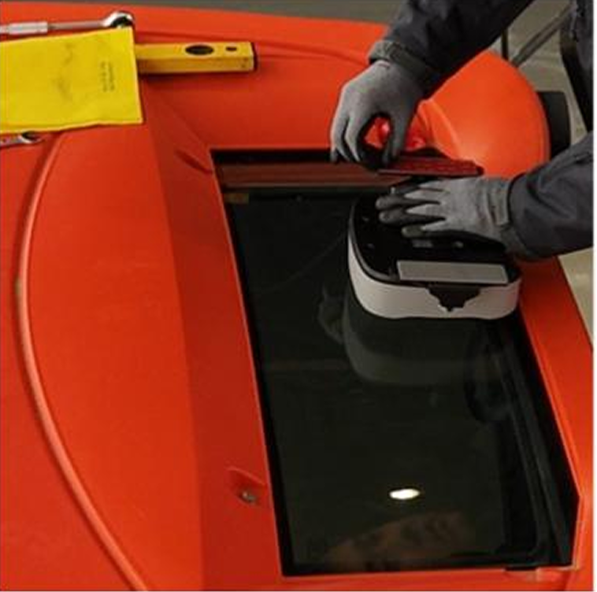

---
layout:
  width: default
  title:
    visible: true
  description:
    visible: false
  tableOfContents:
    visible: true
  outline:
    visible: true
  pagination:
    visible: true
  metadata:
    visible: true
  tags:
    visible: true
metaLinks:
  alternates:
    - /broken/spaces/jOhU5MWpMqraceI5pg9u/pages/lWdZgI2P4YIODQ7uazsl
---

# GNSS 수신기

플루바 아이온 자율주행에 필요한 GNSS 수신기를 설치합니다.

***

### 필요 공구 및 준비물

#### 🔩 준비물

<figure><figcaption></figcaption></figure>

<table><thead><tr><th width="161.1815185546875">이름</th><th>규격</th><th>수량</th></tr></thead><tbody><tr><td>GNSS 수신기</td><td>-</td><td>1</td></tr><tr><td>하네스</td><td>-</td><td>1</td></tr></tbody></table>

#### 🛠️ 필요 공구

<figure><figcaption></figcaption></figure>

<table><thead><tr><th width="130.5">이름</th><th>규격</th><th>수량</th></tr></thead><tbody><tr><td>소켓 렌치</td><td>13mm</td><td>1</td></tr><tr><td>수평계</td><td>-</td><td>1</td></tr><tr><td>마른수건</td><td>-</td><td>1</td></tr></tbody></table>

***

### 설치 방법


{% column width="83.33333333333334%" %}
#### 1. 부착 위치 확인 후 이물질을 제거합니다.

<figure><figcaption></figcaption></figure>



{% column width="16.666666666666657%" %}





{% column width="83.33333333333334%" %}
#### **2.** 브라켓에 붙어 있는 스티커를 제거합니다.&#x20;

<figure><figcaption></figcaption></figure>



{% column width="16.666666666666657%" %}





{% column width="83.33333333333334%" %}
#### **3.** 트랙터 중앙이나 뒤쪽에 GNSS 수신기를 부착합니다.

<figure><figcaption></figcaption></figure>



{% column width="16.666666666666657%" %}





{% column width="83.33333333333334%" %}
#### **4.** 육각머리볼트(M8x25)를 조정 후 수평을 확인 후 볼트를 조입니다.&#x20;

<figure><figcaption></figcaption></figure>


{% column width="16.666666666666657%" %}




