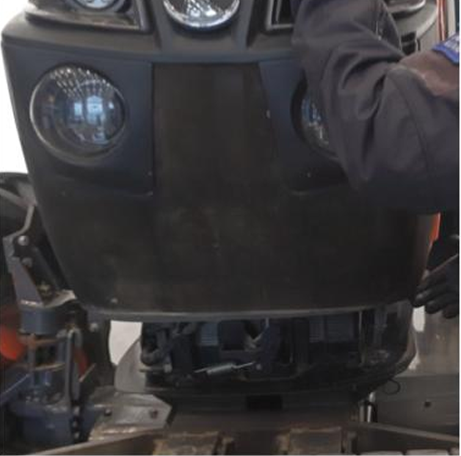
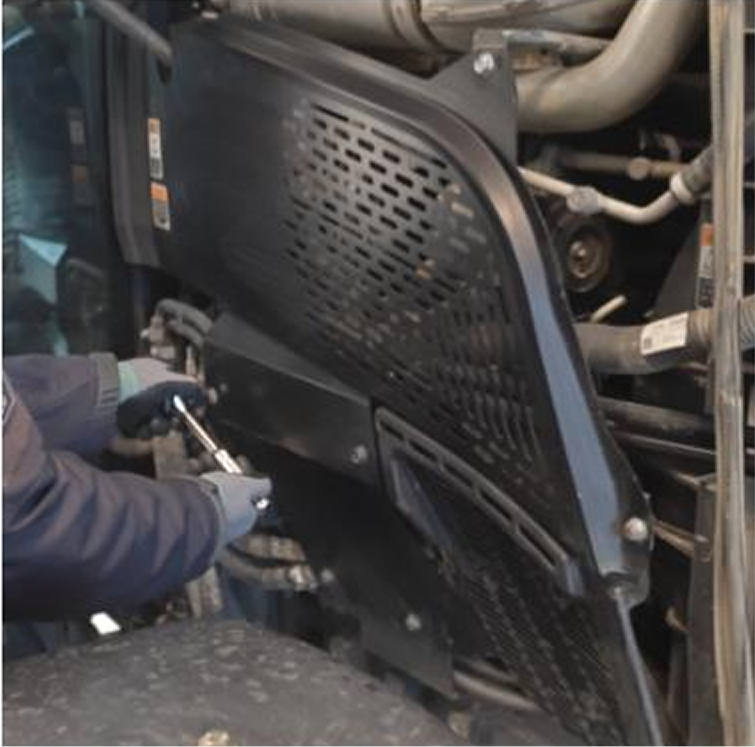
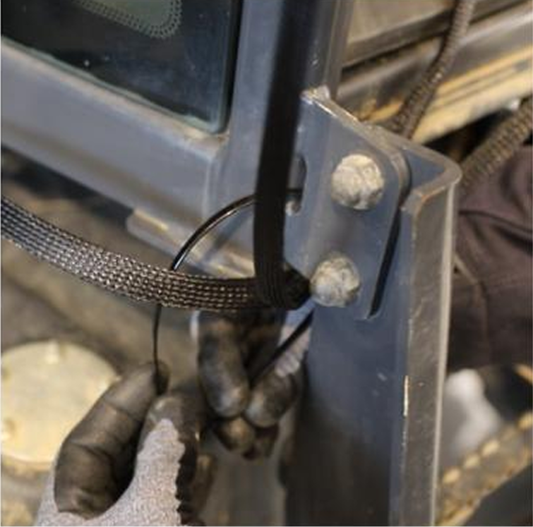
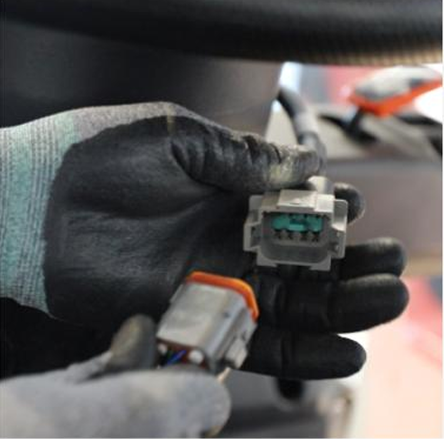

---
layout:
  width: default
  title:
    visible: false
  description:
    visible: false
  tableOfContents:
    visible: true
  outline:
    visible: true
  pagination:
    visible: true
  metadata:
    visible: true
  tags:
    visible: true
---

# 하네스

## 하네스

플루바 아이온 자율주행에 필요한 하네스를 설치합니다.

***

### 필요 공구 및 준비물

#### 🔩 준비물

<figure><figcaption></figcaption></figure>

#### 🛠️ 필요 공구

<figure><figcaption></figcaption></figure>

<table><thead><tr><th width="130.5">이름</th><th>규격</th><th>수량</th></tr></thead><tbody><tr><td>소켓 렌치</td><td>8~13mm</td><td>1</td></tr><tr><td>스패너</td><td>8~13mm</td><td>1</td></tr><tr><td>드라이버(+)</td><td>-</td><td>1</td></tr><tr><td>니퍼</td><td>200mm 8"</td><td>1</td></tr><tr><td>케이블타이</td><td>6 X 150</td><td>15</td></tr></tbody></table>

***

### 설치 방법


{% column width="58.333333333333336%" %}
#### 1. 하네스 배선 분배 위치를 확인합니다.

<figure><figcaption></figcaption></figure>



{% column width="41.666666666666664%" %}





{% column width="58.333333333333336%" %}
#### **2.** 배터리가 있는 보닛을 개방합니다.

<figure><figcaption></figcaption></figure>



{% column width="41.666666666666664%" %}





{% column width="58.333333333333336%" %}
#### **3.** 엔진룸 보호 커버를 제거합니다.

<figure><figcaption></figcaption></figure>



{% column width="41.666666666666664%" %}





{% column width="58.333333333333336%" %}
#### **4.** 전원 단자를 배터리로 이동합니다.

<figure><figcaption></figcaption></figure>



{% column width="41.666666666666664%" %}





{% column width="58.333333333333336%" %}
#### **5.** 배터리에 전원 단자를 결합합니다.

<figure><figcaption></figcaption></figure>



{% column width="41.666666666666664%" %}





{% column width="58.333333333333336%" %}
#### **6.** 분해한 엔진룸 보호커버를 결합합니다.

<figure><figcaption></figcaption></figure>



{% column width="41.666666666666664%" %}





{% column width="58.333333333333336%" %}
#### **7.** 하네스가 닿지 않도록 조심히 보닛을 닫습니다.

<figure><figcaption></figcaption></figure>



{% column width="41.666666666666664%" %}





{% column width="58.333333333333336%" %}
#### **8.** 리시버 단자를 트랙터 지붕으로 이동합니다.&#x20;

<figure><figcaption></figcaption></figure>



{% column width="41.666666666666664%" %}





{% column width="58.333333333333336%" %}
#### **9.** 하네스에 있는 리시버 단자를 리시버에 결합합니다.

<figure><figcaption></figcaption></figure>



{% column width="41.666666666666664%" %}





{% column width="58.333333333333336%" %}
#### **10.** 주행에 불편함이 없도록 하네스를 정리합니다.

<figure><figcaption></figcaption></figure>



{% column width="41.666666666666664%" %}





{% column width="58.333333333333336%" %}
#### **11.** 전원 하네스와 리시버 하네스를 주행에 방해가 없도록 정리합니다.

<figure><figcaption></figcaption></figure>



{% column width="41.666666666666664%" %}





{% column width="58.333333333333336%" %}
#### **12.** 스티어링 모터단자를 스티어링 모터에 결합합니다.

<figure><figcaption></figcaption></figure>



{% column width="41.666666666666664%" %}





{% column width="58.333333333333336%" %}
#### **13.** 스티어링 모터 하네스가 조향에 불편함이 없도록 정리합니다.

<figure><figcaption></figcaption></figure>



{% column width="41.666666666666664%" %}





{% column width="58.333333333333336%" %}
#### **14.** 브레이크 패달 조작에 불편함이 없도록 정리합니다.

<figure><figcaption></figcaption></figure>



{% column width="41.666666666666664%" %}





{% column width="58.333333333333336%" %}
#### **15.** 태블릿 단자를 태블릿 위치로 이동합니다.

<figure><figcaption></figcaption></figure>



{% column width="41.666666666666664%" %}





{% column width="58.333333333333336%" %}
#### **16.** 테블릿단자를 테블릿에 결합합니다.

<figure><figcaption></figcaption></figure>



{% column width="41.666666666666664%" %}





{% column width="58.333333333333336%" %}
#### **17.** 릴레이 배선을 정리합니다.

<figure><figcaption></figcaption></figure>



{% column width="41.666666666666664%" %}





{% column width="58.333333333333336%" %}
#### **18.** 조작에 방해가 되지 않도록 정리합니다.

<figure><figcaption></figcaption></figure>



{% column width="41.666666666666664%" %}




