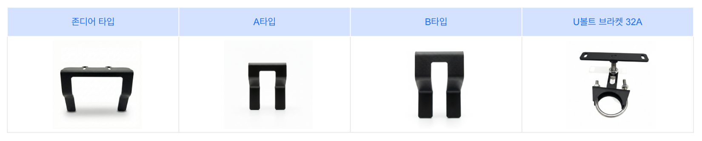

# 구성품 준비

### 구성품 준비

제품 설치를 위해 필요 구성품을 준비합니다.&#x20;

***

#### GNSS 수신기

GNSS 수신기는 RTK 기반 고정밀 위치정보를 이용하여 농기계의 위치를 정밀하게 파악합니다.보정 데이터를 통해 위치 보정이 이루어지며, 관련 설정은 사용 환경에 따라 달라질 수 있습니다.

<figure><figcaption></figcaption></figure>

<table><thead><tr><th width="154.2626953125"></th><th></th></tr></thead><tbody><tr><td>용도</td><td>GNSS 측위를 위한 데이터 수신 장비</td></tr><tr><td>크기</td><td>208 × 189 × 73 mm</td></tr><tr><td>정밀도 RTK</td><td>수평: ±8mm + 1ppm RMS, 수직: ±15mm + 1ppm RMS</td></tr><tr><td>지원 위성</td><td>GPS, GLONASS, Galileo, BDS, QZSS, SBAS (다중 대역 지원)</td></tr><tr><td>방수등급</td><td>IP67</td></tr></tbody></table>

 상태 표시 LED

1. 좌측 LED
   1. 전원 및 시스템의 H/W 이상 여부

<figure><figcaption></figcaption></figure>

상태 구분

<table data-header-hidden><thead><tr><th width="100.4921875"></th><th></th><th></th></tr></thead><tbody><tr><td>색상</td><td>파란색 (점등)</td><td>노란색 점멸</td></tr><tr><td>상태</td><td>정상</td><td>오류 발생</td></tr><tr><td>이미지</td><td></td><td></td></tr></tbody></table>

2. 중앙 LED
   1. GNSS 보정 정보 수신 여부

<figure><figcaption></figcaption></figure>

상태 구분

<table data-header-hidden><thead><tr><th width="99.57421875"></th><th></th><th></th><th></th></tr></thead><tbody><tr><td>색상</td><td>파란색 (점등)</td><td>파란색 점멸</td><td>OFF</td></tr><tr><td>상태</td><td>정상</td><td>5초 이상 미수신</td><td>60초 이상 미수신 (또는 수신된적 없음)</td></tr><tr><td>이미지</td><td></td><td></td><td></td></tr></tbody></table>

3. 우측 LED
   1. GNSS RTK 상태

<figure><figcaption></figcaption></figure>

상태 구분

<table data-header-hidden><thead><tr><th width="126.7890625"></th><th></th><th></th><th></th></tr></thead><tbody><tr><td>색상</td><td>파란색 (점등)</td><td>파란색 점멸</td><td>OFF</td></tr><tr><td>상태</td><td>RTK Fixed</td><td>RTK Fixed Float</td><td>그 밖의 상태</td></tr><tr><td>이미지</td><td></td><td></td><td></td></tr></tbody></table>

 QR코드: 제품 등록시 사용되는 QR 코드입니다.

***

#### 전동 스티어링 휠

전동 스티어링 휠은 농기계의 기존 핸들을 탈착한 뒤, 스티어링 위치에 장착하는 전동 모터 방식 조향 장치입니다. 생성된 주행 경로를 기반으로 조향을 제어하여, 조건부로 운전자의 조향 작업을 보조합니다.

<figure><figcaption></figcaption></figure>

 핸들

 모터

<table><thead><tr><th width="154.2626953125"></th><th></th></tr></thead><tbody><tr><td>용도</td><td>형성된 가상 라인을 따라 물리적 조향에 필요한 장비</td></tr><tr><td>크기</td><td>380 × 380 × 118 mm</td></tr><tr><td>정격 토크</td><td>7 Nm</td></tr><tr><td>최대 토크</td><td>13 Nm</td></tr><tr><td>방수등급</td><td>IP65</td></tr></tbody></table>

#### 프론트 브라켓

<figure><figcaption></figcaption></figure>

***

#### 태블릿

태블릿은 자율주행 시스템의 디스플레이입니다.
작업 경로 설정, 주행 상태 모니터링, 시스템 제어 및 설정을 수행하며, 실시간 위치/주행 정보/오류 상태를 확인할 수 있습니다.

<figure><figcaption></figcaption></figure>

<figure><figcaption></figcaption></figure>

<table><thead><tr><th width="154.2626953125"></th><th></th></tr></thead><tbody><tr><td>용도</td><td>iON 사용 및 조작, 작업지, 경로 관리용 태블릿</td></tr><tr><td>크기</td><td>271 × 173 × 30 mm</td></tr><tr><td>해상도</td><td>1280 × 800 px</td></tr><tr><td>밝기</td><td>750 nits</td></tr><tr><td>방수등급</td><td>IP66</td></tr></tbody></table>

***

 메인 전원 스위치

* 전동 스티어링 휠, GNSS 수신기, 태블릿 등 연결된 모든 장치의 전원을 한 번에 켜거나 끕니다.

<figure><figcaption></figcaption></figure>

 태블릿 전원

* 태블릿의 전원을 켜거나 끕니다.

<figure><figcaption></figcaption></figure>

 우측(▶)

* 설정 화면: 선택 항목을 오른쪽으로 이동합니다.
* 자율주행 중: 등간격을 우측으로 일정 간격 이동합니다.
*   유턴 중: 즉시 유턴을 우측으로 실행합니다.

<figure><figcaption></figcaption></figure>

 좌측(◀)

* 설정 화면: 선택 항목을 왼쪽으로 이동합니다.
* 자율주행 중: 등간격을 좌측으로 일정 간격 이동합니다.
* 유턴 중: 즉시 유턴을 좌측으로 실행합니다.

<figure><figcaption></figcaption></figure>

 선택 / 자율주행 ON·OFF

* 설정 화면: 선택 항목을 확정합니다.
* 자율주행 중: 자율주행을 시작하거나 해제합니다.

<figure><figcaption></figcaption></figure>

 취소/이전

* 이전 화면으로 이동하거나 진행 중 동작을 취소합니다.

<figure><figcaption></figcaption></figure>

 멀티펑션(즐겨찾기)

* 고객이 자주 사용하는 기능을 즐겨찾기로 설정하고, 버튼을 누르면 해당 기능으로 이동합니다.

<figure><figcaption></figcaption></figure>

 메인 커넥터

* 태블릿에 전원과 GNSS 수신기, 전동 스티어링 휠 등의 각종 제품들을 연결하는 장치입니다

<figure><figcaption></figcaption></figure>

***

### 하네스

하네스는 태블릿, GNSS 등 각 장치를 연결해 **전원 및 신호를 전달**하는 연결 구성품입니다.\
설치 시 각 장치가 정상 동작하도록 하네스를 정확히 연결해야 합니다.

<figure><figcaption></figcaption></figure>

<table><thead><tr><th width="154.2626953125"></th><th></th></tr></thead><tbody><tr><td>용도</td><td>GNSS 리시버, 태블릿, 스티어링 휠, 원터치 스위치, 후방카메라에 전원 및 데이터 수신용 하네스</td></tr><tr><td>퓨즈규격</td><td>MIni fuse 30A</td></tr><tr><td>정격전압</td><td>12V</td></tr><tr><td>릴레이 규격</td><td>12V, 40A</td></tr><tr><td>기타</td><td>메인 전원 스위치 연결 필요</td></tr></tbody></table>

#### 단자 이미지

<figure><figcaption></figcaption></figure>

***

### 카메라

플루바 아이온에는 주변 환경을 모니터링하는 카메라 구성품이 포함됩니다.

<figure><figcaption></figcaption></figure>

<table><thead><tr><th width="154.2626953125"></th><th></th></tr></thead><tbody><tr><td>용도</td><td>후방 작업 및 안전성 확보용 카메라</td></tr><tr><td>화질</td><td>1080p 720p CVBS</td></tr><tr><td>시야각</td><td>120</td></tr><tr><td>작동온도</td><td>-30°C ~ +80°C</td></tr><tr><td>방수등급</td><td>IP67</td></tr></tbody></table>

트랙터 뒤쪽 상부에 카메라를 설치하며, 후방 작업을 모니터링합니다.

<figure><figcaption></figcaption></figure>

***

#### 스위치 (옵션품)

스위치는 작업자가 조작하기 편리한 위치에 설치하여, 자율주행 시스템의 시작·정지 등 주요 기능을 간편하게 제어할 수 있습니다.
옵션품은 별도 구매가 필요하며, 모델 타입에 따라 외관 및 색상이 이미지와 다를 수 있습니다.

<figure><figcaption></figcaption></figure>

<table><thead><tr><th width="154.2626953125"></th><th></th></tr></thead><tbody><tr><td>용도</td><td>태블릿 조작을 편리하게 하기 위한 리모컨</td></tr><tr><td>크기</td><td>76 x 151 x 18 mm</td></tr><tr><td>무게</td><td>0.144kg</td></tr><tr><td>재질</td><td>ABS</td></tr><tr><td>방수등급</td><td>IP67</td></tr></tbody></table>

 상태

* 기능
  * 측위 시스템 상태 표기
* 상태
  * 기본 - 미점등
  * GPS 신호 우수 - 초록 점등
  * GPS 신호 보통 - 초록 점멸

<figure><figcaption></figcaption></figure>

 멀티펑션 기능

* 기능
  * 즐겨찾기 기능
* 상태
  * 기본 - 미점등
  * 버튼 동작 - 초록 점등

<figure><figcaption></figcaption></figure>

 취소 or
이전

* 기능
  * 상황에 따른 취소/이전 메뉴로 이동
* 상태
  * 기본 - 미점등
  * 버튼 동작 - 초록 점등

<figure><figcaption></figcaption></figure>

 엔터

* 기능
  * A/B 설정
  * 메뉴 내 OK/확정 동작
* 상태
  * 기본 - 미점등
  * 버튼 동작 - 초록 점등

<figure><figcaption></figcaption></figure>

 좌측(◀)

* 기능
  * 설정 화면: 선택 항목을 왼쪽으로 이동합니다.
  * 자율주행 중: 등간격을 좌측으로 일정 간격 이동합니다.
  * 유턴 중: 즉시 유턴을 좌측으로 실행합니다.
* 상태
  * 기본 - 미점등
  * 버튼 동작 - 초록 점등

<figure><figcaption></figcaption></figure>

 우측(▶)

* 기능
  * 설정 화면: 선택 항목을 오른쪽으로 이동합니다.
  * 자율주행 중: 등간격을 우측으로 일정 간격 이동합니다.
  * 유턴 중: 즉시 유턴을 우측으로 실행합니다.
* 상태
  * 기본 - 미점등
  * 버튼 동작 - 초록 점등

<figure><figcaption></figcaption></figure>

 자율주행 ON/OFF

* 기능
  * 자율주행 모드 진입 및 해제
* 상태
  * 기본 - 미점등
  * 버튼 동작 - 초록 점등

<figure><figcaption></figcaption></figure>

