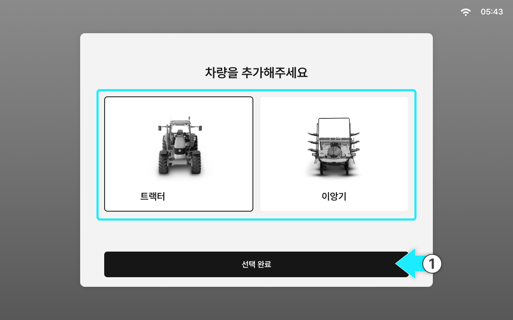
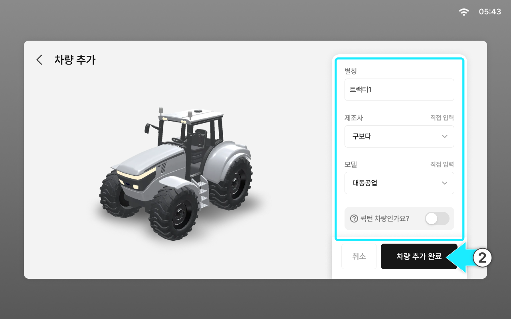
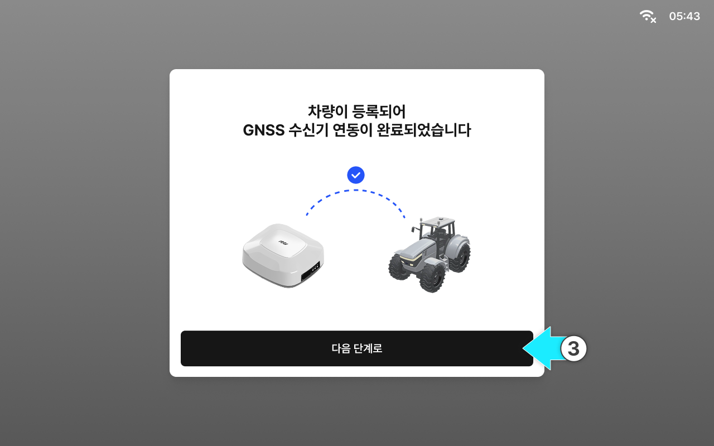
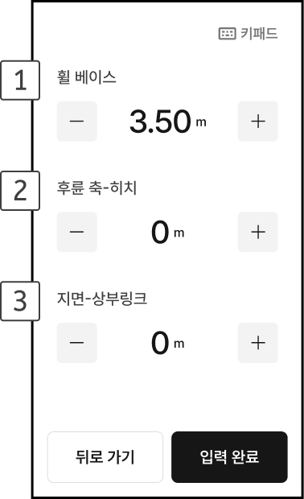
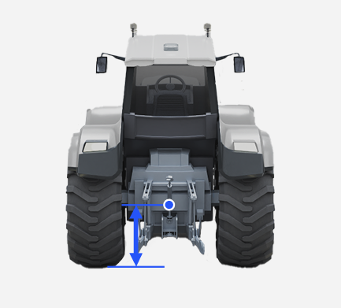
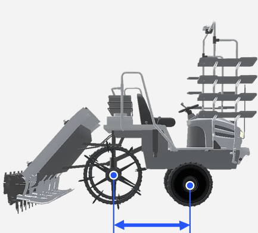
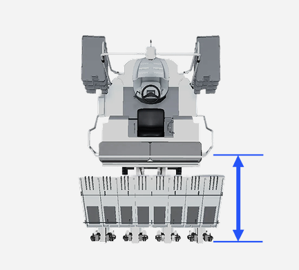
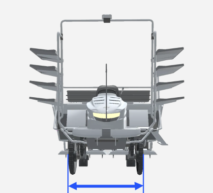
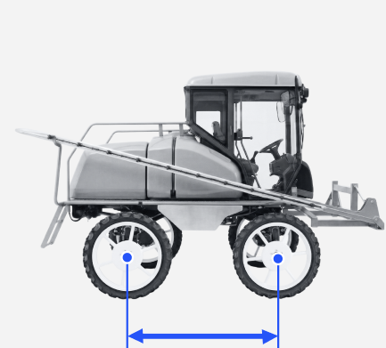

---
layout:
  width: default
  title:
    visible: true
  description:
    visible: false
  tableOfContents:
    visible: true
  outline:
    visible: true
  pagination:
    visible: true
  metadata:
    visible: true
  tags:
    visible: true
---

# 차량 추가

작업에 사용할 차량을 추가합니다.


설정된 차량 수치 값은 태블릿의 [내 차량](/broken/pages/fGVifYcsPhKi7NL4xOBx)에서 확인하고 변경할 수 있습니다.


***

#### 차량 추가 방법



등록할 차량 타입을 선택한 후 \[선택 완료]를 누릅니다.

<figure><figcaption></figcaption></figure>



별칭, 제조사, 모델, 연식, 차량 치수를 입력한 뒤 \[차량 추가 완료]를 누릅니다.

<figure><figcaption></figcaption></figure>


배속턴 차량은 배속턴 특성에 맞춘 보정값이 필요하므로, \[배속턴 차량] 토글을 반드시 켜고 진행해 주세요.




배속턴은 트랙터에만 적용되는 옵션입니다. 이앙기에는 배속턴 옵션이 없습니다.




차량이 등록되고 GNSS 수신기와 연동됩니다. \[다음 단계로]를 누르면 작업기 추가로 이동합니다.

<figure><figcaption></figcaption></figure>



***

#### 차량 치수 설정 항목


차량 치수 측정은 평평한 바닥에서 측정해야합니다.

경사지나 흙바닥에서 측정 시 정확하지 않을 수 있습니다.


#### 트랙터

<figure><figcaption></figcaption></figure>

&#x20; 휠 베이스

* 트랙터의 앞바퀴 중심과 뒷바퀴 중심 간의 거리입니다.
* 

&#x20; 후륜 축-히치

* 트랙터의 후륜 축 중심에서 히치까지의 수평 거리입니다.
* 

&#x20; 지면-상부링크

* 지면에서부터 트랙터의 상부 링크까지의 수직 거리입니다.
* 

#### 이앙기

<figure><figcaption></figcaption></figure>

&#x20; 휠베이스

* 이앙기의 앞바퀴 중심과 뒷바퀴 중심 간의 거리입니다.
* 

&#x20; 후륜 축-차량 끝

* 이앙기의 후륜 축 중심에서 차량 끝까지의 수평 거리입니다.
* 

&#x20; 이앙기 폭

* 이앙기의 폭을 의미하며 타이어 너비를 포함합니다.
* 

&#x20; 간격 편차

* 양방향 작업 주행 시 간격이 일정하지 않을 때 보정하기 위한 수치값입니다. (간격 편차의 절대값을 4로 나눈 수치를 입력)

#### 관리기

<figure><figcaption></figcaption></figure>

&#x20; 휠베이스

* 관리기의 앞바퀴 중심과 뒷바퀴 중심 간의 거리입니다.
* 

&#x20; 후륜 축-차량 끝

* 관리기의 후륜 축 중심에서 차량 끝까지의 수평 거리입니다.
* 

&#x20; 관리기 폭

* 관리기의 폭을 의미하며 타이어 너비를 포함합니다.
* 

&#x20; 간격 편차

* 양방향 작업 주행 시 간격이 일정하지 않을 때 보정하기 위한 수치값입니다. (간격 편차의 절대값을 4로 나눈 수치를 입력)
