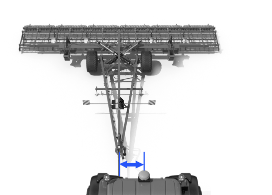

# 작업기 추가 (선택)

### 작업기 추가 (선택)

작업에 사용할 작업기를 추가합니다.

***

#### 작업기 추가 방법



\[추가하기]버튼을 누릅니다.

<figure><figcaption></figcaption></figure>



별칭, 작업기 타입, 작업기 너비, 고랑폭, 링크-작업기 거리, 작업기 편차를 입력하고 \[확인]을 누릅니다.

<figure><figcaption></figcaption></figure>



작업기 등록이 완료됩니다. \[다음 단계로] 버튼을 누르면 차량 보정에 진입합니다.

<figure><figcaption></figcaption></figure>



***

#### 작업기 치수 항목 설명

<figure><figcaption></figcaption></figure>

 **작업기 너비**

* 작업기 너비를 입력합니다.
* 

&#x20; **고랑폭**

* 고랑폭을 입력합니다.
* 

&#x20; **작업기 편차**

* 작업기 편차를 입력합니다.
*   

&#x20; **작업기 편차 계산**

* 3개의 라인을 주행하여 라인 간격을 입력하면 작업기 편차를 자동으로 계산할 수 있습니다.
*   그림에서 안내하는 방향으로 3개의 라인을 주행하고,
주행 라인 사이의 거리를 측정하여 입력하세요. 

    <figure><figcaption></figcaption></figure>

    * S1: 첫 번째 라인과 두 번째 사이의 거리

    * S2: 두 번째 라인과 세 번째 사이의 거리
    * 화면 상단의 토글을 통해 주행 방향을 선택할 수 있습니다.\
      
