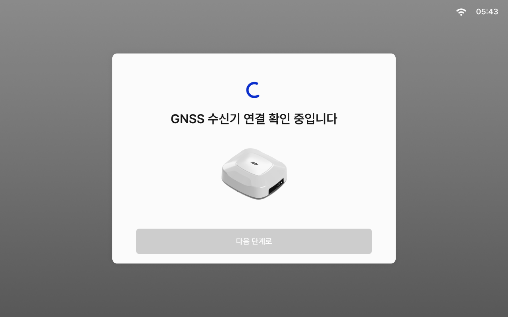

# GNSS 수신기 연결 확인

### GNSS 수신기 연결 확인

태블릿과 GNSS 수신기와의 연결 상태를 확인하는 단계입니다.


설정된 값은 태블릿의 [GNSS 수신기 설정](../../usage/vehicle-settings/gnss-receiver-setting.md)에서 확인하고 변경할 수 있습니다.


***

#### GNSS 수신기 연결 확인



GNSS 수신기 연결 확인 단계에 진입합니다. 진입 시 연결 확인이 자동으로 진행됩니다.

<figure><figcaption></figcaption></figure>



연결 확인이 완료되면 \[다음 단계로]를 눌러 RTK 설정으로 진입합니다.

<figure><figcaption></figcaption></figure>


연결에 실패할 경우 수신기 측면의 LED 상태 확인 후 다시 시도를 눌러 재시도해 주세요.




