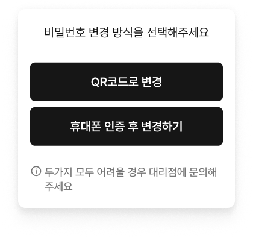

---
metaLinks:
  alternates:
    - https://app.gitbook.com/s/jOhU5MWpMqraceI5pg9u/ion/driving/square-drive
---

# 로그인

### 로그인&#x20;


* 로그인 전, **회원가입 사이트에서 가입**을 진행하세요.
* 고객 계정이 없으면 고객 정보를 기반으로 한 맞춤 자율주행 기능을 제공할 수 없어 **서비스 이용이 제한**됩니다.




아이디와 비밀번호를 입력하고 \[확인]을 누릅니다.

<figure><figcaption></figcaption></figure>



로그인에 성공합니다. **\[다음 단계로]** 버튼을 누르면 개통키 입력 단계로 진입합니다.

<figure><figcaption></figcaption></figure>




비밀번호가 기억나지않는 경우 비밀번호 찾기를 진행합니다.

비밀번호 찾기는 아래 두가지 방식으로 찾을 수 있습니다.

* QR코드로 변경
* 휴대번호 인증 후 변경하기


