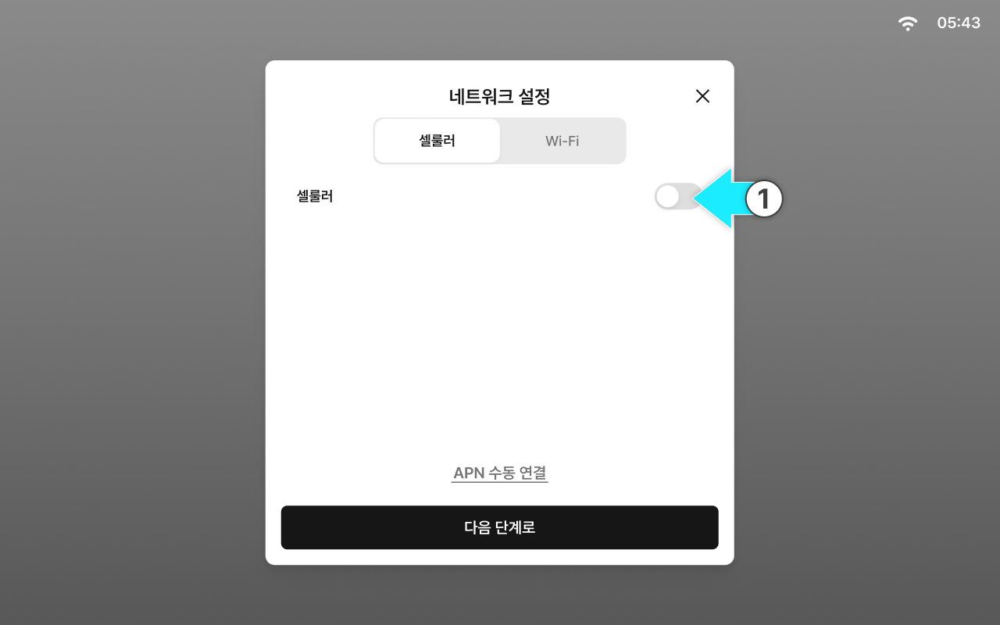
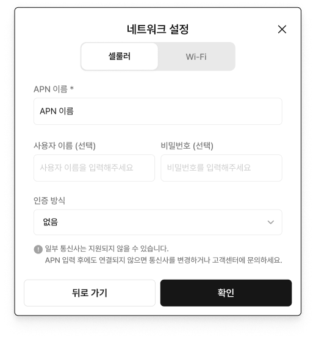
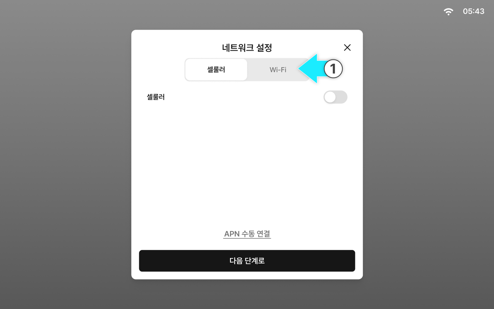

# 네트워크 설정

### 네트워크 설정

퀵셋업을 시작할 수 있도록 현재 네트워크를 설정합니다.

네트워크 연결이 되지않으면 퀵셋업을 진행할 수 없으니 반드시 설정해야합니다.

***

#### 네트워크 설정 항목

1. 셀룰러
2. Wi-Fi


태블릿의 [네트워크 설정](../../usage/network-settings/)에서 네트워크 상태를 확인하고 설정을 변경할 수 있습니다.


***

#### 셀룰러 연결

셀룰러는 태블릿에 삽입된 유심(USIM)을 통해 이동통신망으로 인터넷에 연결하는 방식입니다.


셀룰러는 연결이 안정적이므로, 실시간 보정 신호가 필요한 정밀 작업에는 셀룰러 사용을 권장합니다.



요금제/데이터 사용량에 따라 비용이 발생할 수 있으니 작업 전 유심 개통 상태, 데이터 잔여량, 사용 가능 기간을 확인합니다.




셀룰러 토글을 켭니다.

<figure><figcaption></figcaption></figure>



APN이 자동으로 연결됩니다

<figure><figcaption></figcaption></figure>


셀룰러 설정은 USIM을 태블릿에 장착된 상태에만 설정이 가능합니다.




연결이 완료됩니다. \[다음 단계로] 버튼을 눌러 로그인 단계로 진입합니다.

<figure><figcaption></figcaption></figure>


자동 연결이 되지않는 경우 \[APN 수동 연결]을 진행합니다.\
입력에 필요한 APN 정보는 유심 제공 자료를 참고합니다.





***

#### Wi-Fi 연결

Wi-Fi는 주변의 무선 공유기 또는 스마트폰 테더링에 연결해 인터넷을 사용하는 방식입니다.


환경에 따라 신호가 약하거나 범위를 벗어나면 연결이 끊길 수 있어, 제한된 작업 구간에서 사용을 권장합니다.



테더링 사용 시 스마트폰 배터리 소모와 데이터 사용량이 늘 수 있으니 작업 전 배터리 상태와 절전 설정을 확인합니다.




\[Wi-Fi] 탭을 누릅니다.

<figure><figcaption></figcaption></figure>



Wi-Fi 토글을 켭니다.

<figure><figcaption></figcaption></figure>



연결할 Wi-Fi를 선택합니다.

<figure><figcaption></figcaption></figure>



Wi-Fi 연결이 완료됩니다. \[다음 단계로] 버튼을 눌러 로그인 단계로 진입합니다.

<figure><figcaption></figcaption></figure>


Wi-Fi 범위를 벗어나면 연결이 끊길 수 있습니다.



