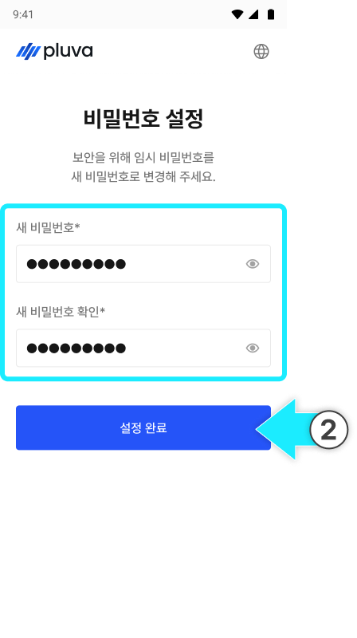

---
layout:
  width: default
  title:
    visible: true
  description:
    visible: false
  tableOfContents:
    visible: true
  outline:
    visible: true
  pagination:
    visible: true
  metadata:
    visible: true
  tags:
    visible: true
metaLinks:
  alternates:
    - https://app.gitbook.com/s/256Umh24fJVf6zNkZpSa/others/admin-login
---

# 어드민 로그인

주문, 개통, 원격 지원 등의 서비스 이용을 위해 어드민 로그인을 진행합니다.



플루바 아이온 제조사 (주)긴트에 아래 정보를 작성하여 계정 발급을 요청합니다.

1. **이름**
2. **이메일**
3. **대리점 명**



계정 발급이 완료되면 [어드민 페이지](https://thegint.slack.com/archives/C0ACCKBFZ7H/p1773212243051089)에 접속합니다.\
전달받은 이메일과 비밀번호를 입력한 후 \[로그인] 버튼을 누릅니다.

<figure><figcaption></figcaption></figure>


발급받은 계정으로 로그인이 되지 않을 경우 (주)긴트에 문의합니다.





첫 로그인 시 새 비밀번호를 설정하고 \[설정 완료]를 누르면 로그인이 완료됩니다.

<figure><figcaption></figcaption></figure>


