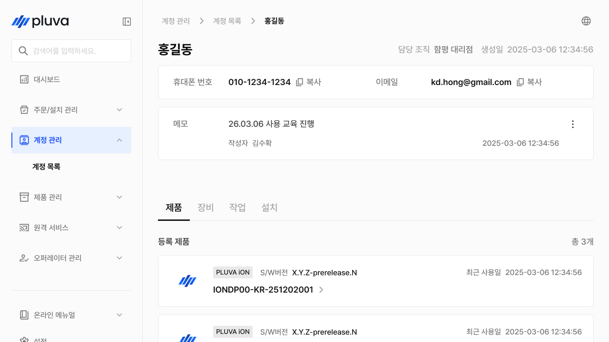
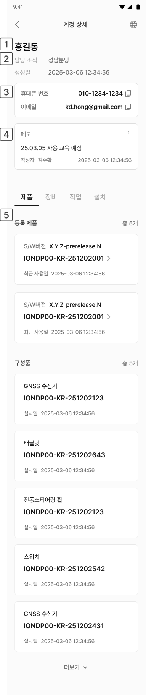

# 작업 이력

계정(고객)이 수행한 작업 이력을 조회하고, 작업 경로와 데이터를 지도에서 분석·재생하는 메뉴입니다. 담당자가 현장에 없었더라도 작업 데이터로 상황을 재구성해 고객 문의·클레임의 원인을 파악하는 데 활용합니다.

***

### 진입 방법



목록에서 조회할 계정을 선택해 계정 상세로 이동합니다.

<figure><figcaption></figcaption></figure>



계정 상세에서 작업 탭을 선택후 원하는 작업을 선택해 작업 이력 상세에 진입합니다.

<figure><figcaption></figcaption></figure>




작업 이력은 기준 시각까지 어드민에 동기화된 작업만 표시됩니다. 현장 작업 직후에는 아직 동기화 전이라 보이지 않을 수 있습니다.


***

### 작업 이력 상세

작업 항목의 \[경로 보기]를 누르면 해당 작업의 경로와 데이터를 지도에서 확인하고, 시간 순서대로 재생할 수 있습니다.

#### PC 환경

 계정 이름

 주소 및 로드뷰

 경로표시설정

* 해당 계정에 등록된 휴대폰 번호와 이메일 주소가 표시됩니다.


**참고**: 휴대폰 번호와 이메일 주소 항목 옆의 복사 버튼을 누르면 클립보드에 바로 복사됩니다.


 메모

* **⋮ 버튼**을 눌러 내용을 수정하거나 삭제할 수 있습니다.
* **작성자 이름**과 **작성 일시**가 함께 표시됩니다.

 계정 상세 정보

* 계정 상세 화면 하단에서 **제품**, **장비**, **작업**, **설치** 탭을 선택하여 각 이력을 조회합니다.\
  목록 조회만 가능하며, 직접 추가·수정은 지원하지 않습니다.
  * 제품 탭: 고객이 보유한 제품 정보를 확인합니다.
    * **등록 제품**: 고객 명의로 등록된 제품 목록과 총 수량이 표시됩니다.
    * **구성품**: 등록된 구성품 목록과 총 수량이 표시됩니다.
  * 장비 탭: 고객이 보유한 장비 정보를 확인합니다.
    * **차량**: 등록된 차량 목록과 총 수량이 표시됩니다.
    * **작업기**: 등록된 작업기 목록과 총 수량이 표시됩니다.
  * 작업 탭: 고객의 작업 관련 이력을 확인합니다.
    * **필드**: 등록된 필드 목록과 총 수량이 표시됩니다.
  * 설치 탭: 고객의 설치 이력을 확인합니다.
    * **설치 이력**: 완료된 설치 작업 목록과 총 건수가 표시됩니다.

#### 모바일 환경

<figure><figcaption></figcaption></figure>

 계정 이름

 소속 대리점 및 생성일

 계정 정보

* 해당 계정에 등록된 휴대폰 번호와 이메일 주소가 표시됩니다.


**참고**: 휴대폰 번호와 이메일 주소 항목 옆의 복사 버튼을 누르면 클립보드에 바로 복사됩니다.


 메모

* **⋮ 버튼**을 눌러 내용을 수정하거나 삭제할 수 있습니다.
* **작성자 이름**과 **작성 일시**가 함께 표시됩니다.

 계정 상세 정보

* 계정 상세 화면 하단에서 **제품**, **장비**, **작업**, **설치** 탭을 선택하여 각 이력을 조회합니다.\
  목록 조회만 가능하며, 직접 추가·수정은 지원하지 않습니다.
  * 제품 탭: 고객이 보유한 제품 정보를 확인합니다.
    * **등록 제품**: 고객 명의로 등록된 제품 목록과 총 수량이 표시됩니다.
    * **구성품**: 등록된 구성품 목록과 총 수량이 표시됩니다.
  * 장비 탭: 고객이 보유한 장비 정보를 확인합니다.
    * **차량**: 등록된 차량 목록과 총 수량이 표시됩니다.
    * **작업기**: 등록된 작업기 목록과 총 수량이 표시됩니다.
  * 작업 탭: 고객의 작업 관련 이력을 확인합니다.
    * **필드**: 등록된 필드 목록과 총 수량이 표시됩니다.
  * 설치 탭: 고객의 설치 이력을 확인합니다.
    * **설치 이력**: 완료된 설치 작업 목록과 총 건수가 표시됩니다.
