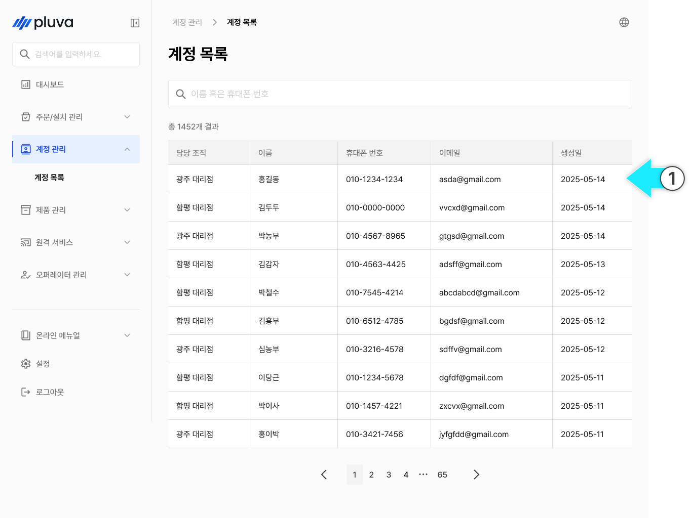
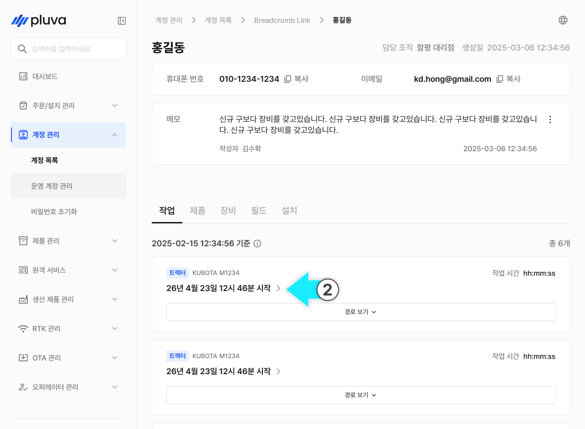

# 작업 이력

계정(고객)이 수행한 작업 이력을 조회하고, 작업 경로와 데이터를 지도에서 분석·재생하는 메뉴입니다. 담당자가 현장에 없었더라도 작업 데이터로 상황을 재구성해 고객 문의·클레임의 원인을 파악하는 데 활용합니다.

***

### 진입 방법



목록에서 조회할 계정을 선택해 계정 상세로 이동합니다.

<figure><figcaption></figcaption></figure>



계정 상세에서 작업 탭을 선택후 원하는 작업을 선택해 작업 이력 상세에 진입합니다.

<figure><figcaption></figcaption></figure>




작업 이력은 기준 시각까지 어드민에 동기화된 작업만 표시됩니다. 현장 작업 직후에는 아직 동기화 전이라 보이지 않을 수 있습니다.


***

### 작업 이력 상세

작업 항목의 \[경로 보기]를 누르면 해당 작업의 경로와 데이터를 지도에서 확인하고, 시간 순서대로 재생할 수 있습니다.

#### PC 환경

 **작업 시작 일시**

* 선택한 작업의 시작 날짜·시각이 표시됩니다.

 **위치 / 로드뷰**

* 작업 위치(주소)가 표시됩니다. \[로드뷰]를 누르면 해당 위치의 로드뷰를 확인합니다.

 **경로 표시 설정**

* \[경로 표시 설정]에서 지도에 표시할 정보를 조정합니다. \[조건 필터]와 \[이벤트] 두 가지로 나뉩니다.
* **조건 필터**: 설정한 조건에 맞는 구간만 지도·타임라인에서 강조해 찾습니다. 여러 조건을 조합할 수 있고, 조건 없이 전체 경로를 볼 수도 있습니다. 조건 항목은 다음과 같습니다.
  * RTK 품질 (Fixed / Fixed 외)
  * 작업 모드 (AB직진 / A+직진 / 격자주행 / 자동경로 / 메모리주행)
  * 속도 (이상 / 이하 / 범위)
  * 주행 방향 (전진 / 후진 / 미정의)
  * 주행 상태 (직진 / 시계방향 / 반시계방향 / 미분류)
* **이벤트**: 지도 위에 표시할 이벤트를 켜고 끕니다. 주행(시작·정지), 에러(발생·복구) 등을 선택할 수 있으며, \[이벤트 표시] 토글로 한 번에 켜고 끄거나 \[초기화]할 수 있습니다.


\[이벤트 표시]를 OFF하면 설정했던 표시값이 지도에서 사라집니다.


 **실시간 데이터**

* 재생 시점을 기준으로 RTK 품질, 속도, 좌표, GPS 이벤트, 헤딩, 주행 상태 등 작업에 필요한 상세 수치를 표시합니다.

 **시작 지점(S)**

* 지도에서 작업이 시작된 지점입니다.

 **종료 지점(E)**

* 지도에서 작업이 종료된 지점입니다.

 **재생 / 일시정지**

* \[▶]를 누르면 작업을 시간 순서대로 재생하고, 다시 누르면 일시정지합니다.

 **재생 타임라인**

* 전체 작업 구간이 표시됩니다. 특정 시점을 선택하면 해당 시점으로 이동하며, 지도의 차량 위치와 실시간 데이터가 함께 바뀝니다.

 **지도 보기 전환**

* \[경로] / \[RTK 품질] 보기를 전환합니다. RTK 품질 모드에서는 경로 표시를 설정할 수 없으며, 대략적인 상황 파악을 위해 히트맵으로 표시됩니다.

 **작업 정보**

* \[작업 정보]를 누르면 좌측 작업 정보 패널을 열고 닫습니다.

<figure><figcaption></figcaption></figure>

 **방향**

* 지도의 북쪽 방향을 표시합니다.

 **현재 위치**

* 지도를 작업 위치로 이동(중심 정렬)합니다.

 **경로 범례**

* 지도에 표시된 경로 색상의 의미를 확인합니다.

<figure><figcaption></figcaption></figure>

 **재생 속도**

* 재생 배속(예: 1x)을 선택합니다.
