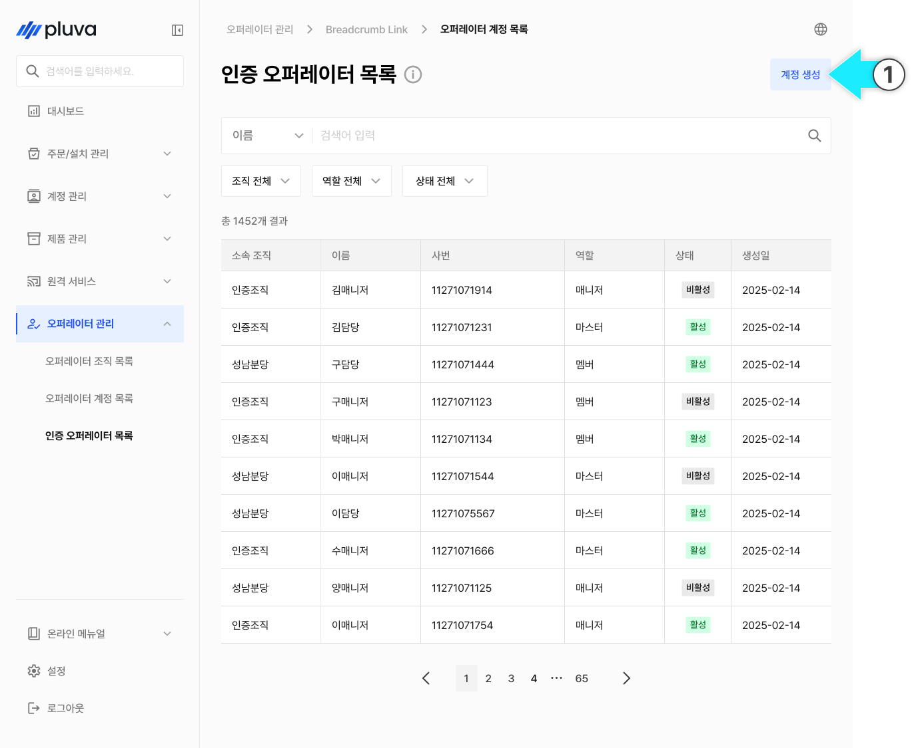
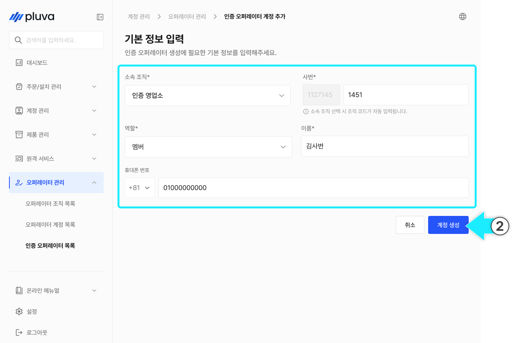
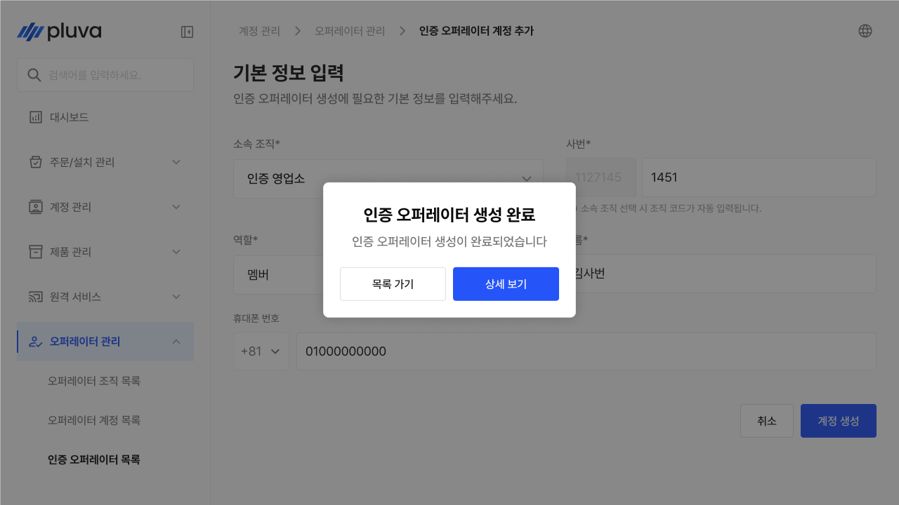
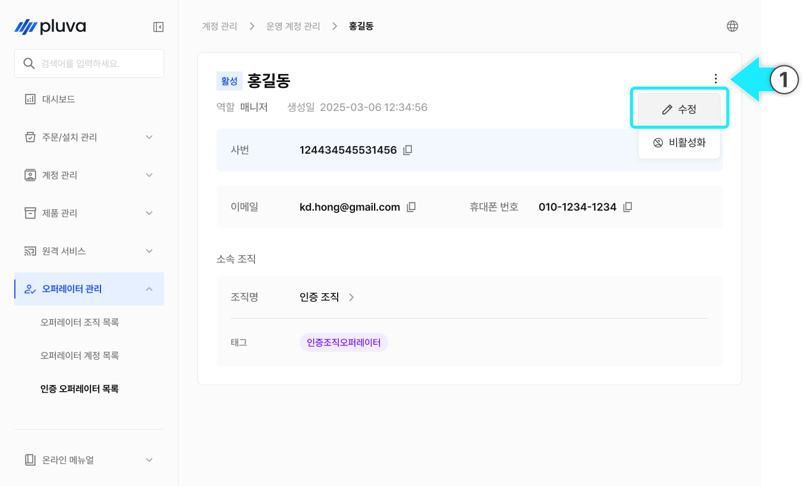
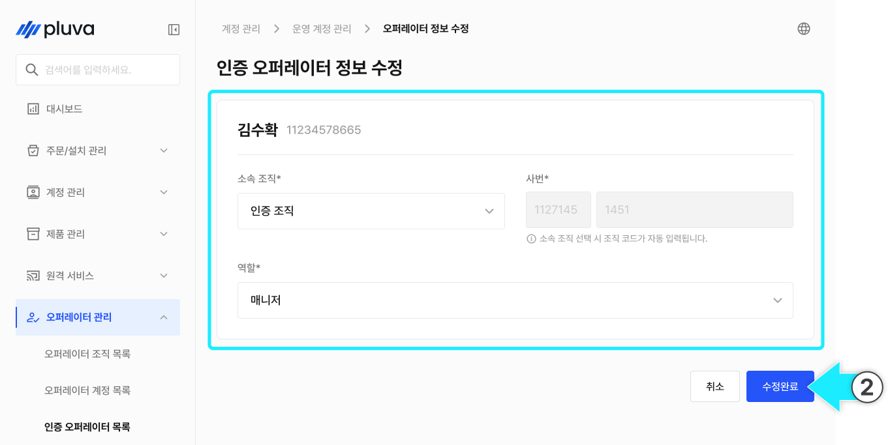
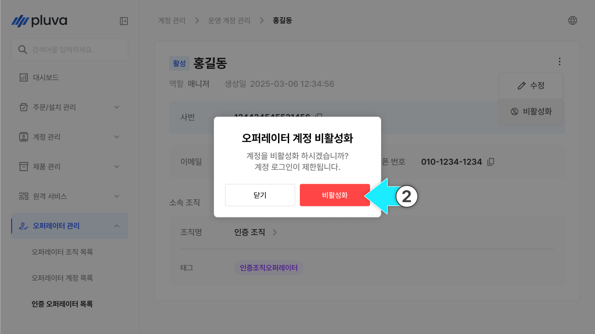
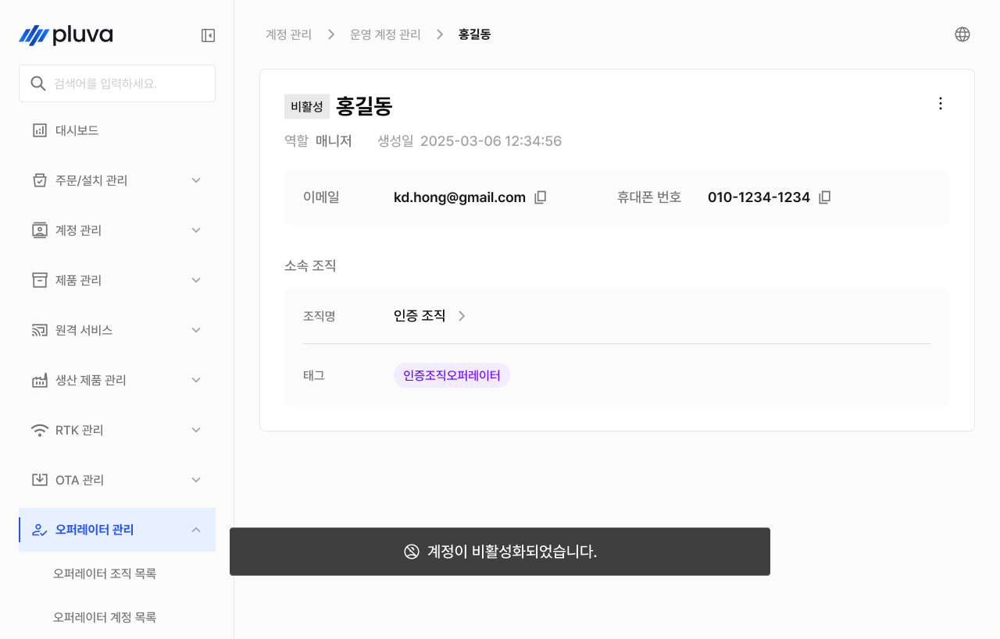
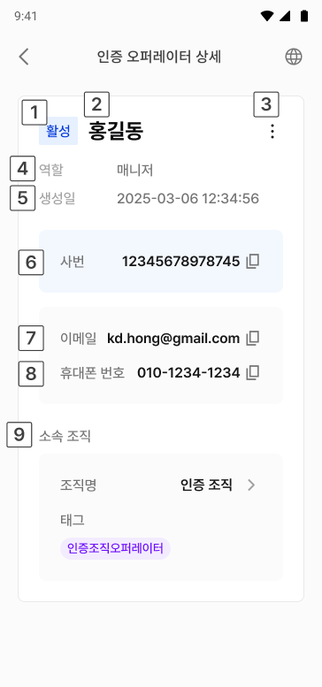

# 인증 오퍼레이터 관리

인증 오퍼레이터 관리는 현장 작업·설치를 수행하는 인증된 실무자(인증 오퍼레이터)를 등록하고 관리하는 메뉴입니다. 역할에 따라 권한이 구분되며, 활성화·비활성화를 통해 사용을 제어할 수 있습니다.


이 메뉴는 파트너 어드민 이상 역할 또는 긴트(Gint) 계정에서만 접근할 수 있습니다.


***

### 진입 방법



좌측 메뉴에서 오퍼레이터 관리를 선택합니다.

<figure><figcaption></figcaption></figure>



하위 메뉴에서 인증 오퍼레이터 관리를 선택하면 목록 화면으로 이동합니다.

<figure><figcaption></figcaption></figure>



***

### 인증 오퍼레이터 등록



목록 화면 오른쪽 위의 \[등록] 버튼을 누릅니다.

<figure><figcaption></figcaption></figure>



아래 항목을 입력합니다. \* 표시 항목은 반드시 입력해야 합니다.

* **기본 정보** : 이름\* / 사번\* / 이메일 / 휴대폰 번호 / 역할 / 소속 조직 / 태그

<figure><figcaption></figcaption></figure>


소속 조직은 이 인증 오퍼레이터의 관리 범위를 결정합니다. 소속 조직에 따라 조회·작업 가능한 범위가 달라집니다.



**역할별 안내**

* **멤버** : 현장 작업·설치 등 실무를 수행합니다.
* **매니저** : 소속 조직의 인증 오퍼레이터를 관리하고 실무를 총괄합니다.




모든 필수 항목을 입력하면 \[등록] 버튼이 활성화됩니다. 버튼을 눌러 등록을 완료합니다.

<figure><figcaption></figcaption></figure>



***

### 인증 오퍼레이터 정보 수정



인증 오퍼레이터 상세에서 더보기 버튼을 누르고 \[수정]을 누릅니다.

<figure><figcaption></figcaption></figure>



변경할 부분을 변경하고 \[수정 완료]를 누릅니다.

<figure><figcaption></figcaption></figure>



수정이 완료됩니다.

<figure><figcaption></figcaption></figure>



***

### 인증 오퍼레이터 비활성화 / 활성화

인증 오퍼레이터를 일시적으로 사용 중지하거나 다시 활성화할 수 있습니다.


인증 오퍼레이터는 삭제되지 않으며, 비활성화로 사용을 차단합니다. 이력은 그대로 보존됩니다.




인증 오퍼레이터 상세에서 더보기 버튼을 누르고 \[비활성화]를 누릅니다.

<figure><figcaption></figcaption></figure>



확인 팝업에서 \[확인] 버튼을 누릅니다.

<figure><figcaption></figcaption></figure>



비활성화가 완료됩니다.

<figure><figcaption></figcaption></figure>




비활성 상태에선 비활성화 옵션 대신 활성화 옵션만 표시됩니다. 해당 항목을 누르면 다시 활성화됩니다.


***

### 인증 오퍼레이터 상세 정보

목록에서 항목을 선택하면 해당 인증 오퍼레이터의 상세 정보 화면으로 이동합니다.

#### PC 환경

<figure><figcaption></figcaption></figure>

 상태

* 활성 / 비활성 상태가 표시됩니다.

 이름

* 인증 오퍼레이터 이름이 표시됩니다.

 더보기 버튼


버튼을 누르면 \[수정], \[비활성화] (또는 \[활성화]) 옵션을 선택할 수 있습니다.


 역할

* 부여된 역할이 표시됩니다. (예: 매니저)

 생성일

* 생성 일시가 표시됩니다.

 사번


옆의 복사 버튼을 누르면 클립보드에 복사됩니다.


 이메일


옆의 복사 버튼을 누르면 클립보드에 복사됩니다.


 휴대폰 번호


옆의 복사 버튼을 누르면 클립보드에 복사됩니다.


 소속 조직


조직명과 태그가 표시됩니다. 조직명을 클릭하면 해당 조직의 상세 화면으로 이동합니다.


#### 모바일 환경

<figure><figcaption></figcaption></figure>

 상태

* 활성 / 비활성 상태가 표시됩니다.

 이름

* 인증 오퍼레이터 이름이 표시됩니다.

 더보기 버튼


버튼을 누르면 \[수정], \[비활성화] (또는 \[활성화]) 옵션을 선택할 수 있습니다.


 역할

* 부여된 역할이 표시됩니다. (예: 매니저)

 생성일

* 생성 일시가 표시됩니다.

 사번


옆의 복사 버튼을 누르면 클립보드에 복사됩니다.


 이메일


옆의 복사 버튼을 누르면 클립보드에 복사됩니다.


 휴대폰 번호


옆의 복사 버튼을 누르면 클립보드에 복사됩니다.


 소속 조직


조직명과 태그가 표시됩니다. 조직명을 클릭하면 해당 조직의 상세 화면으로 이동합니다.

