# 오퍼레이터 조직 관리

오퍼레이터 조직 관리는 어드민에 속한 조직(대리점·영업소 등)을 생성하고 관리하는 메뉴입니다. 조직은 상위–하위 구조로 구성되며, 조직 활성화·비활성화를 통해 사용을 제어할 수 있습니다.


이 메뉴는 파트너 어드민 이상 역할 또는 긴트(Gint) 계정에서만 접근할 수 있습니다.


***

### 진입 방법



좌측 메뉴에서 오퍼레이터 조직 목록을 선택합니다.

<figure>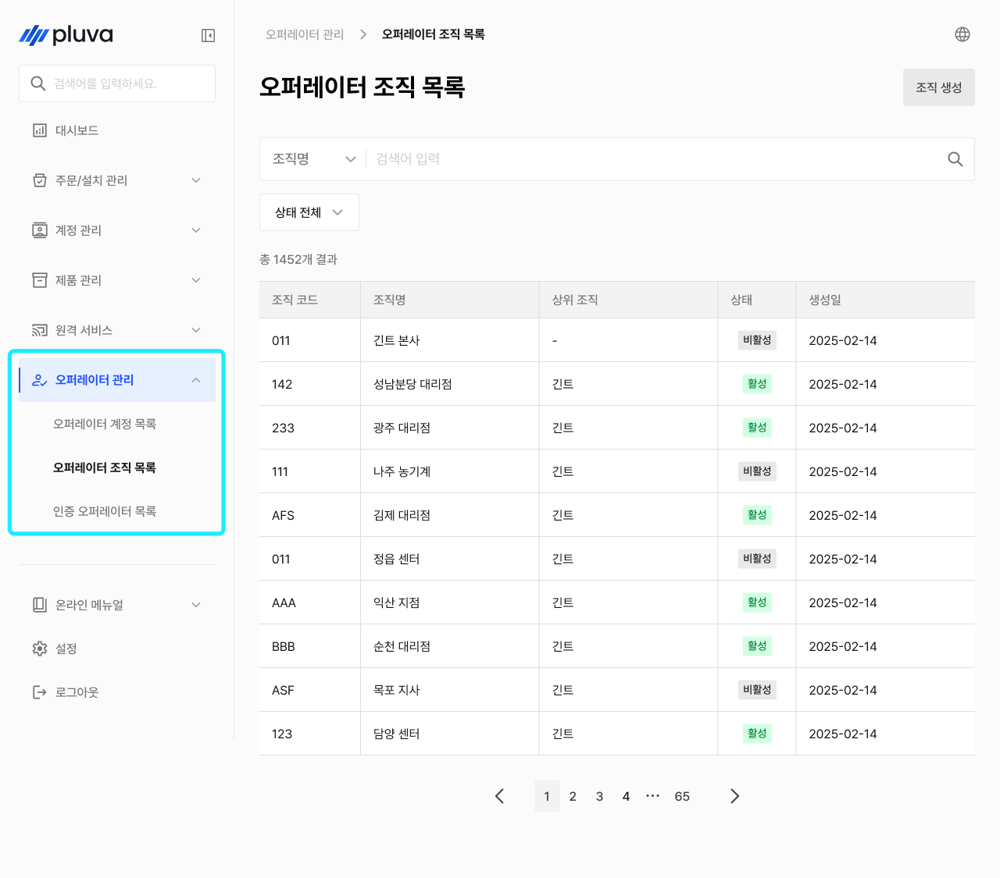<figcaption></figcaption></figure>



원하는 오퍼레이터 조직을 선택해 상세에 진입합니다.

<figure>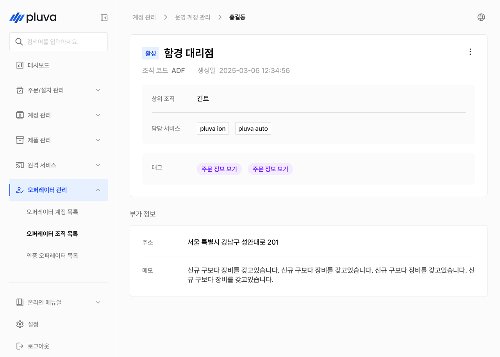<figcaption></figcaption></figure>



***

### 오퍼레이터 조직 생성



조직 목록 화면 오른쪽 위의 \[조직 생성] 버튼을 누릅니다.

<figure><figcaption></figcaption></figure>



모든 필수 항목을 입력하고 조직 생성 버튼을 누릅니다.

<figure>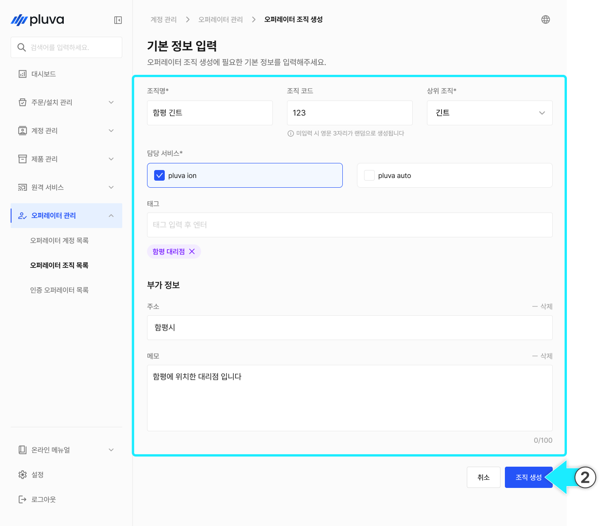<figcaption></figcaption></figure>


상위 조직을 지정하면 조직 계층이 만들어지고, 하위 조직의 조회 범위·권한이 상위 조직을 따릅니다.




조직 생성을 완료됩니다.

<figure>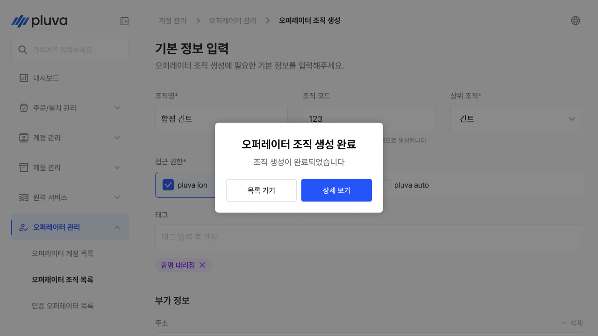<figcaption></figcaption></figure>



***

### 오퍼레이터 조직 정보 수정



조직 상세에서 더보기 버튼을 누르고 \[수정]을 누릅니다.

<figure>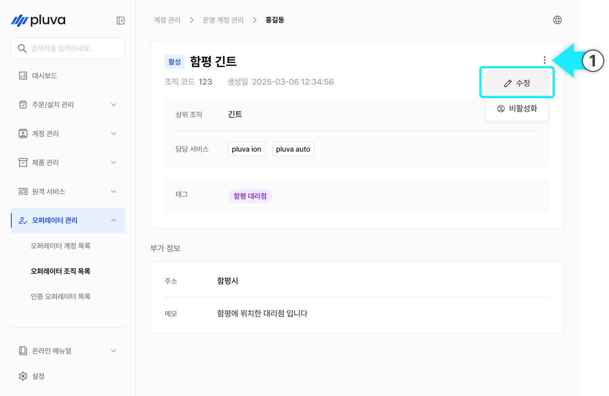<figcaption></figcaption></figure>



변경할 부분을 변경하고 \[수정 완료]를 누릅니다.

<figure>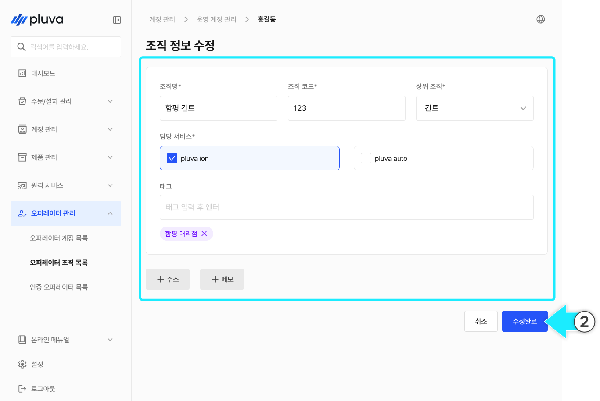<figcaption></figcaption></figure>



수정이 완료됩니다.

<figure>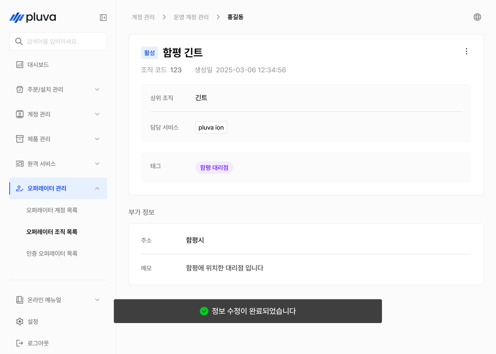<figcaption></figcaption></figure>



***

### 오퍼레이터 조직 비활성화 / 활성화

조직을 일시적으로 사용 중지하거나 다시 활성화할 수 있습니다.


조직은 삭제되지 않으며, 비활성화로 사용을 차단합니다. 이력은 그대로 보존됩니다.




조직 상세에서 더보기 버튼을 누르고 \[비활성화]를 누릅니다.

<figure><figcaption></figcaption></figure>



\[확인] 버튼을 누릅니다.

<figure><figcaption></figcaption></figure>



비활성화가 완료됩니다.

<figure>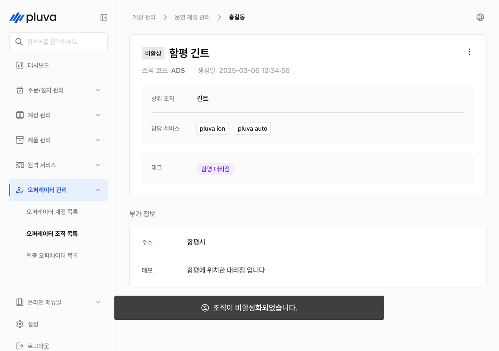<figcaption></figcaption></figure>




비활성 상태 조직에선 비활성화 옵션 대신 활성화 옵션만 표시됩니다. 해당 항목을 누르면 조직이 활성화됩니다.

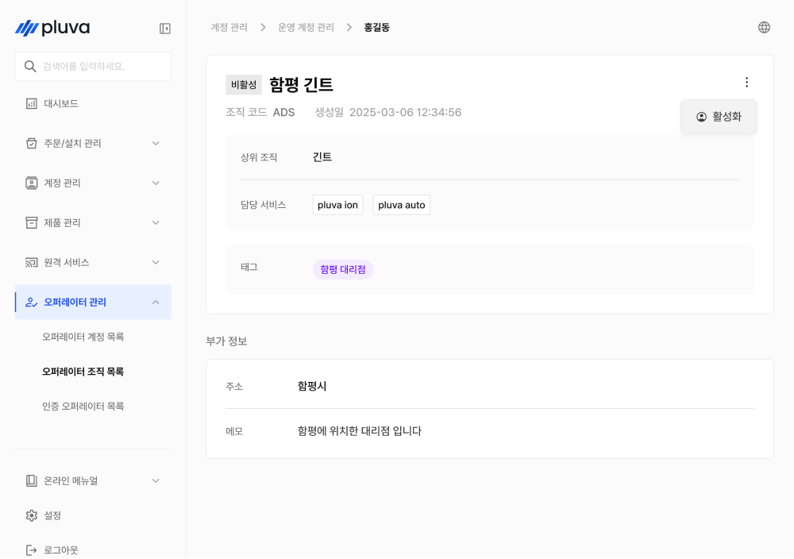


***

### 오퍼레이터 조직 상세 정보

조직 목록에서 조직을 선택하면 해당 조직의 상세 정보 화면으로 이동합니다.

#### PC 환경

<figure>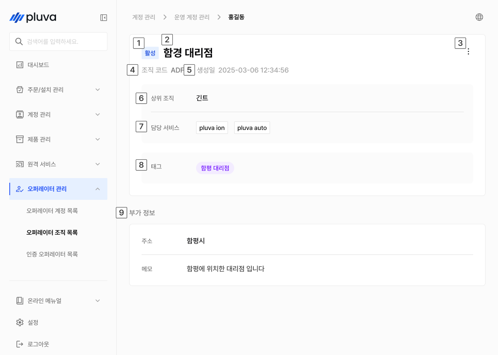<figcaption></figcaption></figure>

 상태

* 조직의 활성 / 비활성 상태가 표시됩니다.

 조직명

* 조직 이름이 표시됩니다.

 더보기 버튼


버튼을 누르면 \[수정], \[비활성화] (또는 \[활성화]) 옵션을 선택할 수 있습니다.


 조직 코드

* 조직 코드가 표시됩니다.

 생성일

* 조직 생성 일시가 표시됩니다.

 상위 조직

* 상위 조직이 표시됩니다.

 담당 서비스

* 조직이 담당하는 서비스가 표시됩니다. (예: pluva ion, pluva auto)

 태그

* 조직 관련 정보를 태그로 표시합니다.

 부가 정보

* 주소와 메모가 표시됩니다.

#### 모바일 환경

<figure>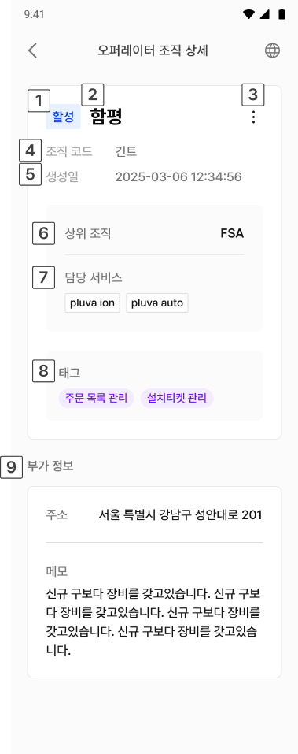<figcaption></figcaption></figure>

 상태

* 조직의 활성 / 비활성 상태가 표시됩니다.

 조직명

* 조직 이름이 표시됩니다.

 더보기 버튼


버튼을 누르면 \[수정], \[비활성화] (또는 \[활성화]) 옵션을 선택할 수 있습니다.


 조직 코드

* 조직 코드가 표시됩니다.

 생성일

* 조직 생성 일시가 표시됩니다.

 상위 조직

* 상위 조직이 표시됩니다.

 담당 서비스

* 조직이 담당하는 서비스가 표시됩니다. (예: pluva ion, pluva auto)

 태그

* 조직 관련 정보를 태그로 표시합니다.

 부가 정보

* 주소와 메모가 표시됩니다.
