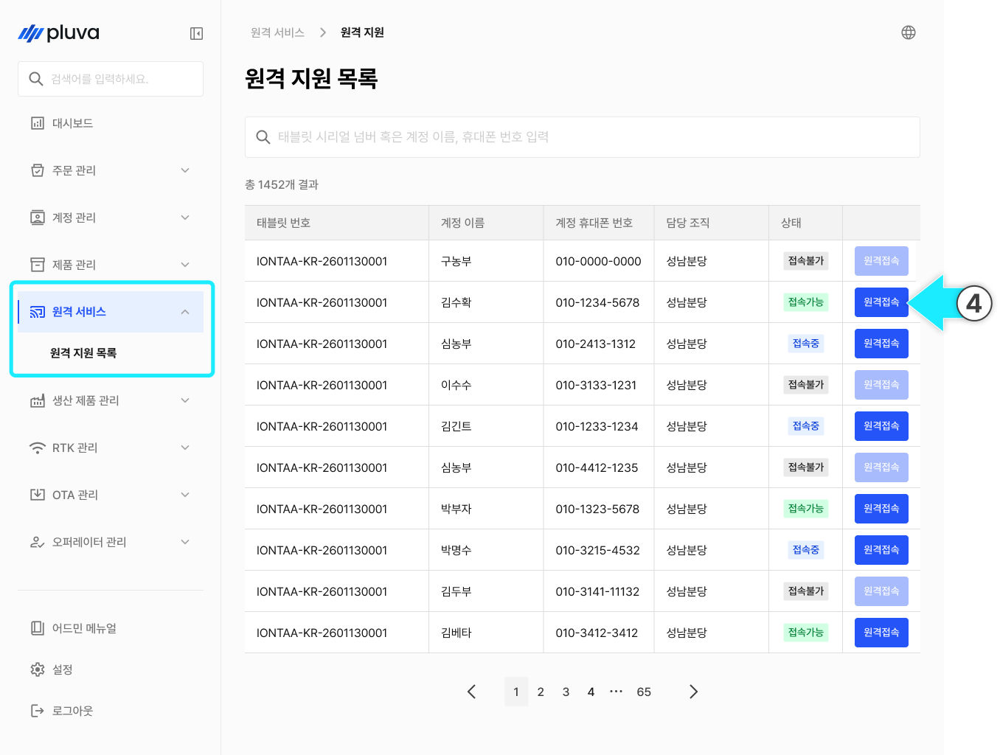
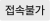
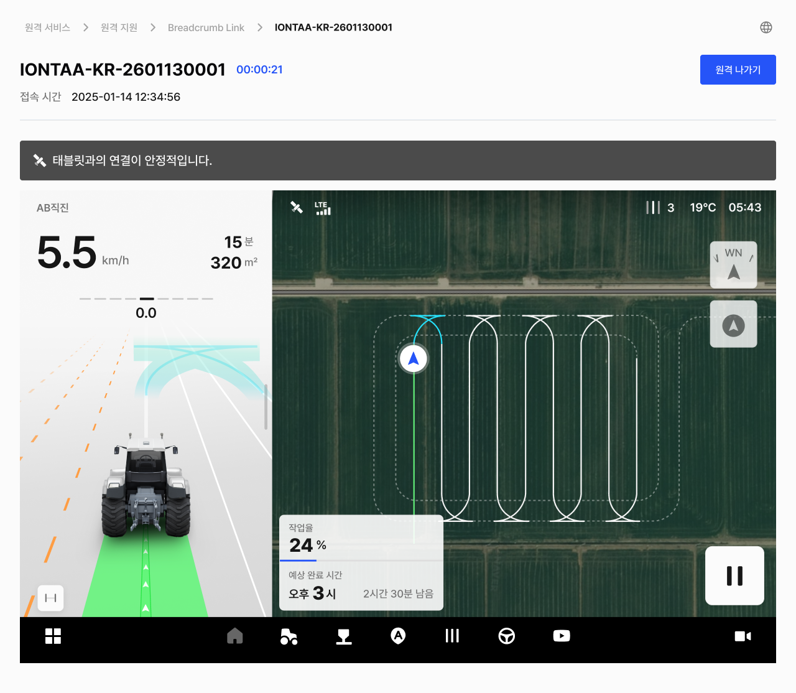
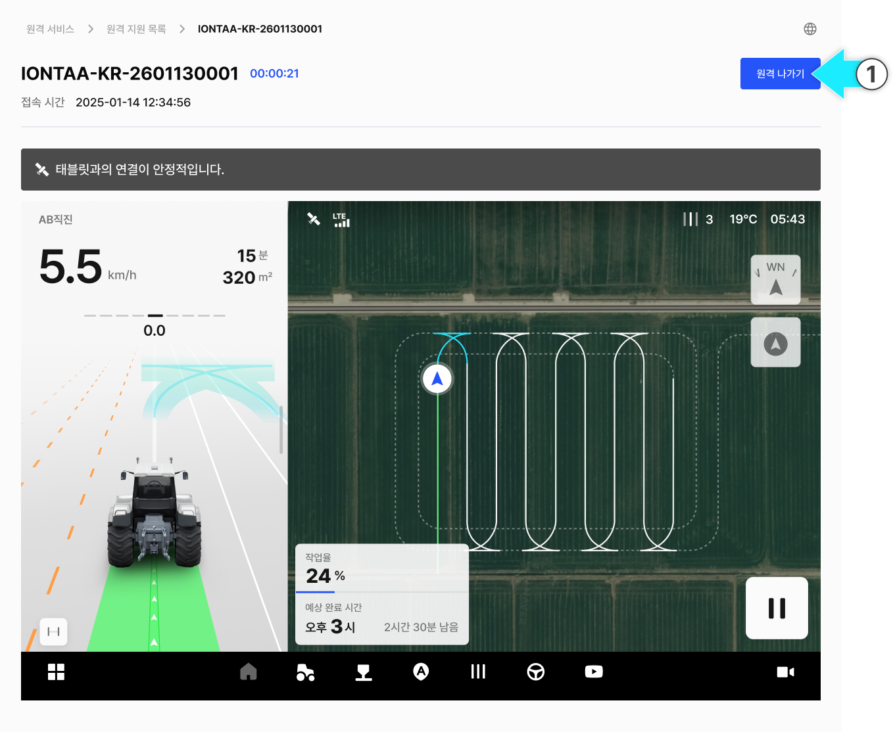
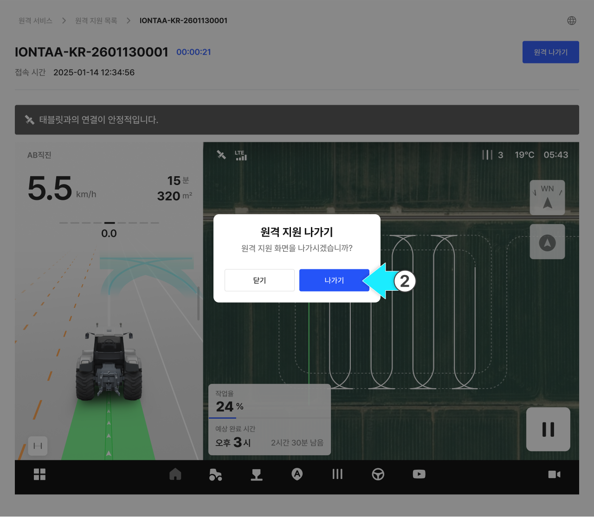
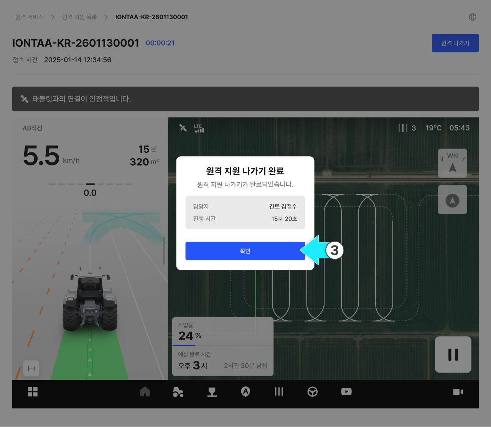

---
layout:
  width: default
  title:
    visible: false
  description:
    visible: false
  tableOfContents:
    visible: true
  outline:
    visible: true
  pagination:
    visible: true
  metadata:
    visible: true
  tags:
    visible: true
---

# 원격 지원 모니터링

### 원격 지원 모니터링 (작성중)

원격 모니터링은 고객 태블릿 상태를 원격으로 확인하고 필요한 지원을 제공하기 위한 기능입니다.\
고객이 앱에서 원격 지원 코드를 발급하면, 담당자는 해당 코드를 어드민에 입력하여 원격 지원을 시작할 수 있습니다.

#### 원격 지원 시 고객 안내 사항

담당자는 고객에게 아래 내용을 명확히 안내해야 합니다.


**원격 지원은 담당자 안내 후 진행해야 합니다.**

* 원격 지원 중에는 **반드시 고객과 전화 통화로 소통**해야 하며, **시작 및 종료 시** 전화로 안내를 진행합니다.



원활한 원격 지원을 위해 **고객 및 담당자의 네트워크 상태**를 점검합니다.

* 네트워크 상태가 좋지 않으면 **화면 멈춤, 동작 오류** 등이 발생할 수 있습니다.
* 셀룰러(데이터) 사용 또는 신호가 안정적인 네트워크 환경에서 원격 지원을 진행합니다.


#### 접속 가능 시간

* 원격 지원이 연결되면 **24시간 동안** 해당 태블릿에 원격 접속이 가능합니다.
* 중간에 \[원격 나가기]를 통해 해당 화면을 나갈 수 있습니다.


**24시간이 지나거나**, 고객이 \[원격 종료]를 누르면 즉시 접속이 종료되며 **코드가 무효화**됩니다.



안전상의 이유로, **반드시 사용자가 차량에 탑승했을 때** 원격 지원을 진행합니다.


***

### 원격 지원 접속



원격 지원 요청을 접수합니다.



원활한 원격 지원을 위해 고객과 **전화로 소통**합니다.



고객 태블릿에서 **원격 지원 코드 발급**을 요청합니다.


발급된 코드는 **24시간 동안 유지**됩니다.



고객이 \[원격 종료]를 누르면 코드는 **무효화**됩니다. 다시 원격 지원이 필요하면 고객에게 원격 지원 코드 발급을 요청합니다.




원격 지원 목록에서 원하는 항목의 **\[원격 접속]** 버튼을 누릅니다.

<figure><figcaption></figcaption></figure>


**원격 지원 상태**

: 고객이 원격 지원을 요청하여 원격 지원 코드가 발급된 상태입니다. 이때 **\[원격 접속]** 버튼이 활성화됩니다.

:  고객이 요청한 원격 지원 화면에 담당자가 접속된 상태입니다. **접속 중**일 때는 다른 담당자는 접속할 수 없습니다.

: 원격 지원이 종료되었거나 고객이 원격 지원을 요청하지 않은 상태입니다. 이때 **\[원격 접속]** 버튼이 비활성화됩니다.




고객에게 전달받은 원격 지원 코드를 입력합니다.

<figure><figcaption></figcaption></figure>



원격 지원 화면 접속이 완료되면 고객과 전화로 소통하며 원격 모니터링을 진행합니다.

<figure><figcaption></figcaption></figure>




발급된 코드 입력이 완료된 상태에서 다시 접속할 경우, **바로 원격 화면으로 진입**합니다.



**접속 중** 상태에서 **\[원격 접속]** 버튼을 누르면 **원격 중복 접속 안내 모달**이 표시됩니다.

중복 접속은 불가합니다. 접속이 필요할 경우 **다른 담당자에게 원격 지원 나가기**를 요청합니다.


***

### 원격 지원 나가기

원격 지원 나가기는 접속한 화면에서 **잠시 나갈 수 있는 기능**입니다. 원격 지원이 종료되는 것은 아니며, 고객이 코드를 발급한 시점으로부터 **24시간 동안** \[원격 접속]을 누르면 다시 접속할 수 있습니다.



원격 지원 화면에서 \[원격 나가기]를 누릅니다.

<figure><figcaption></figcaption></figure>



**\[나가기]** 버튼을 누릅니다.

<figure><figcaption></figcaption></figure>



\[확인]을 누르면 원격 지원 목록으로 이동합니다.

<figure><figcaption></figcaption></figure>


