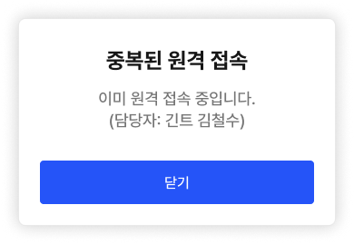
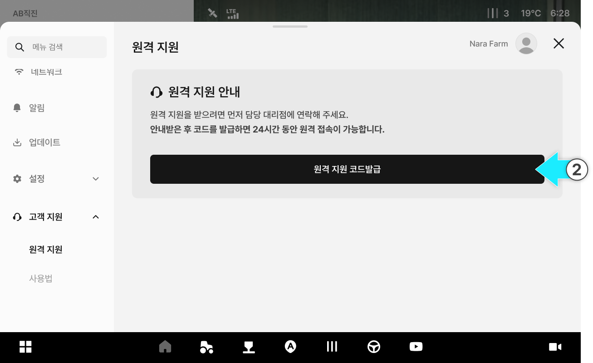
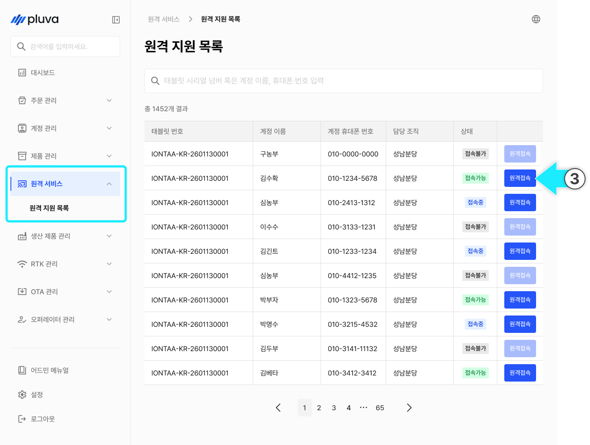
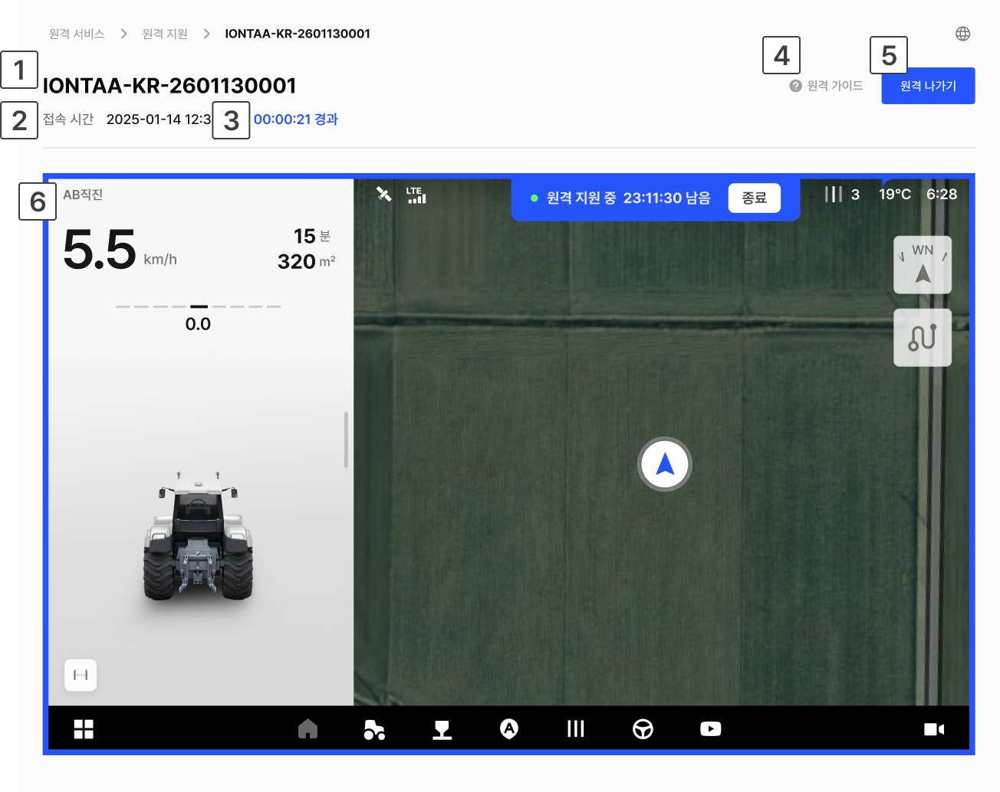
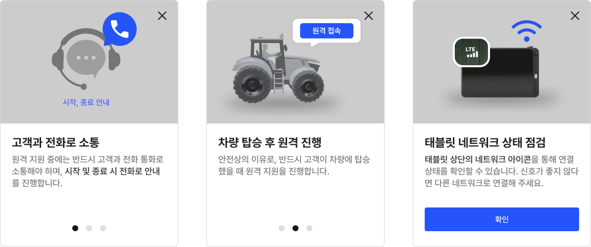
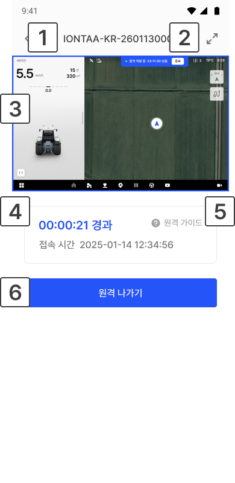
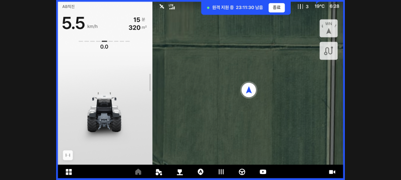

---
layout:
  width: default
  title:
    visible: false
  description:
    visible: false
  tableOfContents:
    visible: true
  outline:
    visible: true
  pagination:
    visible: true
  metadata:
    visible: true
  tags:
    visible: true
---

# 원격 지원 모니터링

### 원격 지원 모니터링

원격 모니터링은 고객 태블릿 상태를 원격으로 확인하고 필요한 지원을 제공하기 위한 기능입니다.\
고객이 앱에서 원격 지원 코드를 발급하면, 담당자는 해당 코드를 어드민에 입력하여 원격 지원을 시작할 수 있습니다.

***

#### 원격 지원 시 고객 안내 사항

담당자는 고객에게 아래 내용을 명확히 안내해야 합니다.


**원격 지원은 담당자 안내 후 진행해야 합니다.**

* 원격 지원 중에는 **반드시 고객과 전화 통화로 소통**해야 하며, **시작 및 종료 시** 전화로 안내를 진행합니다.



원활한 원격 지원을 위해 **고객 및 담당자의 네트워크 상태**를 점검합니다.

* 네트워크 상태가 좋지 않으면 **화면 멈춤, 동작 오류** 등이 발생할 수 있습니다.
* 셀룰러 사용 또는 신호가 안정적인 네트워크 환경에서 원격 지원을 진행합니다.



안전상의 이유로, **반드시 사용자가 차량에 탑승했을 때** 원격 지원을 진행합니다.


#### 원격 지원 접속 상태

1. **접속 가능**

* 태블릿의 **코드 발급 시점으로부터 24시간 동안** 원격 접속 가능한 상태를 유지합니다.
* 담당자는 중간에 \[원격 나가기]를 눌러 해당 화면에서 나갈 수 있습니다.
  * 이 경우 원격 지원이 즉시 종료되는 것은 아니며, 24시간 이내에는 다시 접속할 수 있습니다.

2. **접속 중**

* 담당자가 고객의 원격 지원 화면에 접속한 상태입니다.
* 접속 중에는 다른 담당자가 동시에 접속할 수 없습니다.


접속 가능 시간이 지난 뒤에도 세션이 유지되고 있으면, **세션이 종료될 때까지 원격 지원이 유지됩니다.**



다른 담당자가 접속 중 상태에서 **\[원격 접속]** 버튼을 누르면 원격 중복 접속 안내 모달이 표시됩니다.

* 중복 접속은 불가능합니다. 접속이 필요할 경우 현재 접속 중인 담당자에게 원격 지원 나가기를 요청해야 합니다.



3. **접속 불가능**&#x20;

* 고객이 원격 지원을 요청하지 않았거나, 발급된 코드가 만료 또는 무효화되어 원격 접속이 불가능한 상태입니다.
* 이 상태에서는 **\[원격 접속]** 버튼이 비활성화됩니다.


원격 접속이 불가능한 상태에서 다시 접속하려면 고객에게 원격 지원 코드 발급을 요청해야 합니다.


***

### 원격 지원 접속



고객의 원격 지원 요청을 접수합니다.



고객에게 태블릿에서 원격 지원 코드 발급을 요청합니다.

* 고객 태블릿의 원격지원 화면 

<figure><figcaption></figcaption></figure>


발급된 코드는 **24시간 동안 유지**됩니다.



고객이 \[원격 종료]를 누르면 코드는 **무효화**됩니다.\
다시 원격 지원이 필요하면 고객에게 원격 지원 코드 발급을 요청합니다.




원격 지원 목록에서 원하는 항목의 **\[원격 접속]** 버튼을 누릅니다.

<figure><figcaption></figcaption></figure>



고객에게 전달받은 원격 지원 코드를 입력하고 \[입력 완료]를 누릅니다.

<figure><figcaption></figcaption></figure>



원격 지원 화면 접속이 완료되면 원격 가이드 팝업이 표시됩니다. 팝업 내용을 확인한 뒤 **\[확인]** 버튼을 누릅니다.

<figure><figcaption></figcaption></figure>



원격 지원 화면에 접속이 완료되면 고객과 전화로 소통하며 원격 모니터링을 진행합니다.

<figure><figcaption></figcaption></figure>




화면에서 나갔다가 다시 접속할 경우, 원격 지원 코드 입력 단계를 다시 거칩니다.


***

### 원격 지원 나가기

원격 지원 나가기는 접속한 화면에서 **잠시 나갈 수 있는 기능**입니다. 원격 지원이 종료되는 것은 아니며, 고객이 코드를 발급한 시점으로부터 **24시간 동안** \[원격 접속]을 누르면 다시 접속할 수 있습니다.



원격 지원 화면에서 \[원격 나가기]를 누릅니다.

<figure><figcaption></figcaption></figure>



**\[나가기]** 버튼을 누릅니다.

<figure><figcaption></figcaption></figure>



\[확인]을 누르면 원격 지원 목록으로 이동합니다.

<figure><figcaption></figcaption></figure>



***

### 원격 지원 화면 설명

#### PC 환경

<figure><figcaption></figcaption></figure>

&#x20; **태블릿 시리얼 넘버**: 원격 지원 중인 태블릿의 시리얼 넘버를 표시합니다.

&#x20; **접속 시간**: 원격 지원 화면에 접속한 시간을 표시합니다.

&#x20; **경과 시간**: 원격 지원 시작 후 경과한 시간을 표시합니다.

&#x20; **원격 가이드 버튼**: 원격 지원 시 유의사항과 기본 안내 내용을 확인할 수 있습니다.

*

    <figure><figcaption></figcaption></figure>

&#x20; **원격 나가기 버튼**: 현재 접속 중인 원격 지원 화면에서 나갑니다.

&#x20; **원격 진행 화면**: 현재 고객 태블릿 화면을 확인할 수 있습니다.

#### 모바일 환경

<figure><figcaption></figcaption></figure>

&#x20; **태블릿 시리얼 넘버**: 원격 지원 중인 태블릿의 시리얼 넘버를 표시합니다.

&#x20; **크게 보기 모드 버튼**: 원격 지원 화면을 가로로 전환해 더 크게 볼 수 있습니다.

*

    <figure><figcaption></figcaption></figure>

&#x20; **원격 진행 화면**: 현재 고객 태블릿 화면을 확인할 수 있습니다.

&#x20; **접속 및 경과 시간**: 원격 지원 접속 및 경과한 시간을 표시합니다.

&#x20; **원격 가이드 버튼**: 원격 지원 시 유의사항과 기본 안내 내용을 확인할 수 있습니다.

&#x20; **원격 나가기 버튼**: 현재 접속 중인 원격 지원 화면에서 나갑니다.

