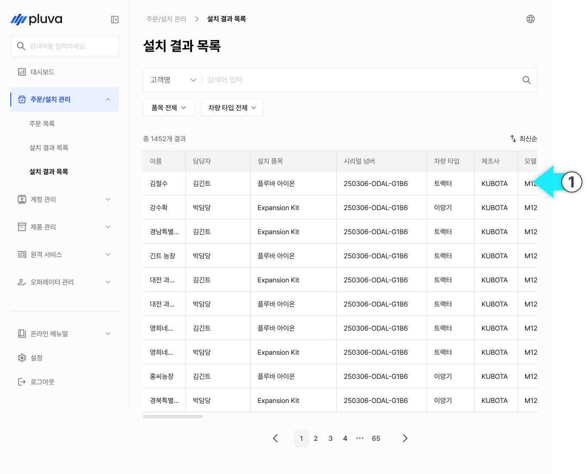
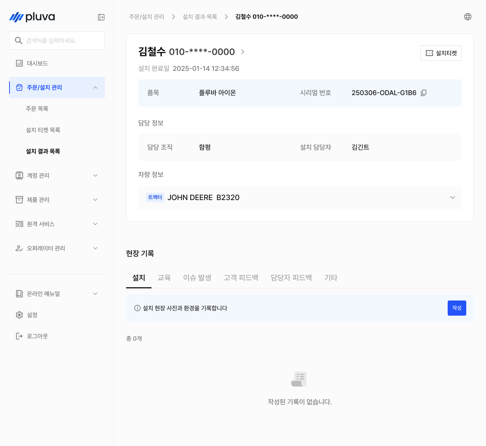
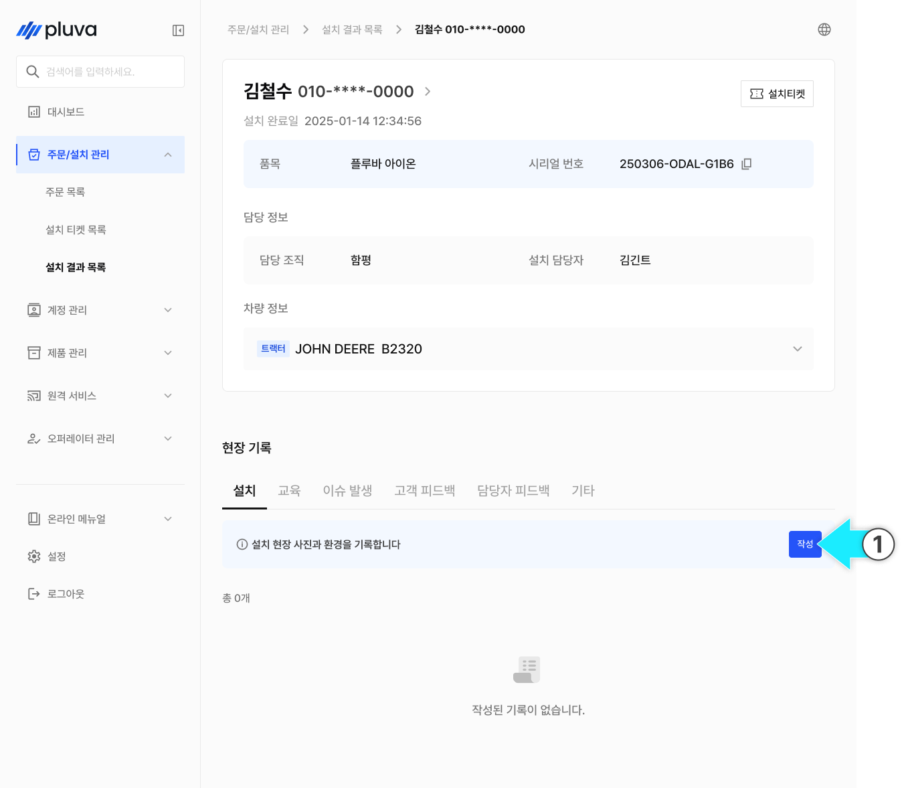
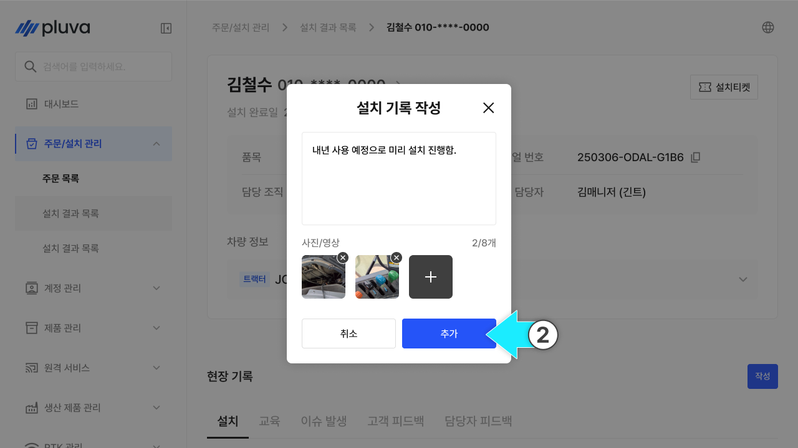
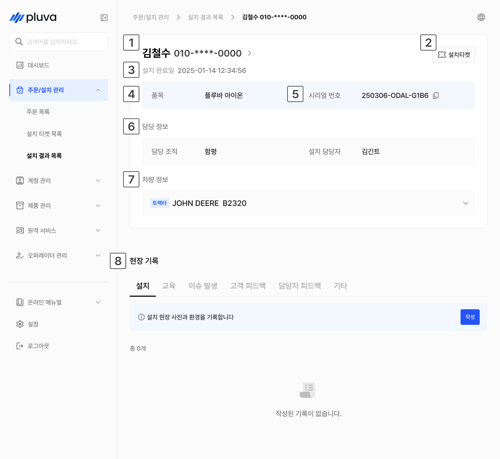
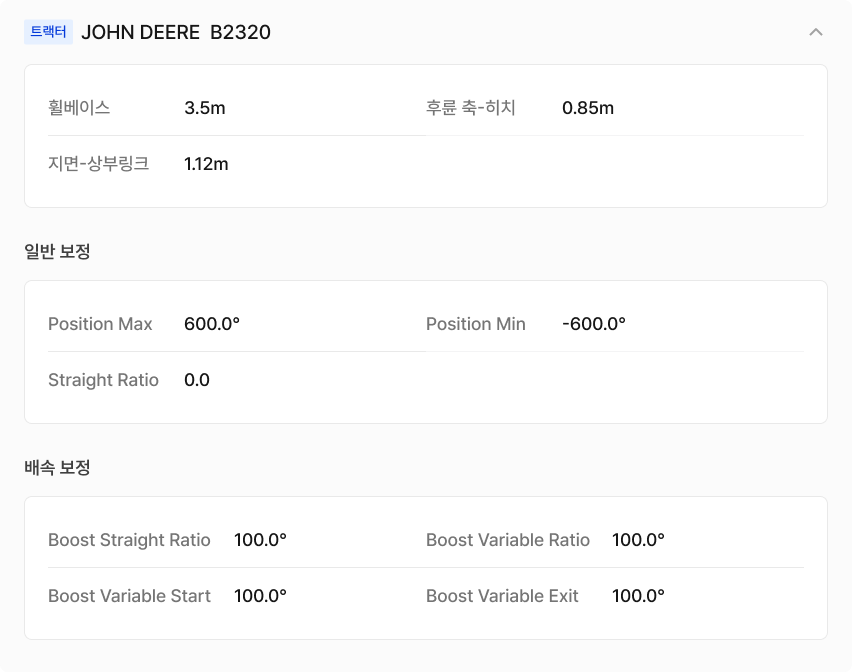
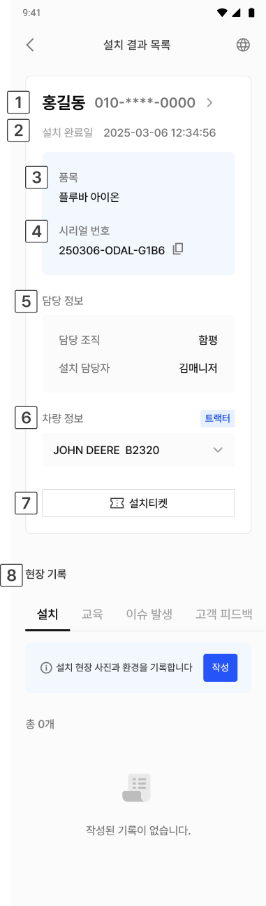

# 설치 결과 목록

설치 결과는 실제로 완료된 설치 내역을 결과 기준으로 확인하는 메뉴입니다. 사전 계획 정보를 담는 설치 티켓과 달리, "누구에게·어떤 제품을·어떤 차량에·언제 설치했는가"를 결과 기준으로 보여줍니다.


설치 티켓이 '완료' 상태로 확인되는 건만 표시됩니다. 설치는 했으나 티켓을 완료 처리하지 않은 건은 목록에 표시되지 않습니다.


***

### 진입 방법



사이드바에서 \[주문/설치 관리]를 누르고 설치 결과 목록을 누릅니다.

<figure><figcaption></figcaption></figure>



설치 결과 목록 진입이 완료됩니다.

<figure><figcaption></figcaption></figure>



***

### 현장 기록 작성 방법



기록할 탭을 선택하고 \[작성]을 누릅니다.

<figure><figcaption></figcaption></figure>



작성 모달에서 내용을 입력하고 사진·영상을 첨부합니다.

<figure><figcaption></figcaption></figure>

* 사진 지원 형식: JPG, PNG, HEIC, WEBP
* 영상 지원 형식: MP4, MOV



\[추가]를 누르면 기록 작성이 완료됩니다.

<figure><figcaption></figcaption></figure>




현장 기록은 설치 결과가 생성된 후 입력·업로드할 수 있으며, 작성·업로드한 사람과 일시가 함께 기록됩니다.

설치 담당자가 아니어도 입력할 수 있고, 작성자 본인만 수정할 수 있습니다.


***

### 설치 결과 목록 설명

#### PC 환경

<figure><figcaption></figcaption></figure>

 **고객 정보**

* 상단에 고객명과 휴대폰 번호가 표시됩니다.
* 고객명을 클릭하면 해당 고객의 계정 상세로 이동합니다.

 **설치티켓 버튼**

* 버튼을 누르면 이 설치 결과와 연결된 설치 티켓으로 이동합니다.

 **설치 완료일**

* 설치가 완료된 일시가 표시됩니다.

 **품목**

* 설치된 제품이 표시됩니다.

 **시리얼 번호**

* 태블릿 시리얼 번호가 표시됩니다. Expansion Kit의 경우 현재 연결된 태블릿 시리얼 번호가 표시됩니다.

 **담당 정보**

* 담당 조직과 설치 담당자가 표시됩니다.

 **차량 정보**

* 설치 차량의 타입, 제조사, 모델이 표시됩니다. (예: 트랙터 · JOHN DEERE B2320)


**참고** 차량 정보 드롭다운을 펼치면 차량 치수와 설치 당시 보정값을 확인할 수 있습니다.



 **현장 기록**

설치 결과에 대한 현장 기록을 탭별로 작성·확인합니다. 각 탭에서 기록하는 내용은 다음과 같습니다.

* **설치** : 설치 현장 사진과 환경을 기록합니다.
* **교육** : 교육 내용과 고객의 이해도를 기록합니다.
* **이슈 발생** : 발생한 문제와 추후 조치 필요 사항을 기록합니다.
* **고객 피드백** : 고객의 반응·만족도와 의견을 기록합니다.
* **담당자 피드백** : 담당자의 성능 평가와 개선 의견을 기록합니다.
* **기타** : 그 외 사항을 기록합니다.

#### 모바일 환경

<figure><figcaption></figcaption></figure>

 **고객 정보**

* 상단에 고객명과 휴대폰 번호가 표시됩니다. 고객명을 클릭하면 해당 고객의 계정 상세로 이동합니다.

 **설치 완료일**

* 설치가 완료된 일시가 표시됩니다.

 **품목**

* 설치된 제품이 표시됩니다.

 **시리얼 번호**

* 태블릿 시리얼 번호가 표시되며, 옆의 복사 버튼을 누르면 클립보드에 복사됩니다.

 **담당 정보**

* 담당 조직과 설치 담당자가 표시됩니다.

 **차량 정보**

* 설치 차량의 타입, 제조사, 모델이 표시됩니다.


**참고** 차량 정보 드롭다운을 펼치면 차량 치수와 설치 당시 보정값을 확인할 수 있습니다.



 **설치티켓 버튼**

* 버튼을 누르면 이 설치 결과와 연결된 설치 티켓으로 이동합니다.

 **현장 기록**

* 설치 결과에 대한 현장 기록을 탭별로 작성·확인합니다. 작성 방법은 위 PC 환경과 동일합니다.
