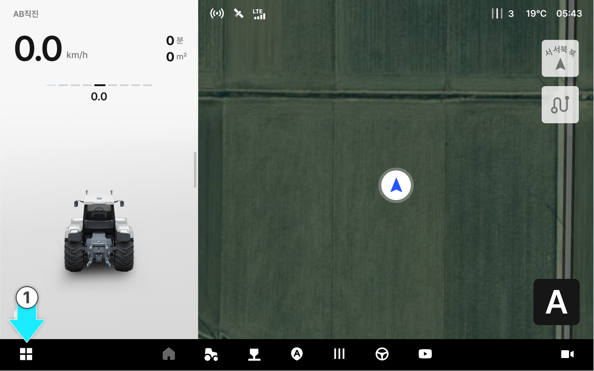
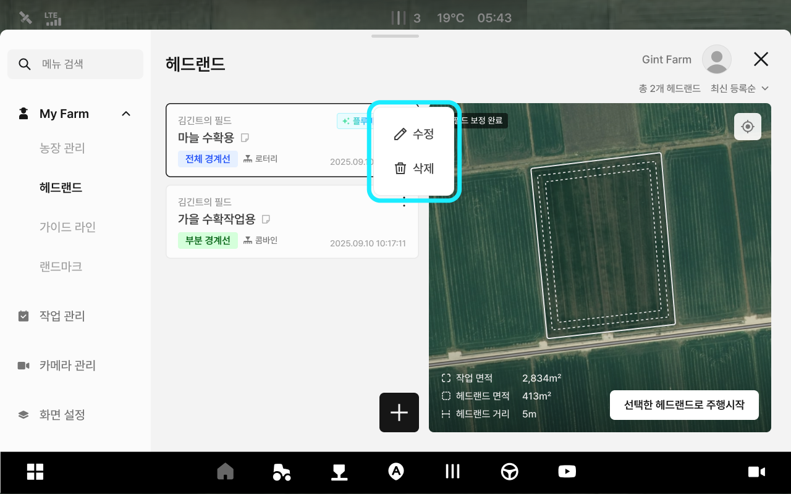
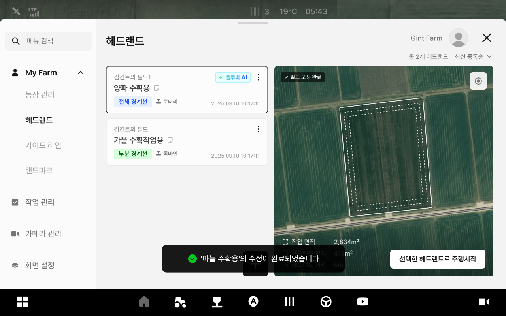
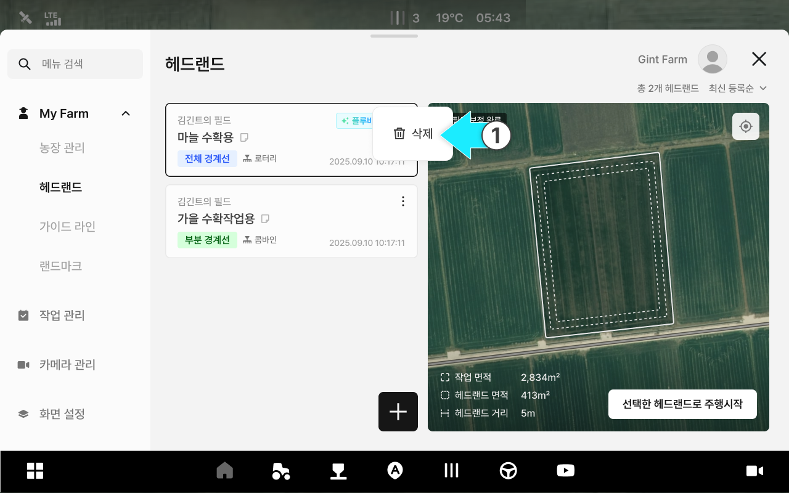

---
metaLinks:
  alternates:
    - >-
      https://app.gitbook.com/s/8Sqfw92xyQ8XV1LQEpTt/undefined-1/my-farm/managing-headland-information
---

# 헤드랜드 정보 관리

### 헤드랜드 정보 관리

헤드랜드 정보 관리에서는 등록된 헤드랜드의 정보를 수정하거나 삭제할 수 있습니다.
 거리, 개수, 위치 조정 값 등을 작업 환경에 맞게 변경해 적용할 수 있습니다.

***

#### 헤드랜드 정보 관리 기능 진입



 전체 메뉴 아이콘을 누릅니다.

<figure><figcaption></figcaption></figure>



My Farm의 헤드랜드 항목을 누릅니다.

<figure><figcaption></figcaption></figure>



원하는 헤드랜드 항목의  아이콘을 누릅니다.

<figure><figcaption></figcaption></figure>



팝업창에서 원하는 관리 기능을 선택합니다.

<figure><figcaption></figcaption></figure>



***

#### 헤드랜드 정보 수정



\[수정] 옵션을 선택합니다..

<figure><figcaption></figcaption></figure>



수정할 정보를 입력한 뒤 \[수정 완료]를 누릅니다.

<figure><figcaption></figcaption></figure>



헤드랜드 정보 수정이 완료됩니다.

<figure><figcaption></figcaption></figure>



***

#### 헤드랜드 정보 삭제



\[삭제]옵션을 누릅니다.

<figure><figcaption></figcaption></figure>



\[삭제]버튼을 누릅니다.

<figure><figcaption></figcaption></figure>



삭제가 완료됩니다.

<figure><figcaption></figcaption></figure>


