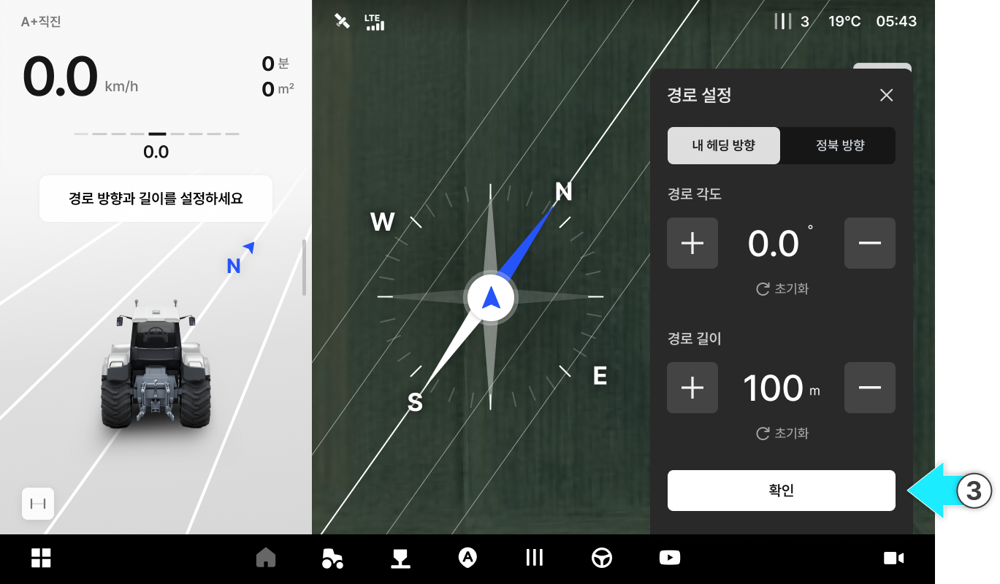

---
metaLinks:
  alternates:
    - >-
      https://app.gitbook.com/s/8Sqfw92xyQ8XV1LQEpTt/undefined-1/driving/a-plus-straight
---

# A+직진

### A+직진

A+직진

* A점을 기준으로 설정한 각도의 대각선 직선 경로로 주행합니다.

<figure><figcaption></figcaption></figure>



버튼을 눌러 A 지점을 생성합니다.

<figure><figcaption></figcaption></figure>



버튼을 누릅니다.

<figure><figcaption></figcaption></figure>



경로 방향, 각도, 길이를 설정한 후 \[확인]을 누릅니다.

<figure><figcaption></figcaption></figure>



\[자율주행 시작] 버튼을 눌러 주행을 시작합니다.

<figure><figcaption></figcaption></figure>


