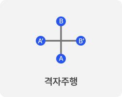
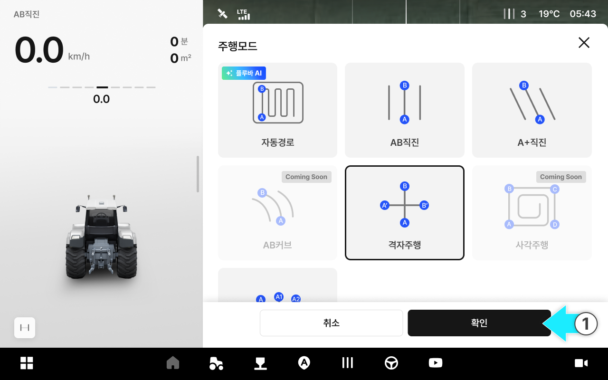
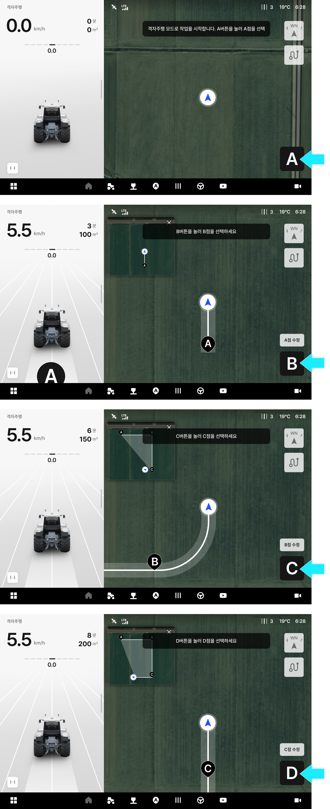
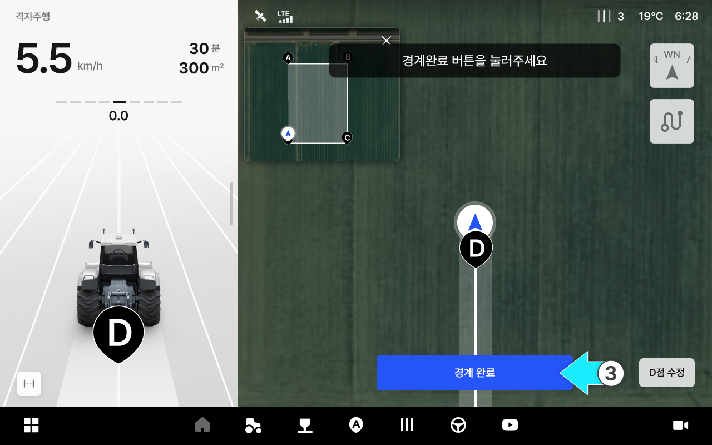
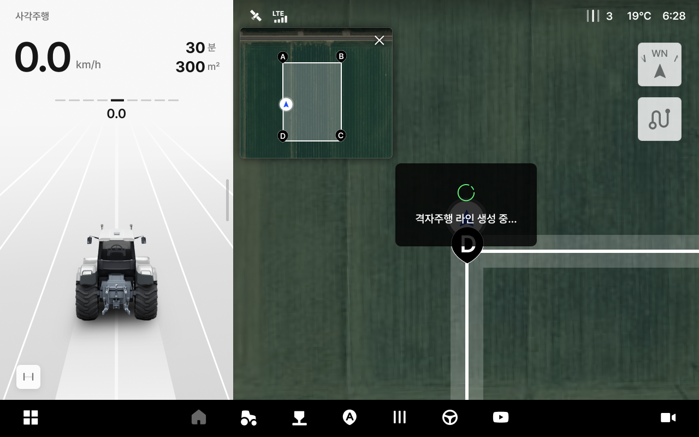
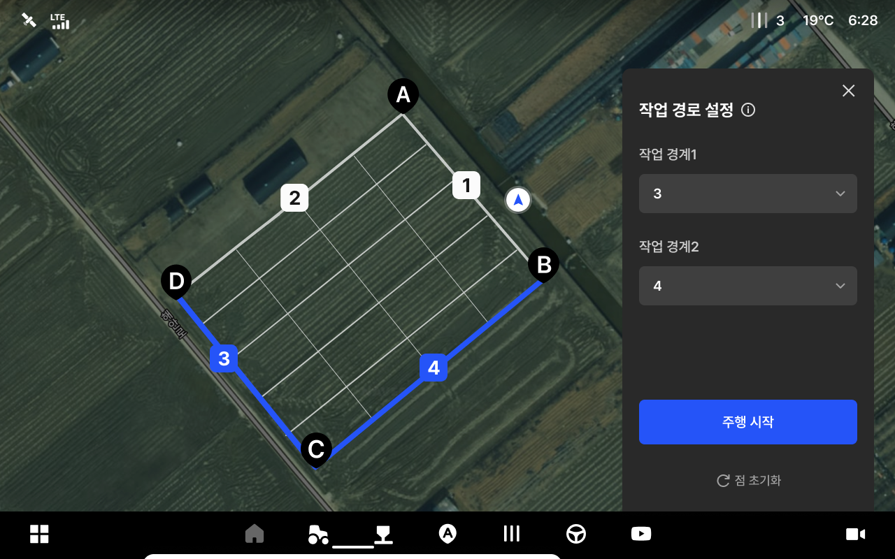

# 격자주행

격자 주행은 바운더리를 설정하고 두 개의 기준변을 선택하면, 두 방향의 격자형 경로를 자동으로 생성하는 주행모드입니다. 가로·세로 방향을 자유롭게 오가며 교차 방향 작업을 수행할 수 있습니다.

<figure><figcaption></figcaption></figure>

### 주요 활용 작업

| 작업          | 설명                        |
| ----------- | ------------------------- |
| 경운 + 써레질    | 토양을 뒤집은 후 교차 방향으로 평탄화     |
| 로터리 + 정지작업  | 토양 부수기 후 교차 방향으로 고르기      |
| 기비 살포 + 로터리 | 비료 살포 후 교차 방향으로 혼합        |
| 제초 + 방제     | 교차 방향으로 약제를 살포하여 커버리지를 높임 |

***

### 사용 방법



주행모드 목록에서 격자주행을 선택합니다.

<figure><figcaption></figcaption></figure>



차량을 이동하며 A, B, C, D점을 순서대로 설정합니다.


A, B, C, D 포인트를 설정하는 것은 작업할 영역의 경계(바운더리)를 지정하는 작업입니다. 설정한 포인트를 꼭지점으로 하는 다각형 영역이 바운더리로 확정되며, 격자 경로는 이 바운더리 안쪽으로 자동 생성됩니다.


<figure><figcaption></figcaption></figure>



\[경계 완료]를 선택합니다.


**최소 설정 점수**

경로를 생성하려면 최소 4점(A\~D)을 설정해야 합니다.


<figure><figcaption></figcaption></figure>


**최대 추가 점수**\
최대 4점까지 추가할 수 있습니다.



**포인트 수정**\
설정 직후 해당 점의 **수정** 버튼이 표시됩니다. 위치가 정확하지 않으면 수정 버튼으로 재설정합니다.





격자 라인이 자동 생성됩니다.

<figure><figcaption></figcaption></figure>



격자 라인 생성이 완료되면 작업 경로를 설정하고 \[주행 시작]을 누릅니다.

<figure><figcaption></figcaption></figure>


격자 경로는 선택한 기준변에 평행한 방향으로 생성됩니다.



**작업 경로 기준 변 상태**

아래 표시 형식에 따라 기준변 상태를 구분합니다.

* **선택 가능:** 
* **선택 불가능:** 
* **선택 됨:** 



**작업 경로 기준변 선택 조건**\
두 기준변은 아래 조건을 모두 충족해야 선택할 수 있습니다. 조건을 충족하지 못하는 변은 선택 항목으로 노출되지않습니다.

* 선택된 작업 경계와 각도가 비슷한 경우
* 길이가 너무 짧은 경우 (작업기 폭\*4 미만)




작업 경로 설정이 완료됩니다. \[자율주행 시작] 버튼을 누르면 선택한 방향의 경로를 따라 자율주행이 시작됩니다.

<figure><figcaption></figcaption></figure>


**사전 설정 항목**\
주행 시작 전까지 아래 항목을 자유롭게 조정할 수 있습니다. 주행 시작 후에는 변경할 수 없습니다. 

* 작업기 폭: 작업기의 작업 너비
* 골간격: 작업 라인 간격 조정 값 (양방향 동일 적용)



격자 주행은 **직선 구간은 자율주행으로 추종**하고, **라인 간 이동(턴)은 운전자가 직접 수동으로** 수행합니다. 다음에 주행할 라인은 화면에서 자유롭게 선택할 수 있어, 가로·세로 방향을 자유롭게 오가며 작업할 수 있습니다.



