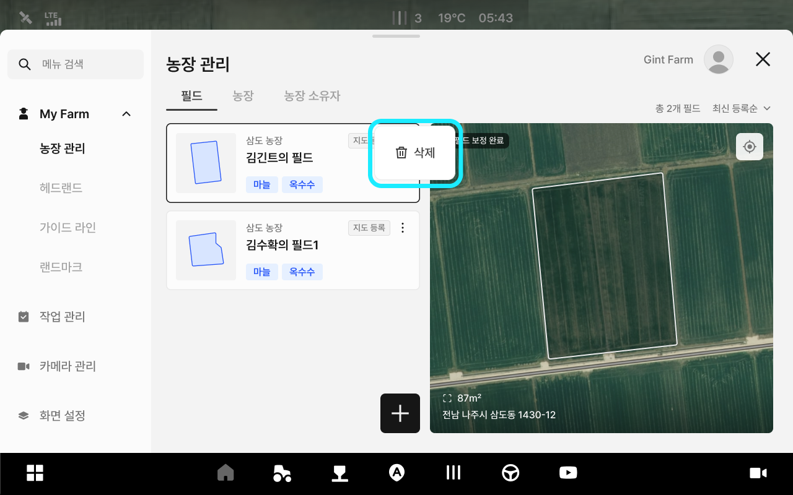
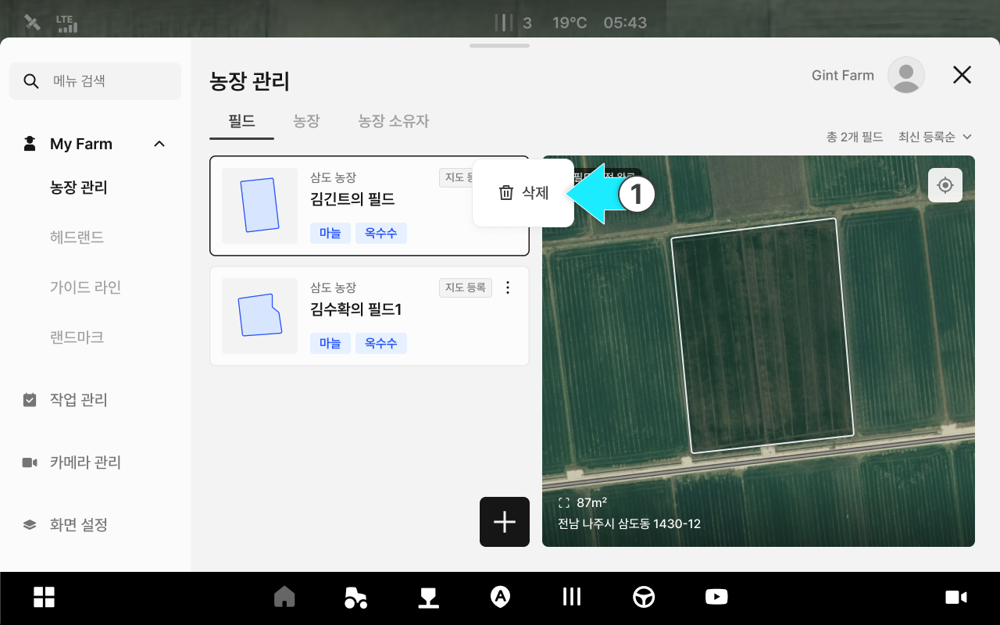

---
metaLinks:
  alternates:
    - >-
      https://app.gitbook.com/s/8Sqfw92xyQ8XV1LQEpTt/undefined-1/my-farm/managing-field-information
---

# 필드 정보 관리

### 필드 정보 관리

필드 이름, 농장 등의 정보를 수정하고 삭제할 수 있는 기능입니다.

필드 추가에 대한 내용은 퀵셋업의 필드 추가 내용과 동일하게 작동합니다.

***

#### 필드 정보 관리 기능 진입



 전체 메뉴 아이콘을 누릅니다.

<figure><figcaption></figcaption></figure>



원하는 필드 항목의  아이콘을 누릅니다.

<figure><figcaption></figcaption></figure>



팝업창에서 원하는 관리 기능을 선택합니다.

<figure><figcaption></figcaption></figure>



***

#### 필드 정보 수정



\[수정] 옵션을 선택합니다..

<figure><figcaption></figcaption></figure>



수정을 원하는 필드 정보를 입력하고 \[수정 완료]를 누릅니다.

<figure><figcaption></figcaption></figure>



필드 정보 수정이 완료됩니다.

<figure><figcaption></figcaption></figure>



***

#### 필드 정보 삭제



\[삭제]옵션을 누릅니다.

<figure><figcaption></figcaption></figure>



\[삭제]를 누릅니다.

<figure><figcaption></figcaption></figure>



삭제가 완료됩니다.

<figure><figcaption></figcaption></figure>


