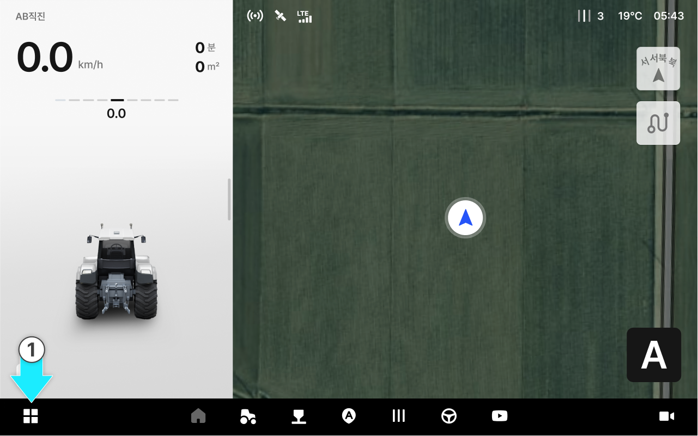
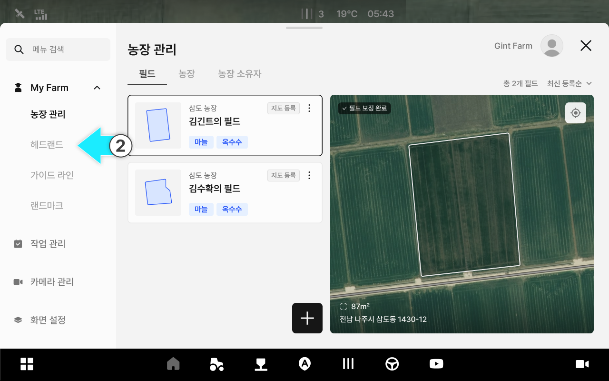
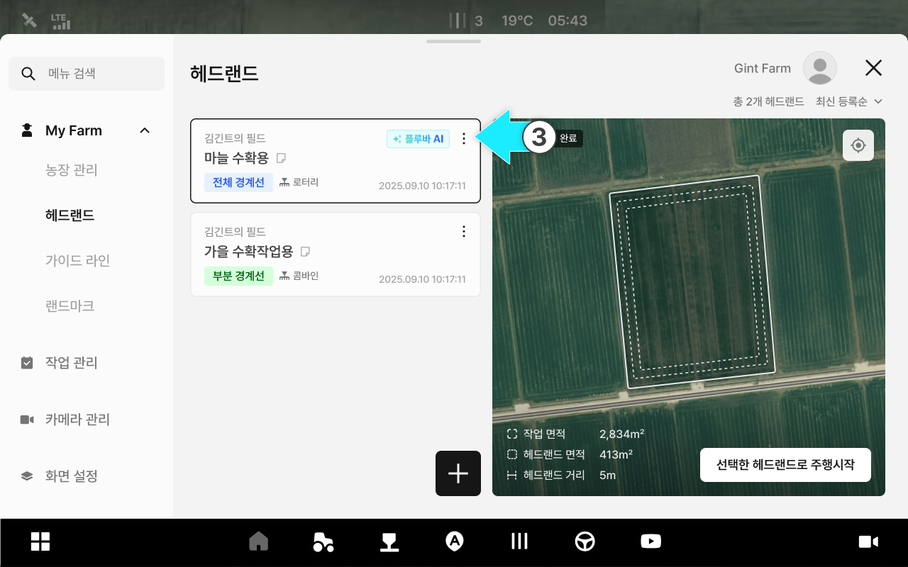
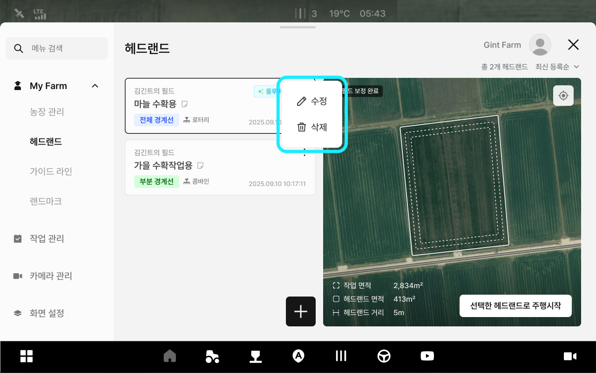
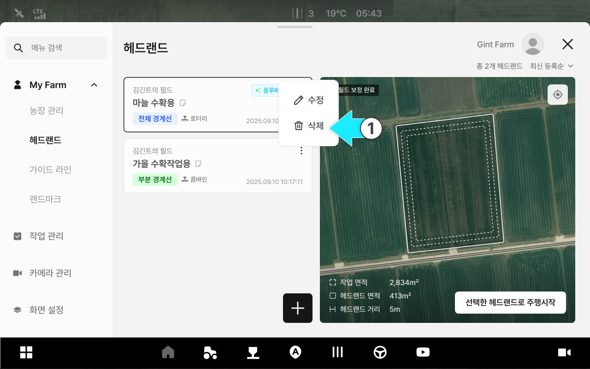
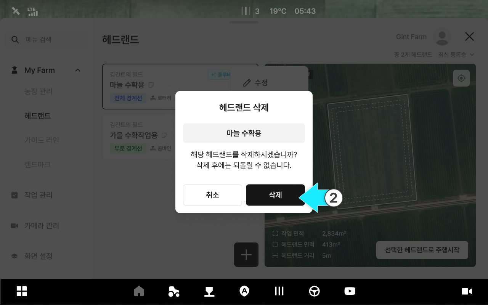
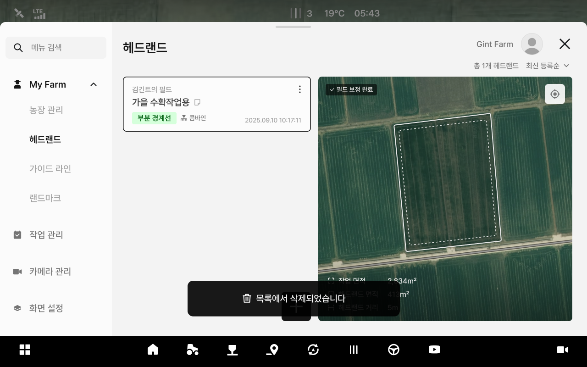

---
layout:
  width: default
  title:
    visible: true
  description:
    visible: false
  tableOfContents:
    visible: true
  outline:
    visible: true
  pagination:
    visible: true
  metadata:
    visible: true
  tags:
    visible: true
metaLinks:
  alternates:
    - >-
      https://app.gitbook.com/s/256Umh24fJVf6zNkZpSa/usage/my-farm/managing-headland-information
---

# 헤드랜드 정보 관리

헤드랜드 정보 관리에서는 등록된 헤드랜드의 정보를 삭제할 수 있습니다.


***

#### 헤드랜드 정보 관리 기능 진입



 전체 메뉴 아이콘을 누릅니다.

<figure><figcaption></figcaption></figure>



My Farm의 헤드랜드 항목을 누릅니다.

<figure><figcaption></figcaption></figure>



원하는 헤드랜드 항목의  아이콘을 누릅니다.

<figure><figcaption></figcaption></figure>



팝업창에서 원하는 관리 기능을 선택합니다.

<figure><figcaption></figcaption></figure>



***

#### 헤드랜드 정보 삭제



\[삭제]옵션을 누릅니다.

<figure><figcaption></figcaption></figure>



\[삭제]버튼을 누릅니다.

<figure><figcaption></figcaption></figure>



삭제가 완료됩니다.

<figure><figcaption></figcaption></figure>


