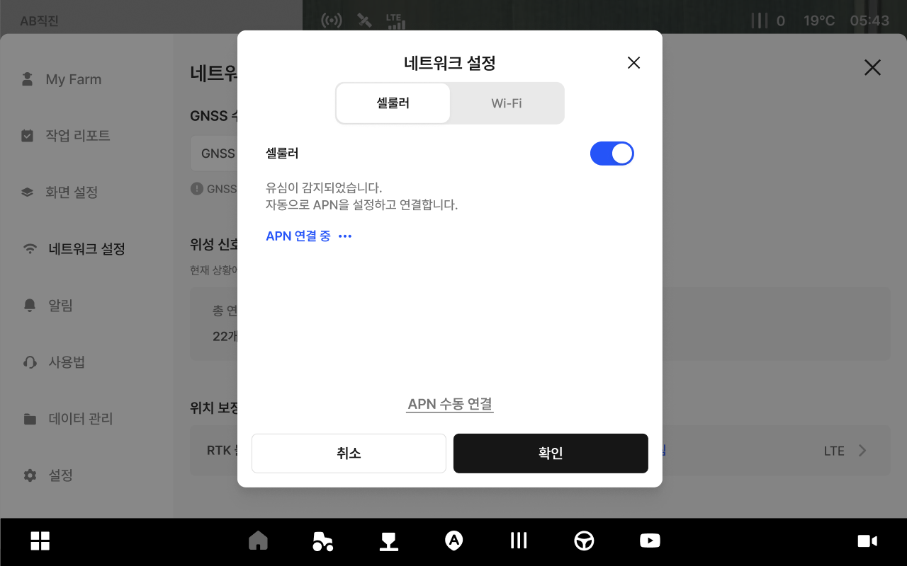
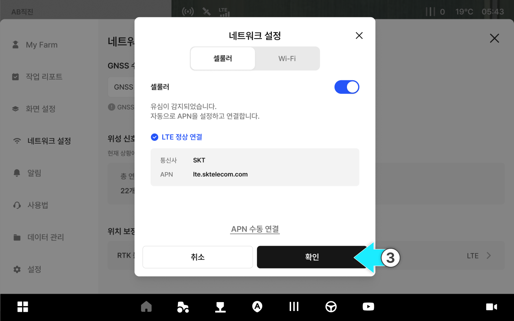

# 네트워크 설정

### 네트워크 설정

태블릿 네트워크를 Wi-Fi 또는 셀룰러(LTE)로 연결합니다. 네트워크가 불안정하면 위치 보정 신호 수신이 끊길 수 있으므로, 작업 전 연결 상태를 먼저 확인하세요. 연결이 불안정한 경우 APN 설정을 확인하거나 다른 네트워크로 전환합니다.

***

#### 네트워크 설정 접근 방법



 전체 메뉴 아이콘을 누릅니다.

<figure><figcaption></figcaption></figure>



\[네트워크 설정]을 누릅니다.

<figure><figcaption></figcaption></figure>



네트워크 항목을 누릅니다.

<figure><figcaption></figcaption></figure>



네트워크 설정 팝업에서 원하는 옵션을 설정합니다.

<figure><figcaption></figcaption></figure>



***

#### 셀룰러(LTE) 연결

셀룰러는 태블릿에 삽입된 유심(USIM)을 통해 이동통신망으로 인터넷에 연결하는 방식입니다.


작업 중 이동이 많아도 연결이 비교적 안정적이므로, 정밀 작업(RTK 등)에는 셀룰러 사용을 권장합니다.



요금제/데이터 사용량에 따라 비용이 발생할 수 있으니 작업 전 유심 상태와 사용 가능 기간을 확인합니다.




셀룰러 토글을 켭니다.

<figure><figcaption></figcaption></figure>



APN을 자동으로 설정해 연결합니다.

<figure><figcaption></figcaption></figure>



연결 완료 후 \[확인]을 누르면 셀룰러 설정이 완료됩니다.

<figure><figcaption></figcaption></figure>


자동 연결이 되지않는 경우 \[APN 수동 연결]을 진행합니다.\
입력에 필요한 APN 정보는 유심(USIM) 제공 자료(또는 통신사 안내)를 참고합니다.





***

#### Wi-Fi 연결

Wi-Fi는 주변의 무선 공유기 또는 스마트폰 테더링에 연결해 인터넷을 사용하는 방식입니다.


환경에 따라 신호가 약하거나 범위를 벗어나면 연결이 끊길 수 있어, 실내 테스트나 제한된 작업 구간에서 사용을 권장합니다.



테더링 사용 시 스마트폰 배터리 소모와 데이터 사용량이 늘 수 있으니 작업 전 충전 상태와 절전 설정을 확인합니다.




\[Wi-Fi] 탭을 누릅니다.

<figure><figcaption></figcaption></figure>



Wi-Fi 토글을 켭니다.

<figure><figcaption></figcaption></figure>



연결할 Wi-Fi를 선택합니다.

<figure><figcaption></figcaption></figure>



Wi-Fi 연결이 완료됩니다.

<figure><figcaption></figcaption></figure>


Wi-Fi 범위를 벗어나면 연결이 끊길 수 있습니다.



