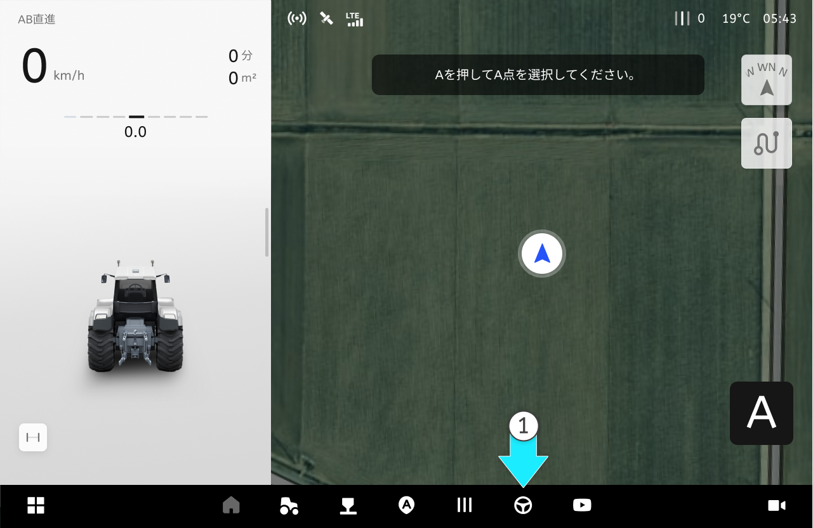
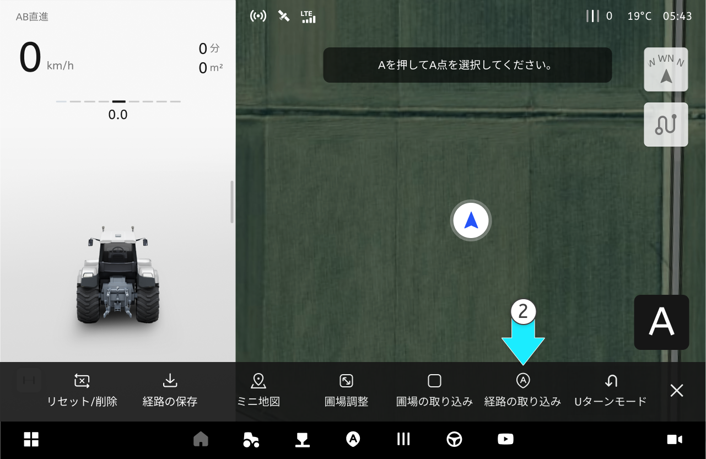
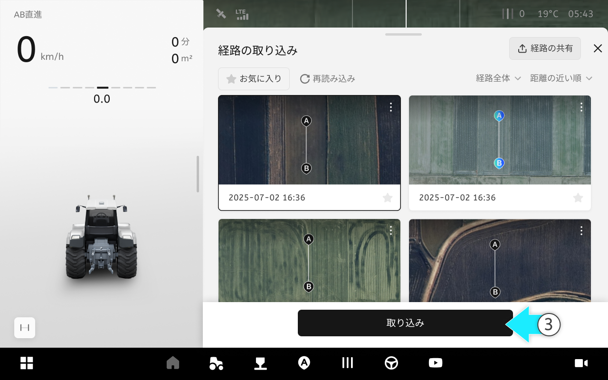
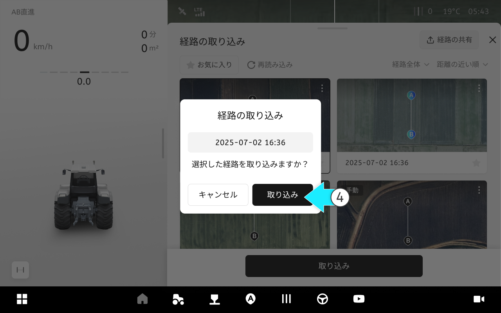
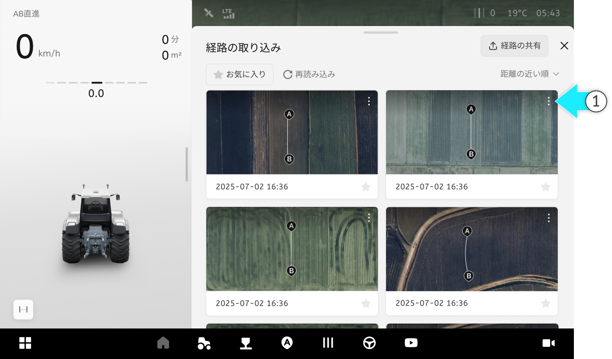
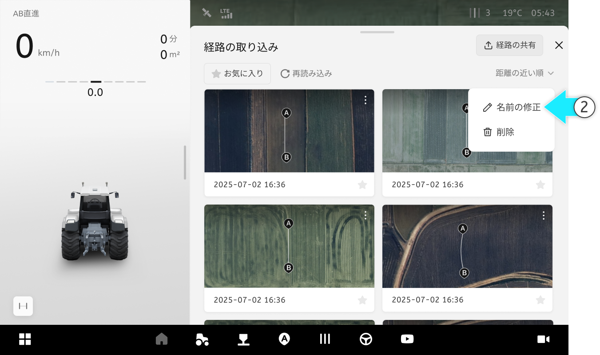
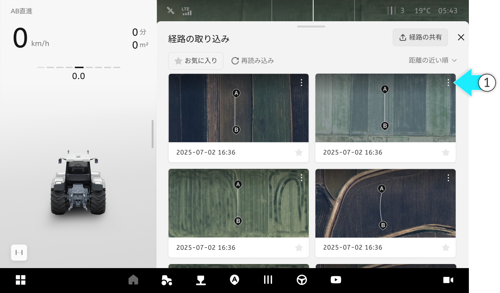
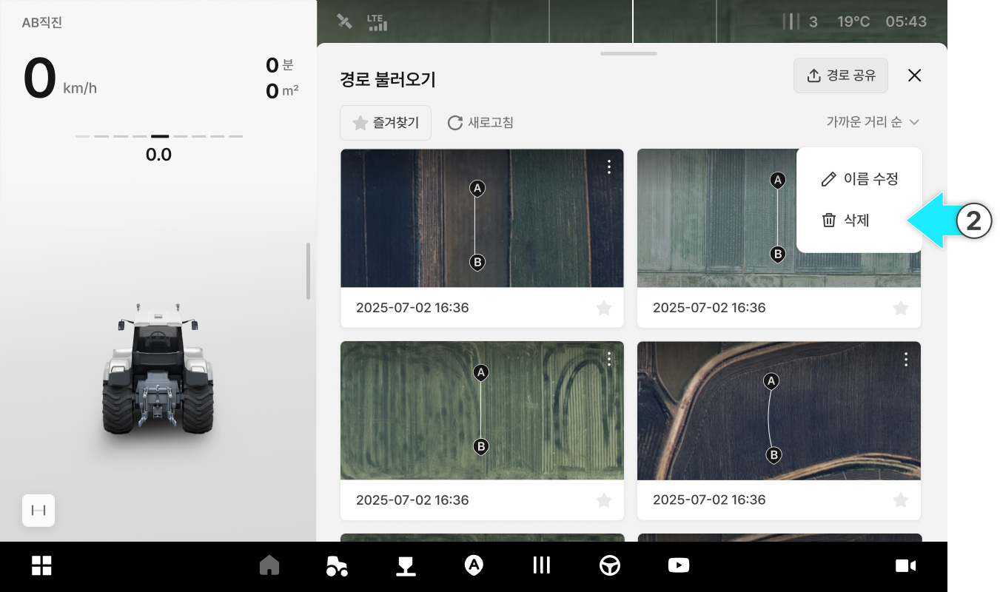
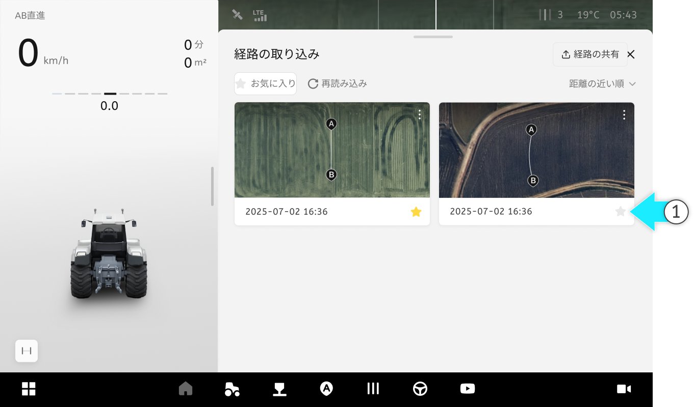
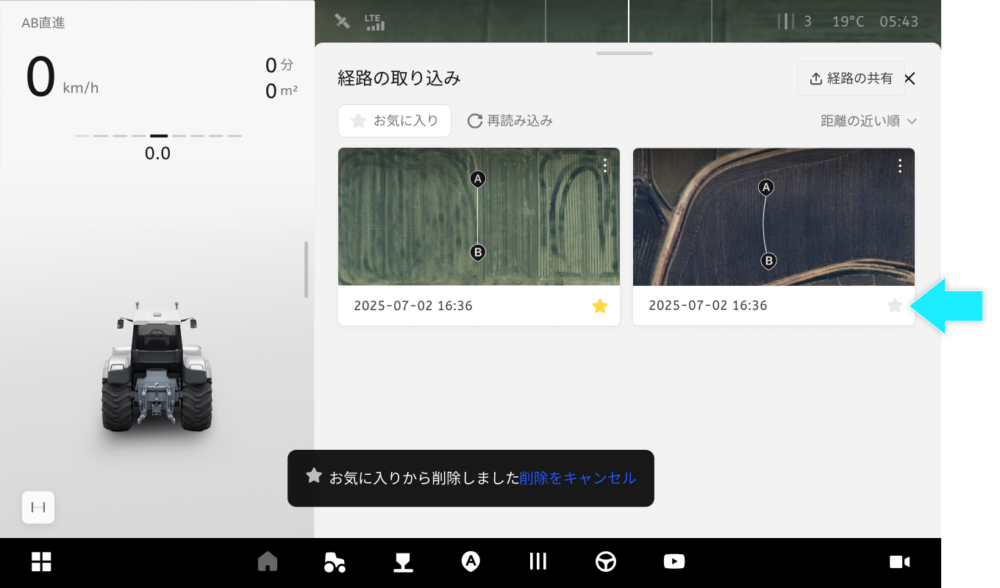

# 経路の取り込み

### 経路の取り込み

保存した経路を取り込んだり、お気に入りや名前の修正、削除などの管理ができます。

***

#### 経路の取り込み



 \[作業]を選択してください。

<figure><figcaption></figcaption></figure>



経路の取り込みをタップしてください。

<figure><figcaption></figcaption></figure>



ご希望の経路を選択し、\[取り込み]を選択してください。

<figure><figcaption></figcaption></figure>



経路の取り込みポップアップから\[取り込み]を選択します。

<figure><figcaption></figcaption></figure>



経路の取り込みが完了します。

<figure><figcaption></figcaption></figure>



***

#### 取り込みたい経路の名前の修正



取り込みたい経路の  アイコンをタップします。

<figure><figcaption></figcaption></figure>



オプションから「名前の修正」を選択します。

<figure><figcaption></figcaption></figure>



修正したい名前を入力します。

<figure><figcaption></figcaption></figure>



名前の修正が完了します。

<figure><figcaption></figcaption></figure>



***

#### 取り込んだ経路の削除



削除したい経路の  アイコンをタップします。

<figure><figcaption></figcaption></figure>



オプションから「削除」を選択します。

<figure><figcaption></figcaption></figure>



モーダルから\[削除]を選択します。

<figure><figcaption></figcaption></figure>



保存された経路は削除されます。

<figure><figcaption></figcaption></figure>



***

#### お気に入り保存



取り込んだ経路から、お気に入り保存したい経路の  お気に入りアイコンをタップします。

<figure><figcaption></figcaption></figure>



お気に入り保存が完了します。

<figure><figcaption></figcaption></figure>


お気に入りをタップすると、お気に入りに保存された経路だけが確認できます。




お気に入りから削除したい場合は、お気に入りアイコンを再度タップすると削除されます。




