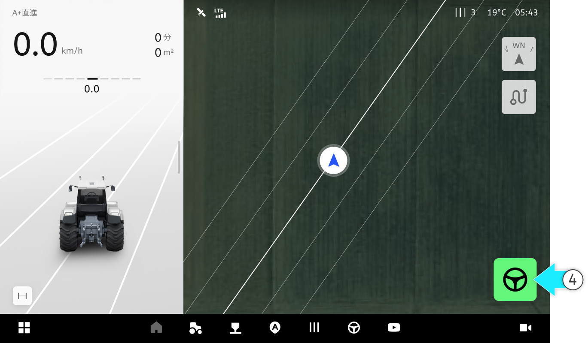

---
layout:
  width: default
  title:
    visible: false
  description:
    visible: false
  tableOfContents:
    visible: true
  outline:
    visible: true
  pagination:
    visible: true
  metadata:
    visible: true
---

# A+直進

### A+直進

A+直進

* A点を基準に設定した角度の斜め直線経路で走行します。

<figure><figcaption></figcaption></figure>



を押してA地点を生成します。

<figure><figcaption></figcaption></figure>



を押します。

<figure><figcaption></figcaption></figure>



経路の方向、角度、長さを設定し\[確認]をタップします。

<figure><figcaption></figcaption></figure>



\[自動操舵の開始]ボタンを押して走行を始めます。

<figure><figcaption></figcaption></figure>


