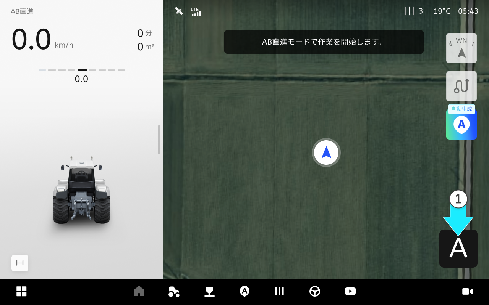
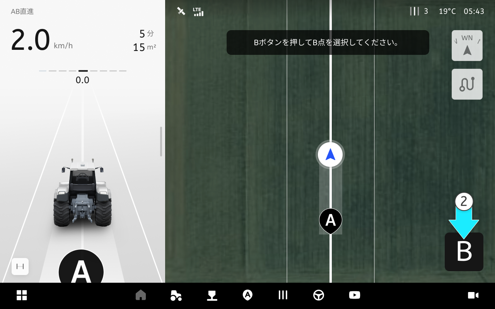
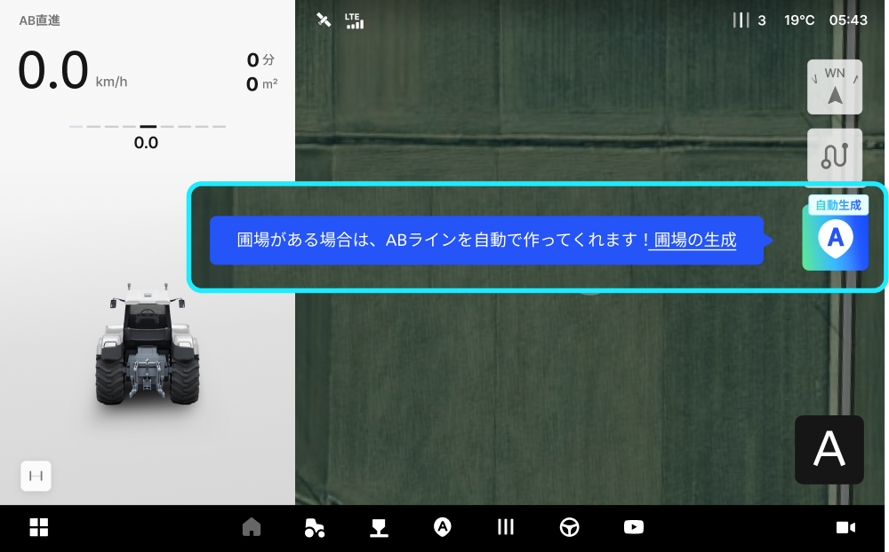
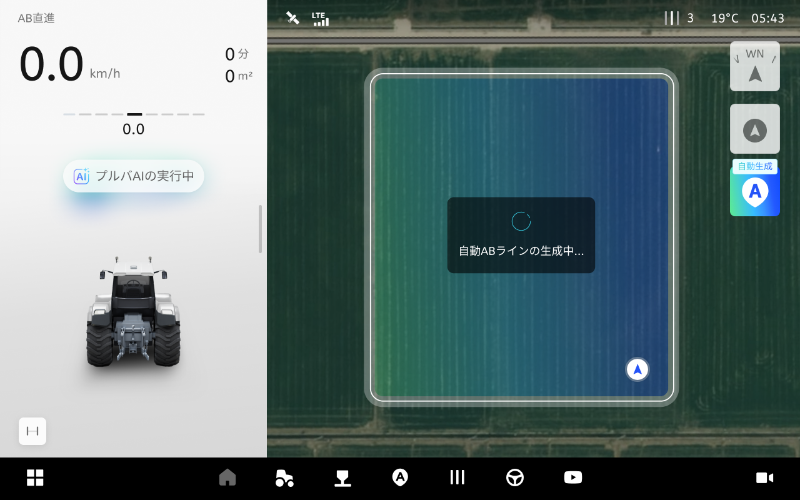
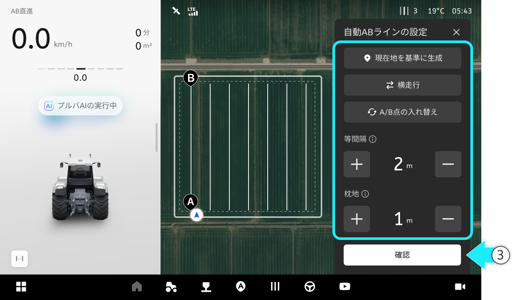

---
layout:
  width: default
  title:
    visible: false
  description:
    visible: false
  tableOfContents:
    visible: true
  outline:
    visible: true
  pagination:
    visible: true
  metadata:
    visible: true
---

# AB直進

### AB直進

AB直進

* A点とB点を結ぶ方向へ直進走行します。

<figure><figcaption></figcaption></figure>



 を押してA地点を生成します。

<figure><figcaption></figcaption></figure>



10m以上直進走行した後、ご希望の地点で  を押してB地点を生成します。

<figure><figcaption></figcaption></figure>



AB直進経路が生成されたら  \[自動操舵の開始]を押して自動操舵を始めます。

<figure><figcaption></figcaption></figure>



***

#### 自動ABラインの生成

自動ABラインの生成は、圃場の条件に合わせて直進基準経路を自動で作ってくれる機能です。
生成後にプレビュー上で間隔/余裕区間などの値を必要に応じて調整できます。



AB直進モードで、  \[ABラインの自動生成ボタン]を押します。

<figure><figcaption></figcaption></figure>


生成された圃場がない場合は、ガイドに従ってすぐ圃場を登録できます。





圃場エリアが有効になり自動ABラインが生成されます。

<figure><figcaption></figcaption></figure>



生成完了後、プレビューが表示されます。 必要に応じて設定を調整し\[確認]をタップしてください。

<figure><figcaption></figcaption></figure>


次の設定で細かい調整ができます。

* 現在地を基準に生成：現在地を基準にラインを生成します。
* 
  * 従来の生成ライン：白
  * 現在地を基準に生成されたライン：青
* 横走行（縦走行）：進行方向の基準が切り替わります。タップすると縦走行ボタンに切り替わります。
* 
  * 縦走行
* 
  * 横走行
* A/B点の入れ替え：A点とB点を入れ替えます。
* 
  * 変更前
* 
  * 変更後
* 等間隔：数値で等間隔を調整します。
* 
* 枕地：数値で枕地の間隔を調整します。
* 





\[自動操舵]ボタンを押すと、生成された経路に沿って走行が開始されます。

<figure><figcaption></figcaption></figure>


