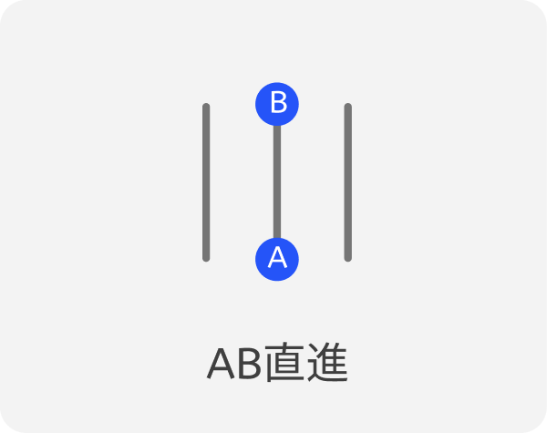
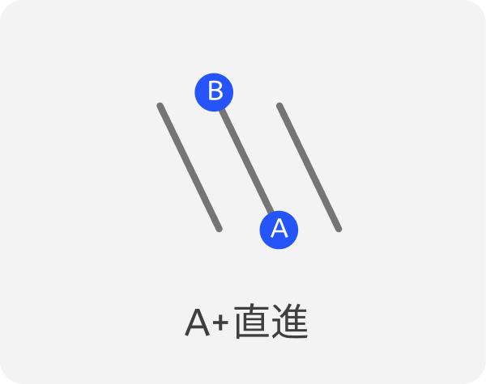
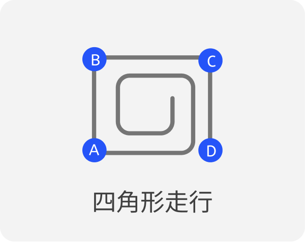
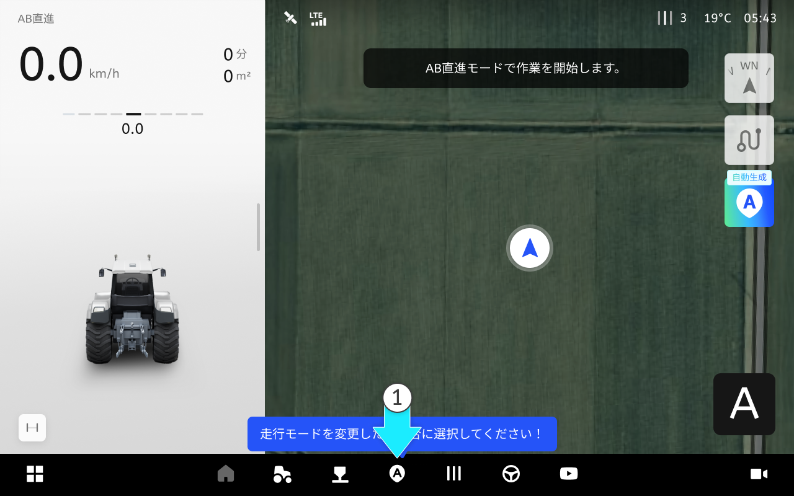
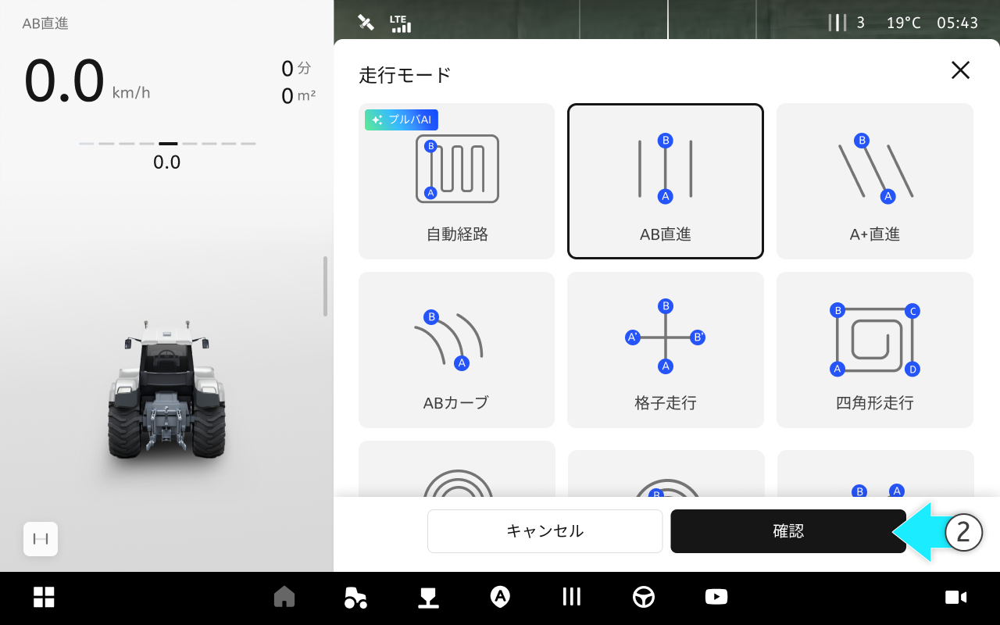
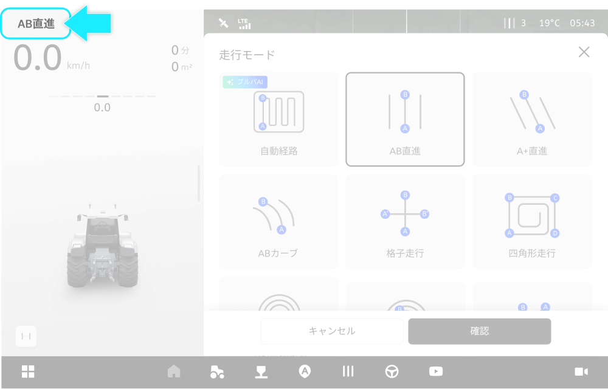

---
layout:
  width: default
  title:
    visible: false
  description:
    visible: false
  tableOfContents:
    visible: true
  outline:
    visible: true
  pagination:
    visible: true
  metadata:
    visible: true
---

# 経路のプランニングの設定方法

### 経路のプランニングの設定方法

経路のプランニングは、AB直進やA+、四角形走行など様々な作業パターンを一箇所で確認し、必要なモードを選択及び設定するメニューです。圃場の形態に合った経路をご提案し、重複走行や走行漏れの区間を減らして作業をより安定的かつ円滑に進められるようサポートいたします。

#### 経路のプランニングモードの種類

AB直進

* A点とB点を結ぶ方向へ直進走行します。

<figure><figcaption></figcaption></figure>

A+直進

* A点を基準として設定した角度の斜め直線経路で走行します。

<figure><figcaption></figcaption></figure>

四角形走行

* A-Bラインを基準に90度直角方向の自動操舵経路を生成し、四角形パターンで走行します。

<figure><figcaption></figcaption></figure>

***

#### 経路のプランニング機能へアクセス



 \[経路のプランニング]ボタンを押します。

<figure><figcaption></figcaption></figure>



ご希望の走行モードを選択し、 \[確認]をタップします

<figure><figcaption></figcaption></figure>




基本走行モードは「AB直進モード」です。
他の走行モードを使用するには、ご希望のモードを選択し\[確認]をタップしてください。



現在選択されている走行モードは、画面左上の走行情報エリアから確認できます。


