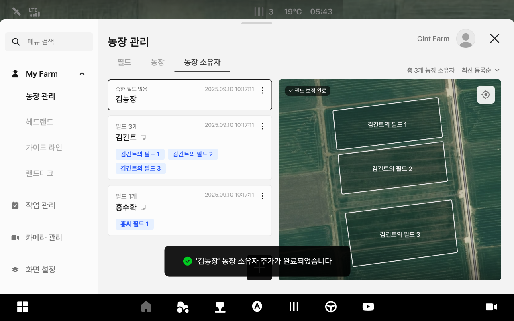

---
layout:
  width: default
  title:
    visible: false
  description:
    visible: false
  tableOfContents:
    visible: true
  outline:
    visible: true
  pagination:
    visible: true
  metadata:
    visible: true
---

# 農場主の管理

### 농장 소유자 관리

농장 소유자 관리에서는 소유자 정보를 추가·수정·삭제할 수 있습니다.
소유자별로 등록된 필드 현황도 함께 확인할 수 있습니다.

***

#### 농장 소유자 관리 진입



 전체 메뉴 아이콘을 누릅니다.

<figure><figcaption></figcaption></figure>



My Farm의 농장관리의 \[농장 소유자 탭]을 누르면 농장 소유자 관리 진입이 완료됩니다.

<figure><figcaption></figcaption></figure>



***

#### 농장 소유자 추가



 \[농장 소유자 추가] 버튼을 누릅니다.

<figure><figcaption></figcaption></figure>



\[농장 소유자 추가하기 팝업]에서 내용을 입력하고 \[추가] 버튼을 누릅니다.

<figure><figcaption></figcaption></figure>



농장 소유자 추가가 완료됩니다.

<figure><figcaption></figcaption></figure>



***

#### 농장 소유자 수정하기



원하는 농장 소유자 항목의  아이콘을 누릅니다.

<figure><figcaption></figcaption></figure>



\[수정]을 누릅니다.

<figure><figcaption></figcaption></figure>



원하는 내용을 수정하고 \[수정 완료]를 누릅니다.

<figure><figcaption></figcaption></figure>



수정이 완료됩니다.

<figure><figcaption></figcaption></figure>



***

#### 농장 소유자 삭제하기



원하는 농장 항목의  아이콘을 누릅니다.

<figure><figcaption></figcaption></figure>



\[삭제]를 누릅니다.

<figure><figcaption></figcaption></figure>



\[농장 소유자 삭제 팝업]에서 삭제를 누릅니다.

<figure><figcaption></figcaption></figure>



농장 소유자 삭제가 완료됩니다.

<figure><figcaption></figcaption></figure>


