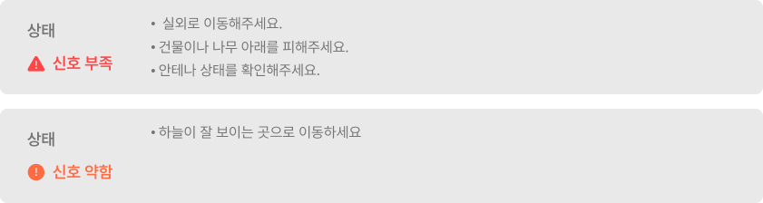

---
layout:
  width: default
  title:
    visible: false
  description:
    visible: true
  tableOfContents:
    visible: true
  outline:
    visible: true
  pagination:
    visible: true
  metadata:
    visible: true
---

# 네트워크 설정 진입 및 화면 설명

### 네트워크 설정 진입 및 화면 설명

네트워크 설정에서는 GNSS 수신기 상태, 위성 신호 품질, 위치 보정 연결 상태와 태블릿 네트워크(Wi-Fi/셀룰러)를 확인하고 변경할 수 있습니다.

***

#### 네트워크 설정은 왜 필요하나요?

주행 작업을 정밀하게 진행하기 위해 필요한 설정입니다. 아래 3가지 항목을 확인해 원활한 자율주행을 진행합니다. 

1. 위성 신호를 수신해 현재 위치를 파악합니다.
2. 위치 보정으로 더 정밀한 주행 작업이 가능합니다.
3. 네트워크가 안정적이어야 보정 신호를 끊김 없이 받을 수 있습니다.

***

#### 네트워크 설정 진입 방법



 전체 메뉴 아이콘을 누릅니다.

<figure><figcaption></figcaption></figure>



\[네트워크 설정]을 누릅니다.

<figure><figcaption></figcaption></figure>



네트워크 설정 화면 진입이 완료됩니다.

<figure><figcaption></figcaption></figure>



***

#### 네트워크 설정 화면 설명

<figure><figcaption></figcaption></figure>

&#x20; **GNSS 수신기 설정**

* 연결된 GNSS 수신기를 확인하고, 필요 시 다른 수신기로 변경할 수 있습니다.

&#x20; **위성 신호**

* GNSS는 GPS(미국), GLONASS(러시아), BDS(중국), Galileo(유럽), QZSS(일본) 등 여러 나라의 위성 시스템에서 내려오는 위성 신호를 통합해 사용하는 개념입니다.
여러 나라의 위성 신호를 함께 수신하면 연결 가능한 위성 수가 늘어나 위치 정확도와 신호 안정성이 향상됩니다.
*   시스템이 현재 환경에서 가장 좋은 위성을 자동으로 선택합니다. 신호 상태가 좋지 않다면 안내 문구에 따라 조치합니다. 

    <figure><figcaption></figcaption></figure>

&#x20; **위치 보정**

* RTK 직접 수신/RTK 블루투스 등 보정 방식과 연결 방법을 설정합니다.\
  자세한 내용은 [위치 보정 설정](/broken/pages/lstJSWDSTbo8ffvKpTv4)을 참고하세요.

&#x20; **네트워크**

* 태블릿의 셀룰러(LTE) 및 Wi-Fi 연결 상태를 설정합니다.\
  자세한 내용은 [네트워크 설정](/broken/pages/NpfpbwwMY8778pZ3TmxV)을 참고하세요.
