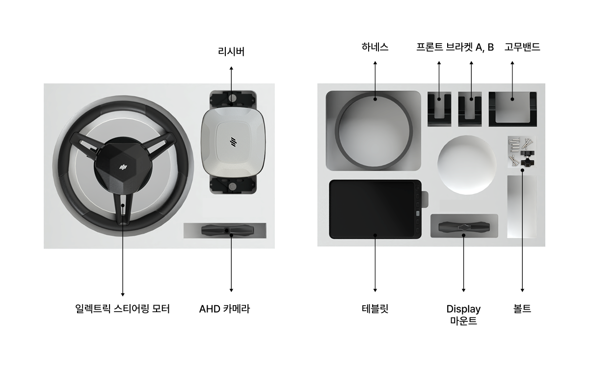
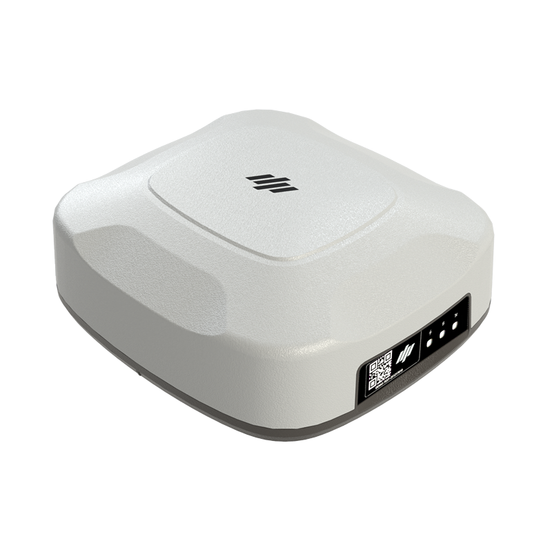
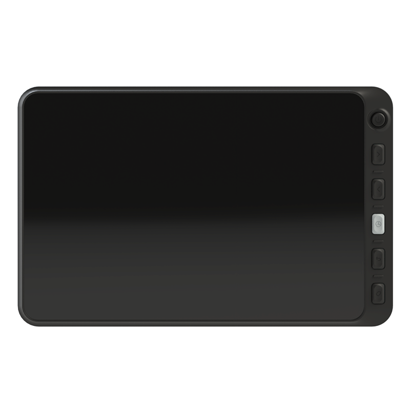
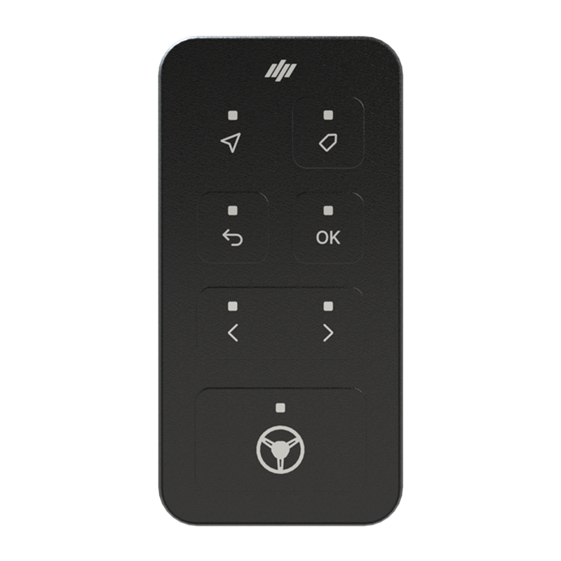

---
layout:
  width: default
  title:
    visible: false
  description:
    visible: false
  tableOfContents:
    visible: true
  outline:
    visible: true
  pagination:
    visible: true
  metadata:
    visible: true
---

# PLUVA iONのご紹介

### Pluva iON 소개

Pluva iON은 농작업 환경에서 사용 가능한 자율주행 보조 기능을 제공합니다.
본 제품은 KS B 7951 기준 Level 2\~3.5 수준의 자율주행 기능을 지원합니다.

자율주행 기능은 여러 구성품의 연동으로 동작합니다. 아래에서 구성품과 각 장치의 역할을 확인하세요.

***

### 1. 제품의 구성

제품을 구입하시면 다음과 같은 구성물을 제공하고 있으니 반드시 확인하세요.\
제품의 구성물 중 일부는 모델 타입에 따라 외관 및 색상이 그림과 다를 수 있습니다.

#### 풀세트

> Pluva iON의 전체 구성품입니다. GNSS 수신기(리시버), 전동 스티어링 휠(모터), 태블릿, 카메라를 포함합니다.

<figure><figcaption></figcaption></figure>

#### 반세트

> 태블릿을 제외한 구성품입니다. GNSS 수신기(리시버), 전동 스티어링 휠(모터), 카메라를 포함합니다.
반세트 주문 전, Pluva iON 태블릿을 보유하고 있는지 확인이 필요합니다.

<figure><figcaption></figcaption></figure>

***

### 2. 주요 구성품 소개



#### **Electric Steering Wheel**&#x20;

**:** 전동 스티어링 휠

<figure><figcaption></figcaption></figure>

농기계의 기존 핸들을 탈착한 뒤 스티어링 위치에 장착하는 전동 모터 방식 조향 장치입니다.

> 자세한 내용은 [일렉트릭 스티어링 휠](/broken/pages/scPRmf2UHNygzfDCY7Iu) 참조



#### **GNSS Receiver**

: GNSS 수신기

<figure><figcaption></figcaption></figure>

고정밀 위치정보(RTK) 기술을 활용하여 농기계의 실시간 위치를 정밀하게 산출합니다.

> 자세한 내용은 [GNSS 리시버](/broken/pages/lWdZgI2P4YIODQ7uazsl) 참조





#### Tablet

**:** 태블릿

<figure><figcaption></figcaption></figure>

자율주행 시스템의 디스플레이로, 작업 경로 설정, 주행 상태 모니터링, 시스템 제어 및 설정을 수행합니다.

> 자세한 내용은 [태블릿](/broken/pages/JktgjzwXNjPEajyHsla4)을 참조



#### Switch(옵션품)

: 스위치&#x20;

<figure><figcaption></figcaption></figure>

작업자가 조작하기 편리한 위치에 설치하여, 자율주행 시스템의 시작/정지 등 주요 기능을 간편하게 제어할 수 있습니다.

> 자세한 내용은 [스위치](/broken/pages/y9S1JIw5wSWooyFebAuU)를 참조


별도의 구매가 필요한 상품입니다




***

### 3. 제품 설치 위치

각 구성품은 농기계에 지정된 위치로 설치됩니다. 실제 장착 위치는 차량 모델 및 장착 키트에 따라 달라질 수 있습니다.

<figure><figcaption></figcaption></figure>
