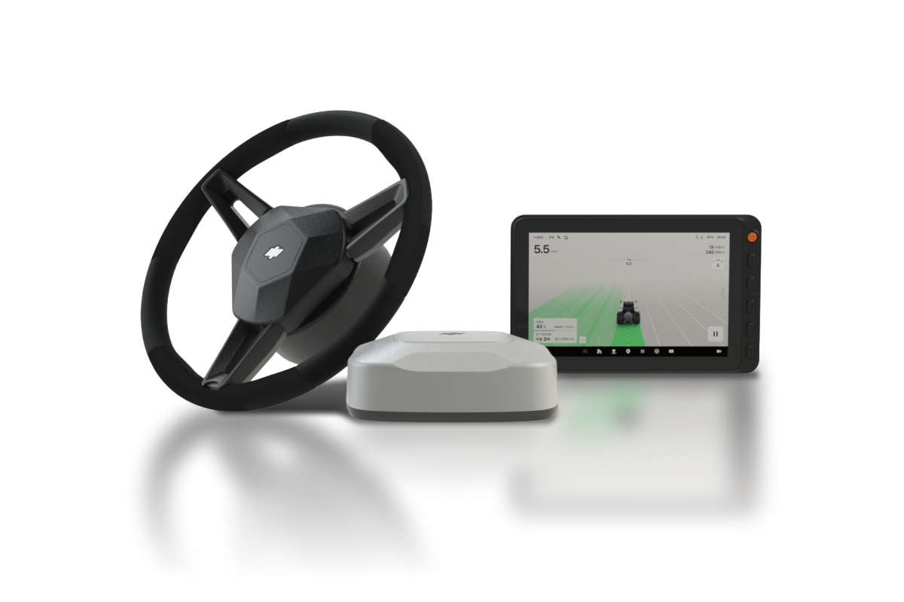

---
layout:
  width: default
  title:
    visible: false
  description:
    visible: false
  tableOfContents:
    visible: true
  outline:
    visible: true
  pagination:
    visible: true
  metadata:
    visible: true
---

# PLUVA iON

<figure><figcaption></figcaption></figure>


**참고**\
자율주행 키트 모델에 따라 제공되는 제품 매뉴얼의 종류 및 내용은 일부 다를 수 있습니다. 제품 매뉴얼의 내용 중 일부 장치 및 소프트웨어는 제조사 정책에 따라 변경될 수 있으며 버전이 다를 수 있습니다.



**주의**\
사용 전 반드시 이 제품 메뉴얼을 읽고 자율주행 키트를 안전하고 올바르게 사용하세요.


### 목차

플루바 아이온의 장치 구성, 초기 설정, 주행 기능, 관리 기능, 고객지원 정보를 제공합니다.

<a href="ion/user-manual-info.md">사용 메뉴얼 정보</a>

<table data-card-size="large" data-view="cards" data-full-width="true"><thead><tr><th></th><th data-hidden data-card-target data-type="content-ref"></th></tr></thead><tbody><tr><td>사용자 메뉴얼 기본 정보</td><td><a href="ion/user-manual-info.md">user-manual-info.md</a></td></tr><tr><td>고지사항 및 안전가이드</td><td><a href="/broken/pages/Sjzm5X0JNymkkikqASjO">Broken link</a></td></tr></tbody></table>

<a href="ion/overview/">개요</a>

<table data-card-size="large" data-view="cards" data-full-width="true"><thead><tr><th></th><th data-hidden data-card-target data-type="content-ref"></th></tr></thead><tbody><tr><td>플루바 아이온 소개</td><td><a href="ion/overview/pluva-ion-introduction.md">pluva-ion-introduction.md</a></td></tr><tr><td>전동 스티어링 휠</td><td><a href="ion/overview/electric-steering-wheel.md">electric-steering-wheel.md</a></td></tr><tr><td>GNSS 수신기</td><td><a href="ion/overview/gnss-receiver.md">gnss-receiver.md</a></td></tr><tr><td>태블릿</td><td><a href="ion/overview/tablet.md">tablet.md</a></td></tr><tr><td>스위치</td><td><a href="ion/overview/switch.md">switch.md</a></td></tr><tr><td>카메라</td><td><a href="ion/overview/camera.md">camera.md</a></td></tr></tbody></table>

<a href="ion/initial-setup/">초기 설정법</a>

<table data-card-size="large" data-view="cards" data-full-width="true"><thead><tr><th></th><th data-hidden data-card-target data-type="content-ref"></th></tr></thead><tbody><tr><td>소프트웨어 업데이트(OTA)</td><td><a href="ion/initial-setup/ota.md">ota.md</a></td></tr></tbody></table>

<a href="ion/driving/">주행 모드 (경로플래닝)</a>

<table data-card-size="large" data-view="cards" data-full-width="true"><thead><tr><th></th><th data-hidden data-card-target data-type="content-ref"></th></tr></thead><tbody><tr><td>경로플래닝 설정 방법</td><td><a href="ion/driving/route-planning-settings.md">route-planning-settings.md</a></td></tr><tr><td>AB직진</td><td><a href="ion/driving/ab-straight.md">ab-straight.md</a></td></tr><tr><td>A+직진</td><td><a href="ion/driving/a-plus-straight.md">a-plus-straight.md</a></td></tr><tr><td>사각주행</td><td><a href="ion/driving/square-drive.md">square-drive.md</a></td></tr><tr><td>자동 경로 (Pluava AI)</td><td><a href="ion/driving/auto-route-generation.md">auto-route-generation.md</a></td></tr></tbody></table>

<a href="ion/uturn-mode/">유턴 모드</a>

<table data-card-size="large" data-view="cards" data-full-width="true"><thead><tr><th></th><th data-hidden data-card-target data-type="content-ref"></th></tr></thead><tbody><tr><td>유턴 설정 방법</td><td><a href="ion/uturn-mode/uturn-mode-setting.md">uturn-mode-setting.md</a></td></tr></tbody></table>

<a href="ion/driving/undefined/">주행 편의 기능</a>

<table data-card-size="large" data-view="cards" data-full-width="true"><thead><tr><th></th><th data-hidden data-card-target data-type="content-ref"></th></tr></thead><tbody><tr><td>경로 저장하기</td><td><a href="ion/driving-convenience-function/save-path.md">save-path.md</a></td></tr><tr><td>경로 불러오기</td><td><a href="ion/driving-convenience-function/bringing-up-path.md">bringing-up-path.md</a></td></tr><tr><td>경로 공유</td><td><a href="ion/driving-convenience-function/path-sharing.md">path-sharing.md</a></td></tr><tr><td>경로 리셋/삭제</td><td><a href="ion/driving-convenience-function/delete-path.md">delete-path.md</a></td></tr><tr><td>등간격 편의 기능</td><td><a href="ion/driving/undefined/undefined.md">undefined.md</a></td></tr><tr><td>주행 화면 조정</td><td><a href="ion/driving/undefined/undefined-1.md">undefined-1.md</a></td></tr></tbody></table>

<a href="ion/my-farm/">내 농장 관리 (MY Farm)</a>

<table data-card-size="large" data-view="cards" data-full-width="true"><thead><tr><th></th><th data-hidden data-card-target data-type="content-ref"></th></tr></thead><tbody><tr><td>농장 관리</td><td><a href="ion/my-farm/farm-management/">farm-management</a></td></tr><tr><td>농장 소유자 관리</td><td><a href="ion/my-farm/farm-owner-management.md">farm-owner-management.md</a></td></tr><tr><td>필드 등록</td><td><a href="ion/my-farm/field-management/">field-management</a></td></tr><tr><td>필드 정보 수정/삭제</td><td><a href="ion/my-farm/managing-field-information.md">managing-field-information.md</a></td></tr><tr><td>헤드랜드 등록</td><td><a href="ion/my-farm/headland-add.md">headland-add.md</a></td></tr><tr><td>헤드랜드 정보 관리</td><td><a href="ion/my-farm/managing-headland-information.md">managing-headland-information.md</a></td></tr></tbody></table>

<a href="ion/vehicle-settings/">차량 관리</a>

<table data-card-size="large" data-view="cards" data-full-width="true"><thead><tr><th></th><th data-hidden data-card-target data-type="content-ref"></th></tr></thead><tbody><tr><td>내 차량 진입 및 화면 설명</td><td><a href="ion/vehicle-settings/entering-my-vehicle.md">entering-my-vehicle.md</a></td></tr><tr><td>오토스티어 보정</td><td><a href="ion/vehicle-settings/autostere-calibration.md">autostere-calibration.md</a></td></tr><tr><td>롤/피치/요 보정</td><td><a href="ion/vehicle-settings/imu-calibration.md">imu-calibration.md</a></td></tr><tr><td>관성센서 보정</td><td><a href="ion/vehicle-settings/inertial-sensor-calibration.md">inertial-sensor-calibration.md</a></td></tr><tr><td>차량 제어 설정</td><td><a href="ion/vehicle-settings/vehicle-control-settings.md">vehicle-control-settings.md</a></td></tr><tr><td>GNSS 수신기 설정</td><td><a href="ion/vehicle-settings/gnss-receiver-setting.md">gnss-receiver-setting.md</a></td></tr></tbody></table>

<a href="ion/workstation-management/">작업기 관리</a>

<table data-card-size="large" data-view="cards" data-full-width="true"><thead><tr><th></th><th data-hidden data-card-target data-type="content-ref"></th></tr></thead><tbody><tr><td>작업기 목록 진입 및 화면 설명</td><td><a href="ion/workstation-management/worker-entry.md">worker-entry.md</a></td></tr><tr><td>작업기 추가</td><td><a href="ion/workstation-management/add-worker.md">add-worker.md</a></td></tr></tbody></table>

<a href="ion/network-settings/">네트워크 설정</a>

<table data-card-size="large" data-view="cards" data-full-width="true"><thead><tr><th></th><th data-hidden data-card-target data-type="content-ref"></th></tr></thead><tbody><tr><td>네트워크 설정 진입 및 화면 설명</td><td><a href="ion/network-settings/enter-network.md">enter-network.md</a></td></tr><tr><td>위치 보정 설정</td><td><a href="ion/network-settings/rtk.md">rtk.md</a></td></tr><tr><td>네트워크 설정</td><td><a href="ion/network-settings/network-setting.md">network-setting.md</a></td></tr></tbody></table>

<a href="ion/consumer-info/">고객 지원</a>

<table data-card-size="large" data-view="cards" data-full-width="true"><thead><tr><th></th><th data-hidden data-card-target data-type="content-ref"></th></tr></thead><tbody><tr><td>문제해결 안내</td><td><a href="ion/consumer-info/problem-solving.md">problem-solving.md</a></td></tr><tr><td>정비</td><td><a href="ion/consumer-info/maintenance.md">maintenance.md</a></td></tr><tr><td>개인정보 처리 방침</td><td><a href="https://pluva.jp/pluva_ion/privacy-policy/">https://pluva.jp/pluva_ion/privacy-policy/</a></td></tr><tr><td>제원 정보</td><td><a href="ion/consumer-info/specification-information.md">specification-information.md</a></td></tr></tbody></table>

