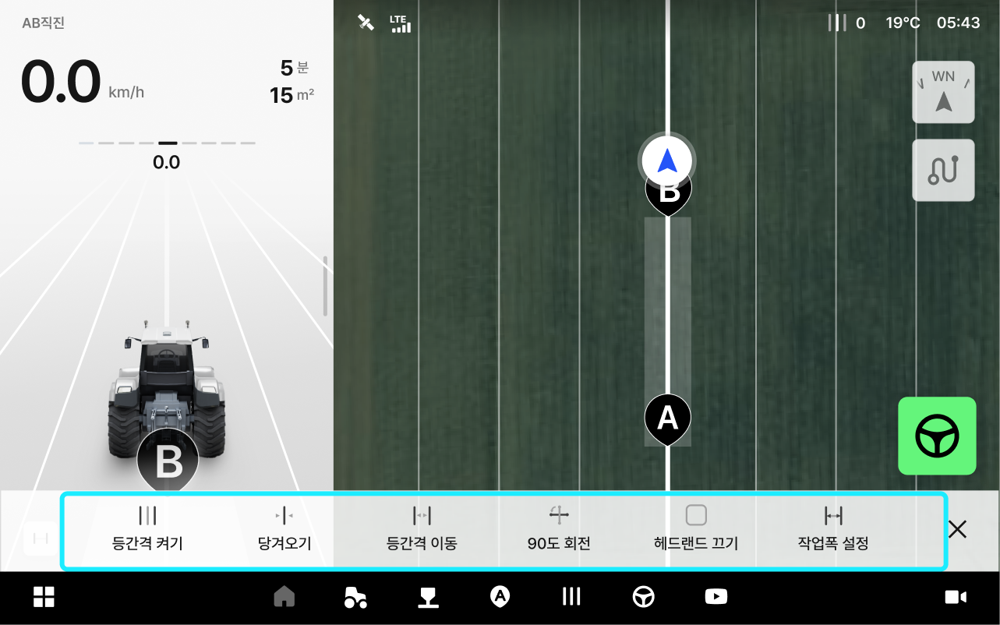

---
layout:
  width: default
  title:
    visible: false
  description:
    visible: false
  tableOfContents:
    visible: true
  outline:
    visible: true
  pagination:
    visible: true
  metadata:
    visible: true
---

# 등간격 편의 기능

### 등간격 편의 기능

등간격 이동, 당겨오기 90도 회전 등 등간격 관련 기능을 편하게 확인하고 사용할 수 있습니다.\
반드시 AB 경로를 생성한 후에 사용이 가능합니다.

***

#### 등간격 편의 기능 진입



AB 경로를 설정한 이후에  \[등간격 편의 기능]버튼을 누릅니다.

<figure><figcaption></figcaption></figure>



원하는 등간격 메뉴를 선택합니다.

<figure><figcaption></figcaption></figure>



***

#### 등간격 편의 기능 상세 설명

<figure><figcaption></figcaption></figure>

&#x20;.svg>) **등간격 켜기/끄기**

* 생성한 등간격을 켜고 끕니다.
  * 자율주행 중에는 사용할 수 없으며 수동 주행 상태에서만 사용할 수 있습니다.
  *   &#x20;  **눌렀을 때**

      <figure><figcaption></figcaption></figure>
  *   &#x20;  **눌렀을 때**

      <figure><figcaption></figcaption></figure>

&#x20;.svg>) **당겨오기**

* 차량의 현재 위치로 생성한 경로가 이동합니다. 변경된 위치 기준으로\
  등간격 선이 재설정 됩니다.
  * 자율주행 중에는 사용할 수 없으며 수동 주행 상태에서만 사용할 수 있습니다.
  *   **당겨 오기 사용 전**

      <figure><figcaption></figcaption></figure>
  *   &#x20;**당겨 오기 사용 후**

      <figure><figcaption></figcaption></figure>

&#x20;.svg>) **등간격 이동**

* 입력한 수치만큼 AB 경로가 평행 이동합니다.
  *   &#x20;**등간격 이동 전**

      <figure><figcaption></figcaption></figure>
  *   &#x20;**등간격 이동 후**

      <figure><figcaption></figcaption></figure>

&#x20;.svg>) **90도 회전**

* 차량의 현재 위치에서 생성한 주행 경로를 수직 방향(90도)으로 회전합니다.
  * 자율주행 중에는 사용할 수 없으며 수동 주행 상태에서만 사용할 수 있습니다.
  *   &#x20;**90도 회전 사용 전**

      <figure><figcaption></figcaption></figure>
  *   &#x20;**90도 회전 사용 후**

      <figure><figcaption></figcaption></figure>

&#x20;.svg>) **헤드랜드 켜기/끄기**

* 헤드랜드 표시를 켜거나 끕니다.
  * 헤드랜드는 점선으로 표시합니다.
  *   &#x20; **헤드랜드 켜기 사용** 

      <figure><figcaption></figcaption></figure>
  *    **헤드랜드 끄기 사용** 

      <figure><figcaption></figcaption></figure>

&#x20;.svg>) **작업폭 설정**

* 등간격 넓이의 기준인 작업폭을 수치로 설정합니다. 입력한 작업기 폭, 고랑폭에 따라 자동으로 작업폭이 설정됩니다.
  * 작업 중 작업기 폭 또는 고랑 폭 변경으로 작업폭이 달라졌다면, 원활한 작업을 위해 당겨오기 기능을 사용한 뒤 작업을 재개합니다.
  *   &#x20;**작업폭 설정 전**

      <figure><figcaption></figcaption></figure>
  *   **작업폭 설정 중**\
      :작업기폭, 고랑폭 수치를 입력하고 \[확인]버튼을 누릅니다.

      <figure><figcaption></figcaption></figure>
  *   **작업폭 설정 후**

      <figure><figcaption></figcaption></figure>
