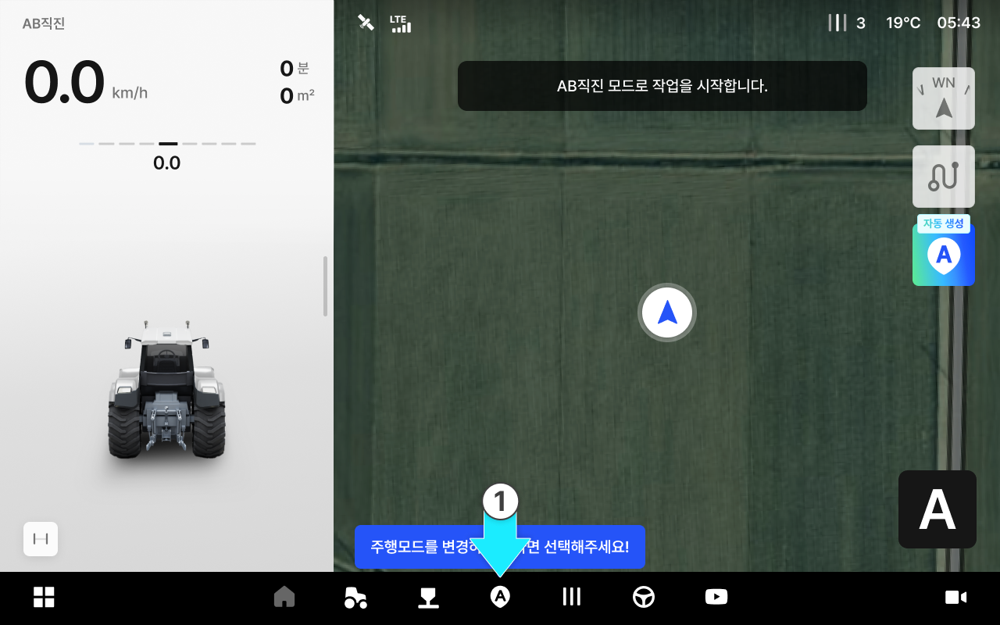

# 경로플래닝 설정 방법

### 경로플래닝 설정 방법

작업·작물·목적에 맞는 다양한 경로 플래닝 모드를 선택할 수 있어,\
현장 조건에 맞는 경로로 작업을 진행하고 겹침·누락을 줄여 작업 효율과 완성도를 높입니다.

***

#### 경로 플래닝 모드 종류

AB 직진

* A점과 B점을 잇는 방향으로 직진 주행합니다.

<figure><figcaption></figcaption></figure>

A+직진

* A점을 기준으로 설정한 각도의 대각선 직선 경로로 주행합니다.

<figure><figcaption></figcaption></figure>

사각주행

* A-B 라인 기준으로 90도 직각 방향의 자율주행 경로를 생성하여 사각형 패턴으로 주행합니다.

<figure><figcaption></figcaption></figure>

자동 경로 (Pluva AI)

* 사용자의 필드/차량 조건을 바탕으로 최적의 작업 경로를 자동 생성하는 기능입니다.

<figure><figcaption></figcaption></figure>

***

#### 경로 플래닝 기능 진입



 \[경로 플래닝] 버튼을 누릅니다.

<figure><figcaption></figcaption></figure>



원하는 주행 모드를 선택한 후 \[확인]을 누릅니다.

<figure><figcaption></figcaption></figure>




기본 주행 모드는 AB 직진입니다.
다른 주행 모드를 사용하려면 원하는 모드를 선택한 후 \[확인]을 누르세요.



현재 선택된 주행 모드는 화면 왼쪽 상단의 주행 정보 영역에서 확인할 수 있습니다.



