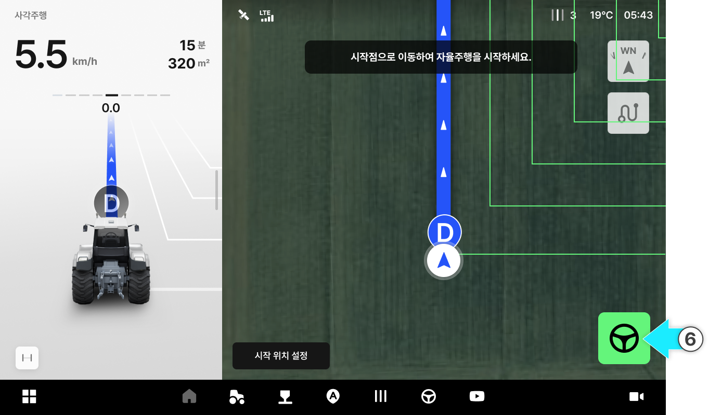

---
layout:
  width: default
  title:
    visible: false
  description:
    visible: true
  tableOfContents:
    visible: true
  outline:
    visible: true
  pagination:
    visible: true
  metadata:
    visible: true
---

# 사각주행

### 사각주행

사각주행

* A-B 라인 기준으로 90도 직각 방향의 자율주행 경로를 생성하여 사각형 패턴으로 주행합니다.

<figure><figcaption></figcaption></figure>



버튼을 눌러 A 지점을 생성합니다.

<figure><figcaption></figcaption></figure>



10m 이상 직진 주행한 뒤, 원하는 지점에서 버튼을 눌러 B 지점을 생성합니다.

<figure><figcaption></figcaption></figure>


A점을 생성하면 미니맵이 표시됩니다.




생성한 점은 \[수정]을 눌러 조정할 수 있습니다.




버튼을 눌러 C 지점을 생성합니다.

<figure><figcaption></figcaption></figure>



버튼을 눌러 D 지점을 생성합니다.

<figure><figcaption></figcaption></figure>



사각 주행 라인이 생성되면 시작점과 시작 방향을 선택한 후 \[확인]을 누릅니다.

<figure><figcaption></figcaption></figure>



시작점으로 이동한 뒤\[자율주행 시작] 버튼을 누릅니다.

<figure><figcaption></figcaption></figure>



