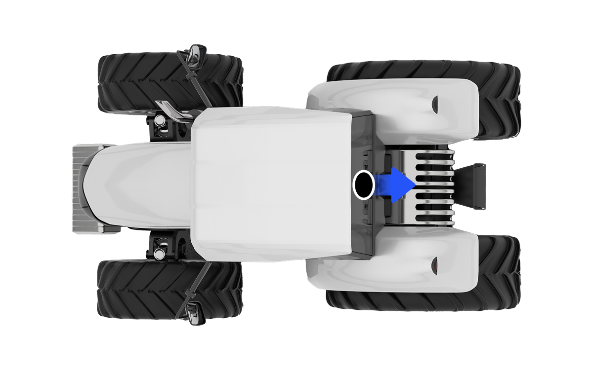

---
layout:
  width: default
  title:
    visible: false
  description:
    visible: false
  tableOfContents:
    visible: true
  outline:
    visible: true
  pagination:
    visible: true
  metadata:
    visible: true
---

# 카메라

### 카메라

플루바 아이온에는 주변 환경을 모니터링하는 카메라 구성품이 포함됩니다.

<figure><figcaption></figcaption></figure>

트랙터 뒤쪽 상부에 카메라를 설치하며, 후방 작업을 모니터링합니다.

<figure><figcaption></figcaption></figure>

***

#### 터치스크린에서 카메라 켜기

차량 터치스크린에서 하단 메뉴에서 카메라 아이콘을 터치하여 카메라를 켤 수 있습니다.

자세한 내용은 [카메라뷰 켜기](../driving-convenience-functio/adjusting-driving-screen.md#undefined-2)을(를) 참조하세요.

