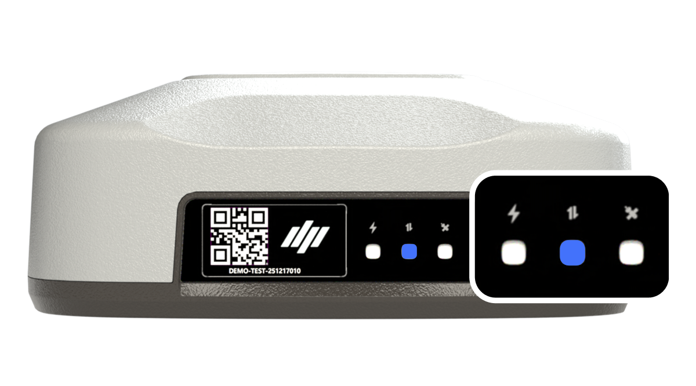

---
layout:
  width: default
  title:
    visible: false
  description:
    visible: false
  tableOfContents:
    visible: true
  outline:
    visible: true
  pagination:
    visible: true
  metadata:
    visible: true
  tags:
    visible: true
---

# GNSS 수신기

### GNSS 수신기

GNSS 수신기는 RTK 기반 고정밀 위치정보를 이용하여 농기계의 위치를 정밀하게 파악합니다.보정 데이터를 통해 위치 보정이 이루어지며, 관련 설정은 사용 환경에 따라 달라질 수 있습니다.

<figure><figcaption></figcaption></figure>

 상태 표시 LED

1. 좌측 LED
   1. 전원 및 시스템의 H/W 이상 여부

<figure><figcaption></figcaption></figure>

상태 구분

1. 파란색 (점등)
   1. 정상
   2. .png>)
2. 노란색 점멸
   1. 오류 발생
   2. .png>)

2. 중앙 LED
   1. GNSS 보정 정보 수신 여부

<figure><figcaption></figcaption></figure>

상태 구분

1. 파란색 (점등)
   1. 정상
   2. 
2. 노란색 점멸
   1. 오류 발생
   2. .png>)
3. OFF
   1. 60초 이상 미수신 (또는 수신된적 없음)
   2. 
4. 우측 LED
   1. GNSS RTK 상태

<figure><figcaption></figcaption></figure>

상태 구분

1. 파란색 (점등)
   1. RTK 우수
   2. .png>)
2. 파란색 점멸
   1. RTK 보통
   2. .png>)
3. OFF
   1. 그 밖의 상태
   2. .png>)

 QR코드: 제품 등록시 사용되는 QR 코드입니다.
