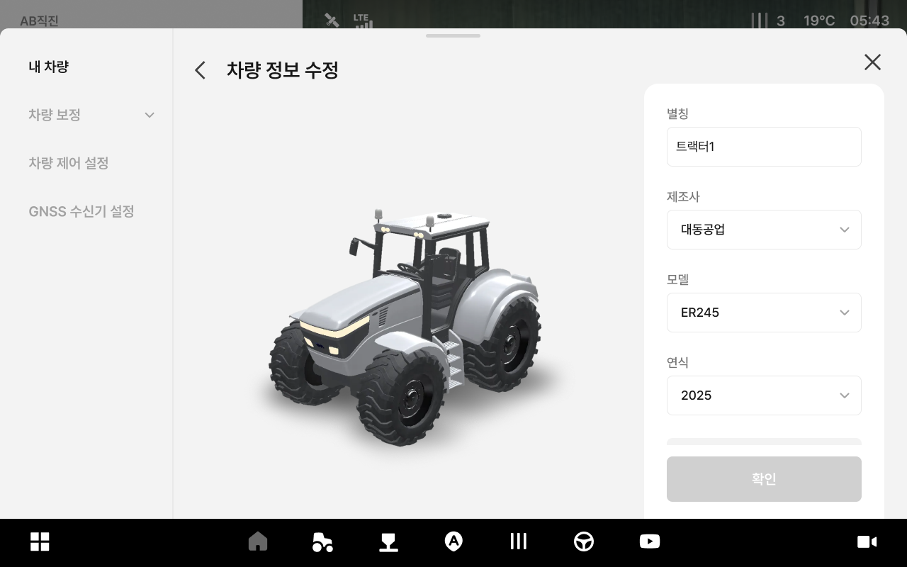

---
layout:
  width: default
  title:
    visible: false
  description:
    visible: false
  tableOfContents:
    visible: true
  outline:
    visible: true
  pagination:
    visible: true
  metadata:
    visible: true
---

# 내 차량 정보 수정

### 내 차량 정보 수정

작업에 사용하는 차량의 정보와 수치를 수정할 수 있습니다.

***

#### 내 차량 정보 수정 진입 방법



 \[차량] 버튼을 누릅니다.

<figure><figcaption></figcaption></figure>



내 차량에 진입이 완료됩니다. 차량 치수를 누릅니다.

<figure><figcaption></figcaption></figure>



내 차량 정보 수정 진입이 완료됩니다.

<figure><figcaption></figcaption></figure>



***

#### 내 차량 정보 수정 항목 설명

<figure><figcaption></figcaption></figure>

&#x20; **별칭**

* 차량을 별칭을 표시합니다.

&#x20; **제조사**

* 차량의 제조사를 선택합니다.

&#x20;.svg>) **모델**

* 차량의 모델을 선택합니다.

&#x20;.svg>) **연식**

* 차량의 연식을 선택합니다.

&#x20;.svg>) **치수 입력**

* 차량의 치수를 입력합니다. 차량 타입에 따라 입력 항목이 달라집니다.
  * 트랙터\
    
  * 이앙기\
    
