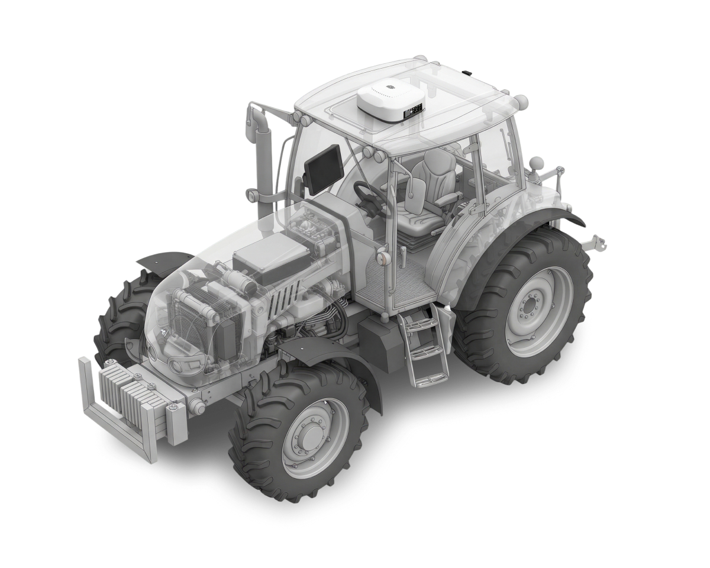

---
layout:
  width: default
  title:
    visible: true
  description:
    visible: false
  tableOfContents:
    visible: true
  outline:
    visible: true
  pagination:
    visible: true
  metadata:
    visible: true
  tags:
    visible: true
metaLinks:
  alternates:
    - https://app.gitbook.com/s/fIil1QjLd6DqdBnn2Ex9/
---

# KUBODA PLUVA iON Service Manual

<figure><figcaption></figcaption></figure>

### 목차

서비스 메뉴얼 정보

<table data-card-size="large" data-view="cards" data-full-width="true"><thead><tr><th></th><th data-hidden data-card-target data-type="content-ref"></th></tr></thead><tbody><tr><td>서비스 메뉴얼 기본 정보</td><td><a href="user-manual-info.md">user-manual-info.md</a></td></tr></tbody></table>

개통/설치

<table data-card-size="large" data-view="cards" data-full-width="true"><thead><tr><th></th><th data-hidden data-card-target data-type="content-ref"></th></tr></thead><tbody><tr><td>개통/설치 단계 설명</td><td><a href="order-installation/order-installation-steps.md">order-installation-steps.md</a></td></tr><tr><td>제품 개통</td><td><a href="order-installation/product-registration.md">product-registration.md</a></td></tr><tr><td>제품 설치</td><td><a href="https://kuboda-pluva-servicemanual.pluva.io/ion/kr/order-installation/product-installation">https://kuboda-pluva-servicemanual.pluva.io/ion/kr/order-installation/product-installation</a></td></tr><tr><td>퀵셋업</td><td><a href="https://kuboda-pluva-servicemanual.pluva.io/ion/kr/order-installation/quick-setup">https://kuboda-pluva-servicemanual.pluva.io/ion/kr/order-installation/quick-setup</a></td></tr><tr><td>설치 완료 확인</td><td><a href="https://kuboda-pluva-servicemanual.pluva.io/ion/kr/order-installation/installation-completed">https://kuboda-pluva-servicemanual.pluva.io/ion/kr/order-installation/installation-completed</a></td></tr></tbody></table>

사용법

<table data-card-size="large" data-view="cards" data-full-width="true"><thead><tr><th></th><th data-hidden data-card-target data-type="content-ref"></th></tr></thead><tbody><tr><td>초기 설정법</td><td><a href="./">.</a></td></tr><tr><td>주행모드(경로플래닝)</td><td><a href="https://kuboda-pluva-servicemanual.pluva.io/ion/kr/driving">https://kuboda-pluva-servicemanual.pluva.io/ion/kr/driving</a></td></tr><tr><td>턴 모드</td><td><a href="https://kuboda-pluva-servicemanual.pluva.io/ion/kr/uturn-mode">https://kuboda-pluva-servicemanual.pluva.io/ion/kr/uturn-mode</a></td></tr><tr><td>주행 편의 기능</td><td><a href="https://kuboda-pluva-servicemanual.pluva.io/ion/kr/driving-convenience-function">https://kuboda-pluva-servicemanual.pluva.io/ion/kr/driving-convenience-function</a></td></tr><tr><td>내 농장 관리 (MY Farm)</td><td><a href="https://kuboda-pluva-servicemanual.pluva.io/ion/kr/my-farm">https://kuboda-pluva-servicemanual.pluva.io/ion/kr/my-farm</a></td></tr><tr><td>차량 관리</td><td><a href="https://kuboda-pluva-servicemanual.pluva.io/ion/kr/vehicle-settings">https://kuboda-pluva-servicemanual.pluva.io/ion/kr/vehicle-settings</a></td></tr><tr><td>작업기 관리</td><td><a href="https://kuboda-pluva-servicemanual.pluva.io/ion/kr/workstation-management">https://kuboda-pluva-servicemanual.pluva.io/ion/kr/workstation-management</a></td></tr><tr><td>네트워크 설정</td><td><a href="https://kuboda-pluva-servicemanual.pluva.io/ion/kr/network-settings">https://kuboda-pluva-servicemanual.pluva.io/ion/kr/network-settings</a></td></tr></tbody></table>

기타

<table data-card-size="large" data-view="cards" data-full-width="true"><thead><tr><th></th><th data-hidden data-card-target data-type="content-ref"></th></tr></thead><tbody><tr><td>고객 불편사항 대응 방법</td><td><a href="https://kuboda-pluva-servicemanual.pluva.io/ion/kr/others/initial-setup">https://kuboda-pluva-servicemanual.pluva.io/ion/kr/others/initial-setup</a></td></tr><tr><td>어드민 로그인</td><td><a href="https://kuboda-pluva-servicemanual.pluva.io/ion/kr/others/admin-login">https://kuboda-pluva-servicemanual.pluva.io/ion/kr/others/admin-login</a></td></tr><tr><td>원격 지원</td><td><a href="https://kuboda-pluva-servicemanual.pluva.io/ion/kr/others/monitorning">https://kuboda-pluva-servicemanual.pluva.io/ion/kr/others/monitorning</a></td></tr></tbody></table>

