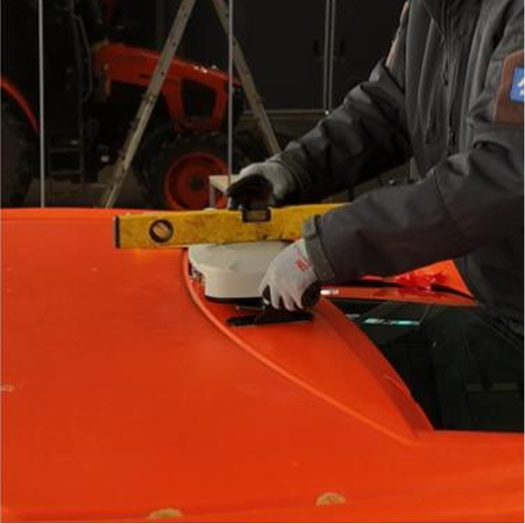

---
metaLinks:
  alternates:
    - >-
      https://app.gitbook.com/s/Pt5o7wgXBzTKHnr0VazS/order-installation/product-installation/gnss-receiver
---

# GNSS受信機の取り付け

## GNSS受信機の取り付け

pluva ionの自動操舵に必要なGNSS受信機を取付ます。

***

### 必要工具および準備物

#### 🔩 用意する物

<figure><figcaption></figcaption></figure>

<table><thead><tr><th width="161.1815185546875">項目</th><th>規格</th><th>数量</th></tr></thead><tbody><tr><td>GNSS 受信機</td><td>-</td><td>1</td></tr><tr><td>ハーネス</td><td>-</td><td>1</td></tr></tbody></table>

#### 🛠️ 必要な工具

<figure><figcaption></figcaption></figure>

<table><thead><tr><th width="130.5">項目</th><th>規格</th><th>数量</th></tr></thead><tbody><tr><td>
ソケット

レンチ
</td><td>13mm</td><td>1</td></tr><tr><td>水準器</td><td>-</td><td>1</td></tr><tr><td>乾いた雑巾</td><td>-</td><td>1</td></tr></tbody></table>

***

### GNSS受信機の取り付け&#x20;


{% column width="66.66666666666666%" %}
#### 1. 取り付ける位置を確認し、汚れをふき取る

<figure><figcaption></figcaption></figure>



{% column width="33.33333333333334%" %}





{% column width="66.66666666666666%" %}
#### **2.** ブラケットに付いているシールをはがす

<figure><figcaption></figcaption></figure>



{% column width="33.33333333333334%" %}





{% column width="66.66666666666666%" %}
#### **3.** トラクターの中央に受信機を付着する

<figure><figcaption></figcaption></figure>



{% column width="33.33333333333334%" %}





{% column width="66.66666666666666%" %}
#### **4.** 六角頭ボルト(M8x25)を緩め水平を合わせてから再度締める六角頭ボルトの締付トルクは、10Nm以上とする。

<figure><figcaption></figcaption></figure>


{% column width="33.33333333333334%" %}




