---
layout:
  width: default
  title:
    visible: true
  description:
    visible: false
  tableOfContents:
    visible: true
  outline:
    visible: true
  pagination:
    visible: true
  metadata:
    visible: true
  tags:
    visible: true
metaLinks:
  alternates:
    - >-
      https://app.gitbook.com/s/fIil1QjLd6DqdBnn2Ex9/order-installation/product-registration
---

# 製品の開通

製品を登録し、開通キーを発行します。取り付けを円滑に進めるため、取り付け前に開通することを推奨します。

***

#### 注文製品ごとの開通に必要な構成品

注文いただいた製品ごとに、下記の構成品をご用意ください。

1. **PLUVA iON**

* 全ての主な構成品を登録します。
  * タブレット
  * GNSS受信機
  * 電動ステアリングホイール

2. **エクスパンションキット（拡張キット）**

* タブレット以外の構成品を登録します。
  * GNSS受信機
  * 電動ステアリングホイール

3. **追加オプション**

* ワンタッチスイッチ

***

#### シリアル番号の登録（梱包番号）

製品の登録は、製品に付着してあるQRコード（シリアル番号、または梱包番号）をスキャンして進めます。

* 梱包番号（外箱のQRコード）を登録すると、構成品を**一括登録**できます。

#### QRコードの位置

#### 梱包箱のシリアル番号


{% column width="58.333333333333336%" %}
外箱側面のQRコードを確認してください。

<figure><figcaption></figcaption></figure>


{% column width="41.666666666666664%" %}




#### 各構成品のシリアル番号



#### タブレット

裏面のQRコードを確認してください。

<figure>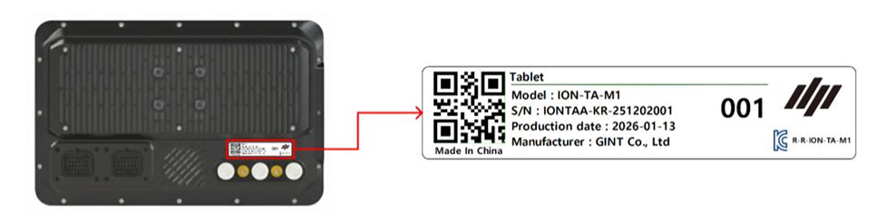<figcaption></figcaption></figure>



#### GNSS受信機

右側面、または底面のQRコードを確認してください。

<figure><figcaption></figcaption></figure>





#### 電動ステアリングホイール

モーター側面のQRコードを確認してください。

<figure><figcaption></figcaption></figure>



#### ワンタッチスイッチ

裏面のQRコードを確認してください。

<figure><figcaption></figcaption></figure>



***

#### 製品の開通方法



製品の開通ページにアクセスし、\[QRをスキャンし社員番号を入力]をタップします。

<figure><figcaption></figcaption></figure>



社員番号のQRコードをスキャンします。

<figure>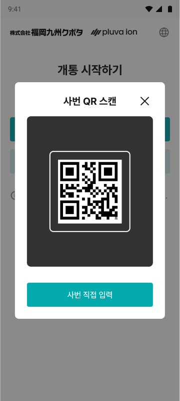<figcaption></figcaption></figure>


QRスキャンできない場合は、\[社員番号の直接入力]をタップし、社員番号を手動で入力します。





「開通する製品の選択」ページにて注文製品および追加オプション情報を設定してから\[次へ]をタップします。

<figure>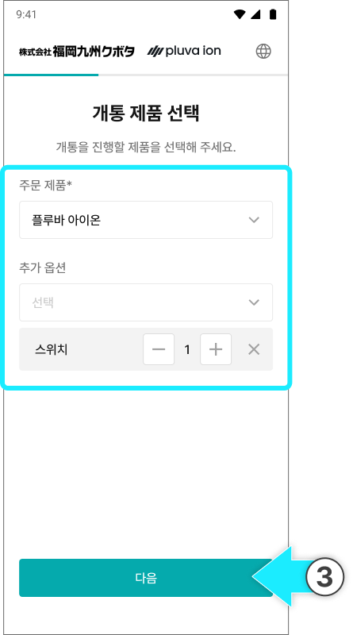<figcaption></figcaption></figure>




「主な製品の開通」ページにて\[パッケージでまとめて開通する]をタップします。

<figure>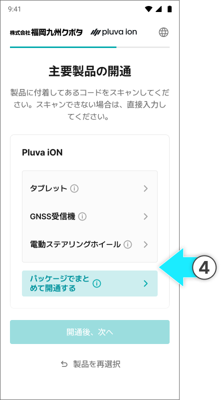<figcaption></figcaption></figure>


各構成品をそれぞれ登録することもできます。




梱包番号のQRコードをスキャンします。

<figure><figcaption></figcaption></figure>


カメラスキャンによるコード入力ができない場合は、入力欄をタップし、直接入力してください。

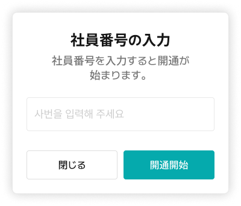




梱包番号を確認し、\[確認完了]をタップします。

<figure>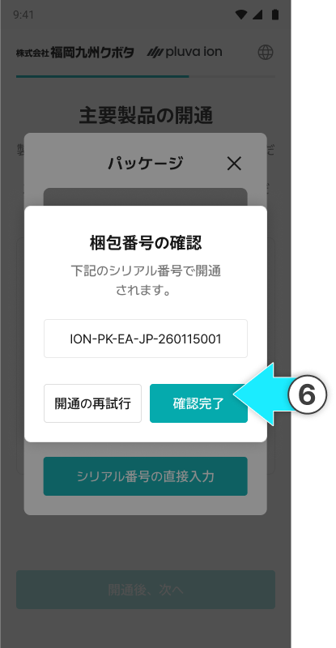<figcaption></figcaption></figure>



登録完了されると、主な製品の開通ポップアップから\[開通完了]をタップします。

<figure>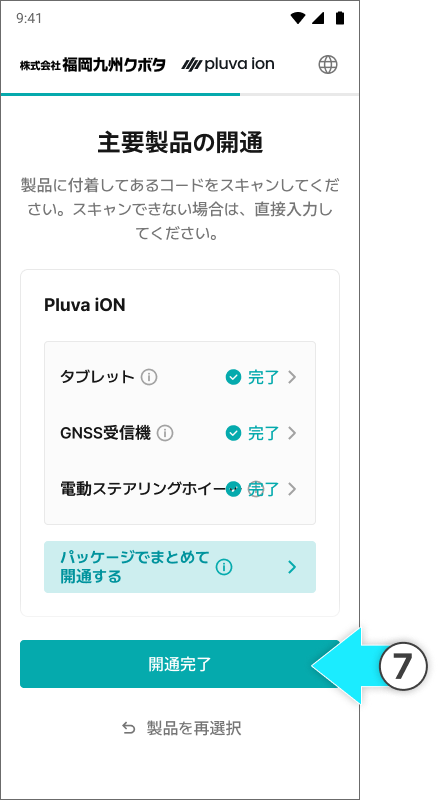<figcaption></figcaption></figure>


梱包番号（シリアル番号）が無効な場合、QRコードのスキャン画面に戻ります。

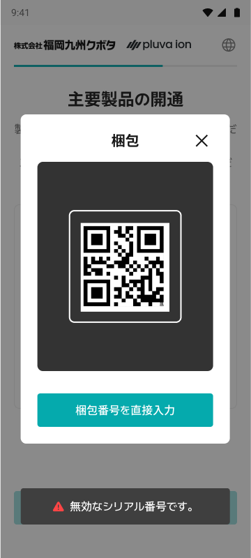



追加オプション品をご注文の場合は、主要製品の開通後に、追加オプションの開通を完了させることで、全体の開通が完了となります。

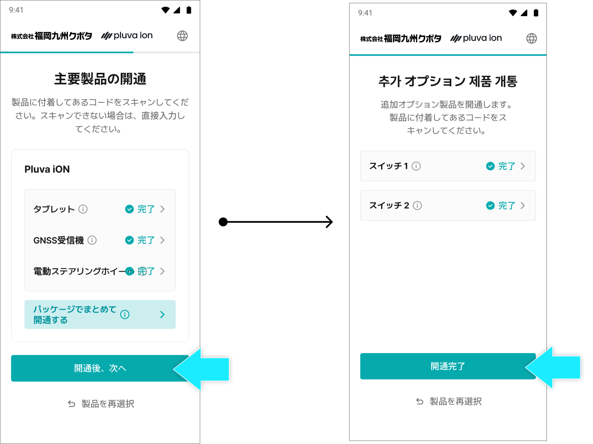



再度、製品を開通および選択する場合は、\[製品を再選択]をタップし、製品の選択ページへ戻ります。

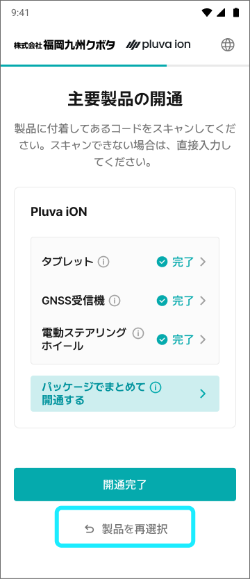




製品の開通が完了されます。

<figure>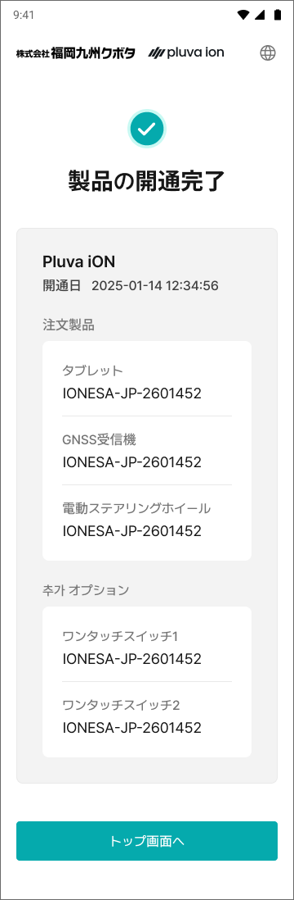<figcaption></figcaption></figure>


