---
layout:
  width: default
  title:
    visible: true
  description:
    visible: false
  tableOfContents:
    visible: true
  outline:
    visible: true
  pagination:
    visible: true
  metadata:
    visible: true
  tags:
    visible: true
metaLinks:
  alternates:
    - >-
      https://app.gitbook.com/s/256Umh24fJVf6zNkZpSa/order-installation/product-registration
---

# 제품 개통

제품을 등록하여 개통키를 발급합니다. 원활한 설치를 위해 설치 전 개통을 권장합니다.

***

#### 주문 제품별 개통 구성품

각 주문 제품에 따라 아래 구성품을 준비합니다.

1. **플루바 아이온**

* 모든 주요 구성품을 등록합니다.
  * 태블릿
  * GNSS 수신기
  * 전동 스티어링 휠

2. **Expansion Kit (확장키트)**

* 태블릿을 제외한 구성품들을 등록합니다.
  * GNSS 수신기
  * 전동 스티어링 휠

3. **추가 옵션**

* 스위치

***

#### 시리얼 넘버 등록 (패키징 넘버)

제품 등록은 제품에 부착된 QR 코드(시리얼 넘버 혹은 패키징 넘버)를 스캔해 진행합니다.

* 패키징 넘버(패키지 박스 QR)를 등록하면, 구성품을 **한 번에 등록**할 수 있습니다.

#### QR 코드 위치 안내

#### 패캐지 시리얼 넘버


{% column width="58.333333333333336%" %}
박스 측면의 QR코드를 확인합니다.

<figure><figcaption></figcaption></figure>


{% column width="41.666666666666664%" %}




#### 개별 시리얼 넘버



#### 태블릿

후면의 QR코드를 확인합니다.

<figure><figcaption></figcaption></figure>



#### GNSS 수신기

우측면 또는 하단의 QR 코드를 확인합니다.

<figure>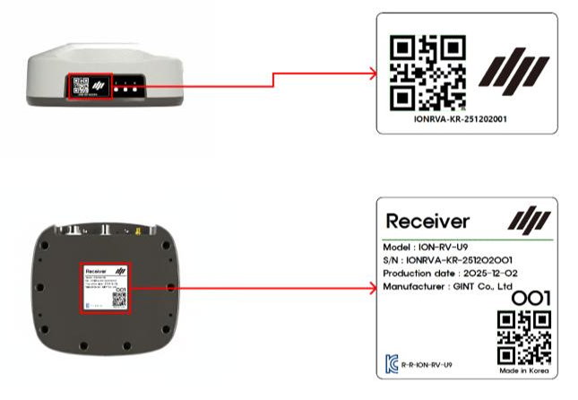<figcaption></figcaption></figure>





#### 전동 스티어링 휠

모터 측면에 QR 코드를 확인합니다.

<figure>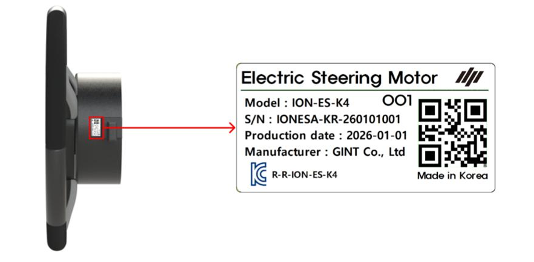<figcaption></figcaption></figure>



#### 스위치

후면의 QR코드를 확인합니다.

<figure>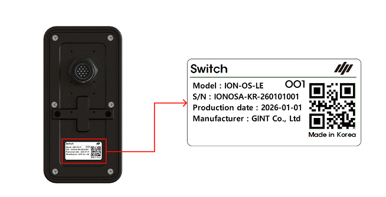<figcaption></figcaption></figure>



***

#### 제품 개통 방법



제품 개통 페이지에 접속하여 \[QR코드로 사번 입력] 버튼을 누릅니다.

<figure>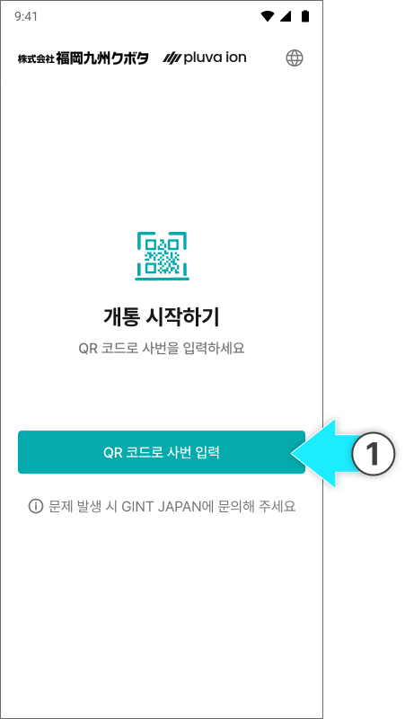<figcaption></figcaption></figure>



사번 QR코드를 스캔합니다.

<figure><figcaption></figcaption></figure>


QR 스캔이 어려울 경우 \[직접 입력] 버튼을 눌러 사번을 직접 입력합니다.





개통 제품 선택 페이지에서 주문 제품 및 추가 옵션 여부를 설정한 후 \[다음] 버튼을 누릅니다.

<figure><figcaption></figcaption></figure>




주요 제품 개통 페이지에서 \[패키지로 한 번에 개통]을 누릅니다.

<figure>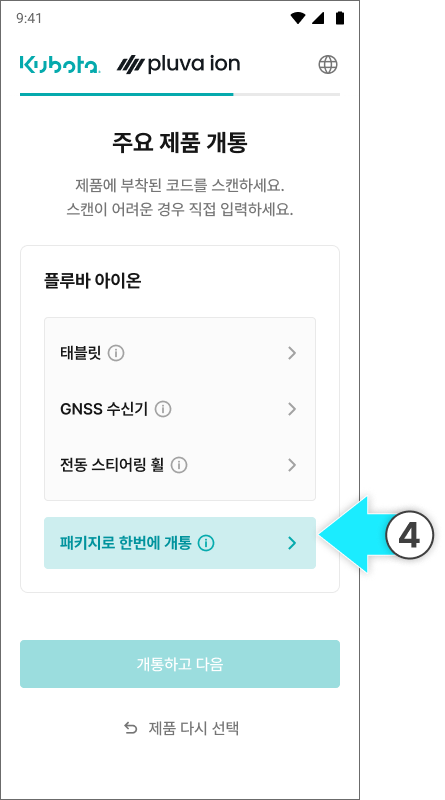<figcaption></figcaption></figure>


제품 항목을 개별 선택하여 등록할 수도 있습니다.




패키징 넘버 QR코드를 스캔합니다.

<figure>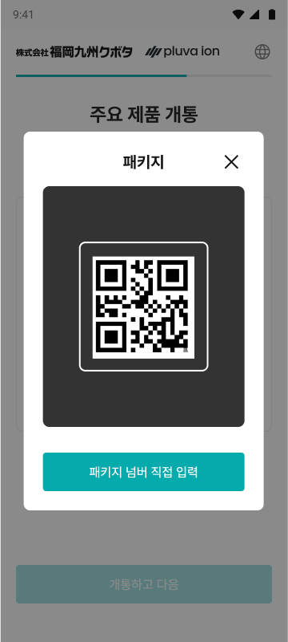<figcaption></figcaption></figure>


카메라 스캔으로 올바른 코드가 입력되지 않을 경우 입력란을 눌러 직접 입력합니다.

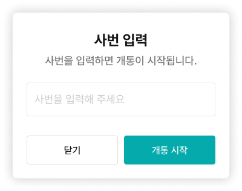




패키징 넘버를 확인한 후 \[확인 완료]를 누릅니다.

<figure>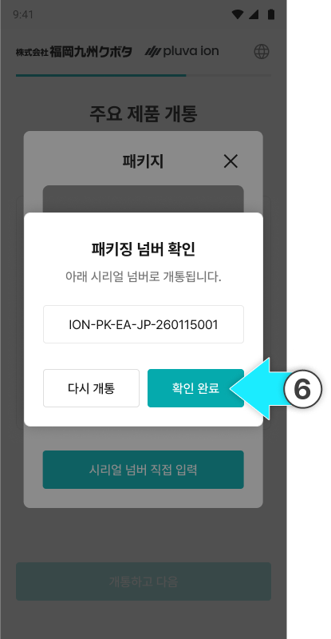<figcaption></figcaption></figure>



등록이 완료되면 제품 개통 팝업에서 \[개통 완료]를 누릅니다.

<figure>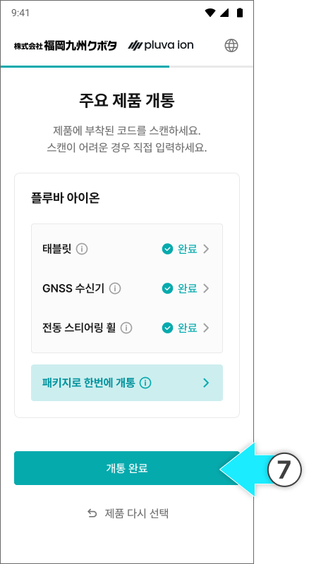<figcaption></figcaption></figure>


패키징 넘버(시리얼 넘버)가 유효하지 않을 경우 QR 스캔 화면으로 돌아갑니다.

자세한 내용은 [기타 불편사항 대응 방법 → 6)QR코드가 스캔되지 않음](/broken/pages/NzifUvx5zIDCh6FtuDrB#qr-not-scanned) 항목 참고하세요.

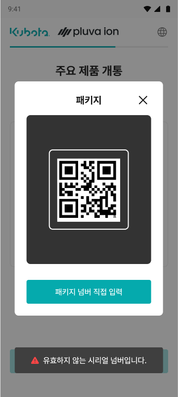



추가 옵션을 주문한 경우 주요 제품 개통 이후 추가 옵션 개통을 완료해야 전체 개통이 완료됩니다.

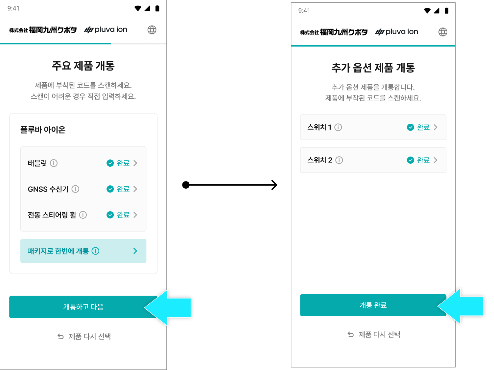



제품 개통 및 선택을 다시 진행하려면 \[제품 다시 선택]을 눌러 제품 선택 페이지로 돌아갑니다.

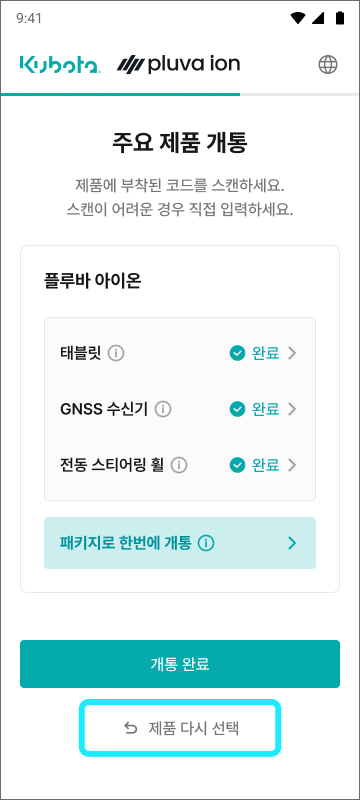




제품 개통이 완료됩니다.

<figure>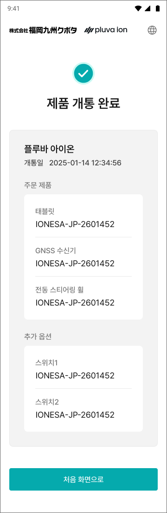<figcaption></figcaption></figure>


