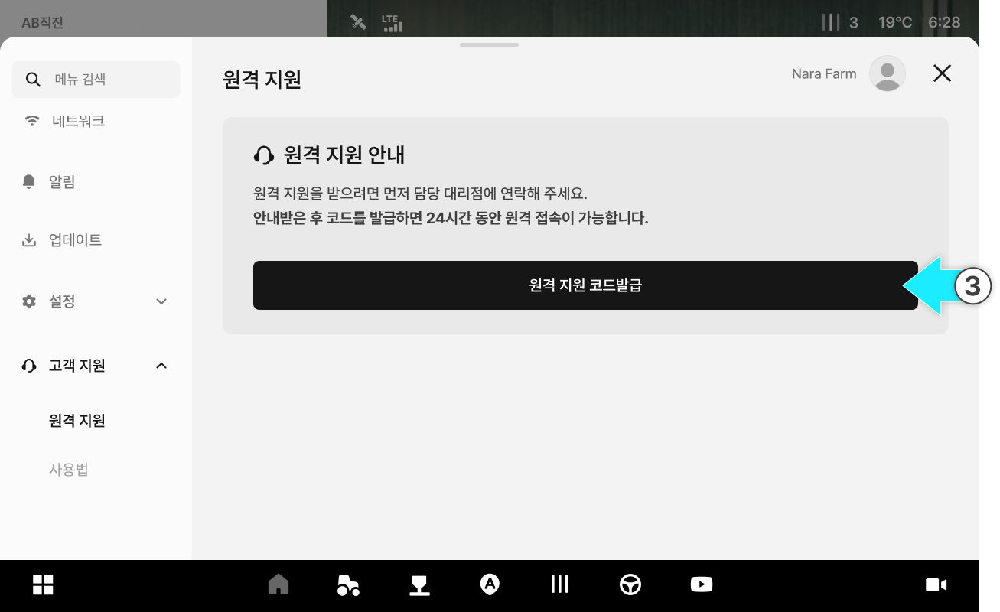
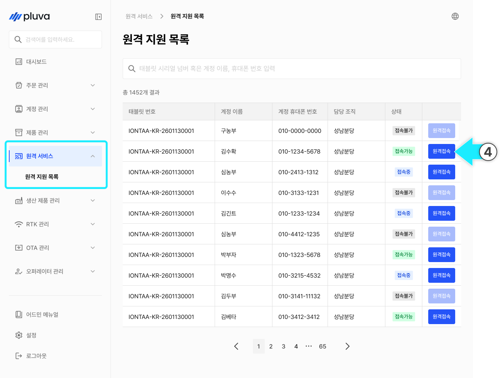
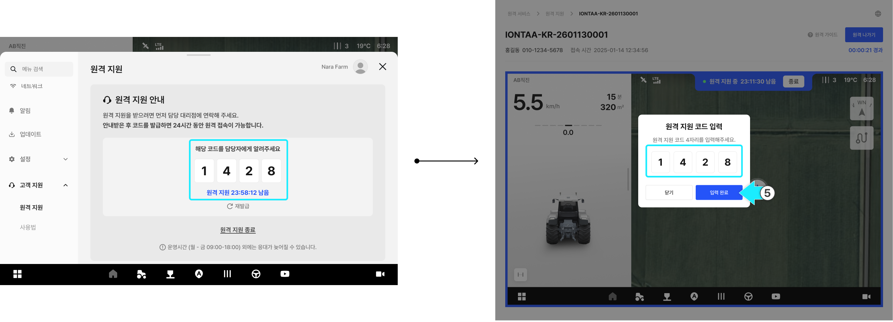
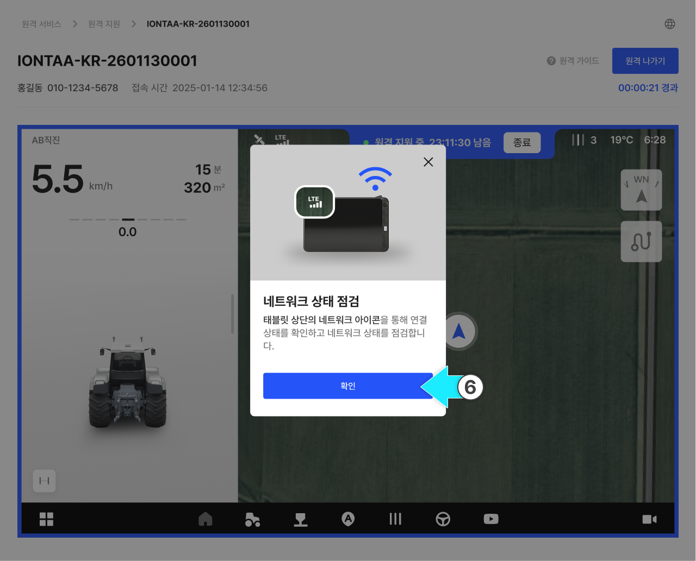
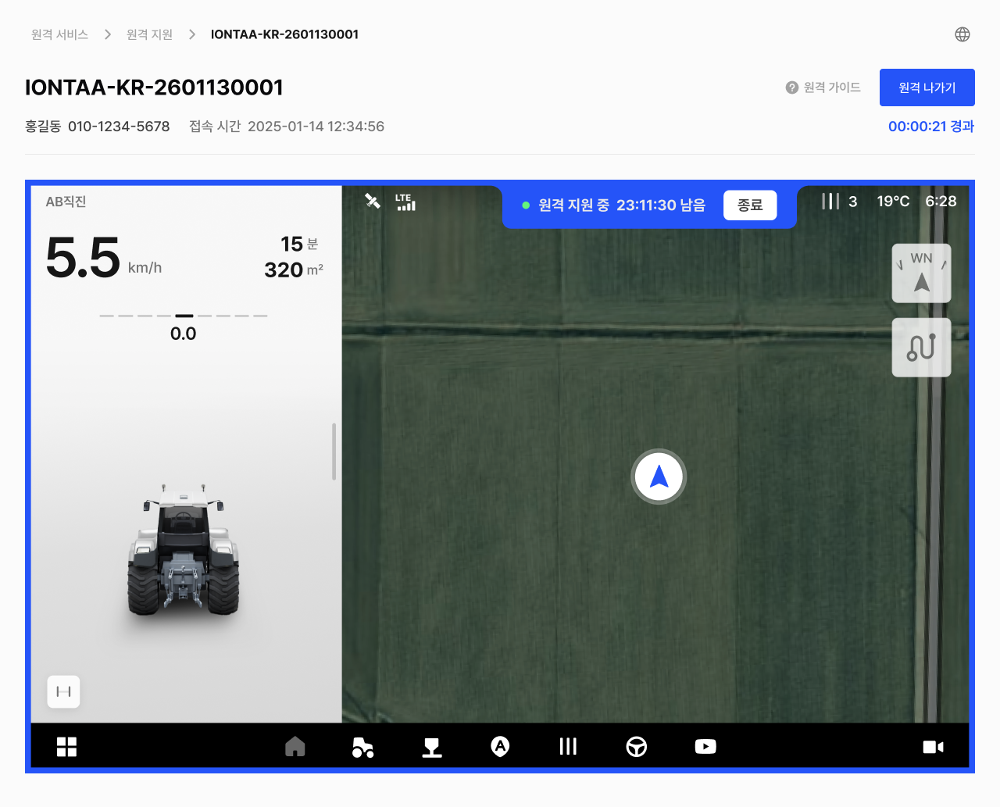
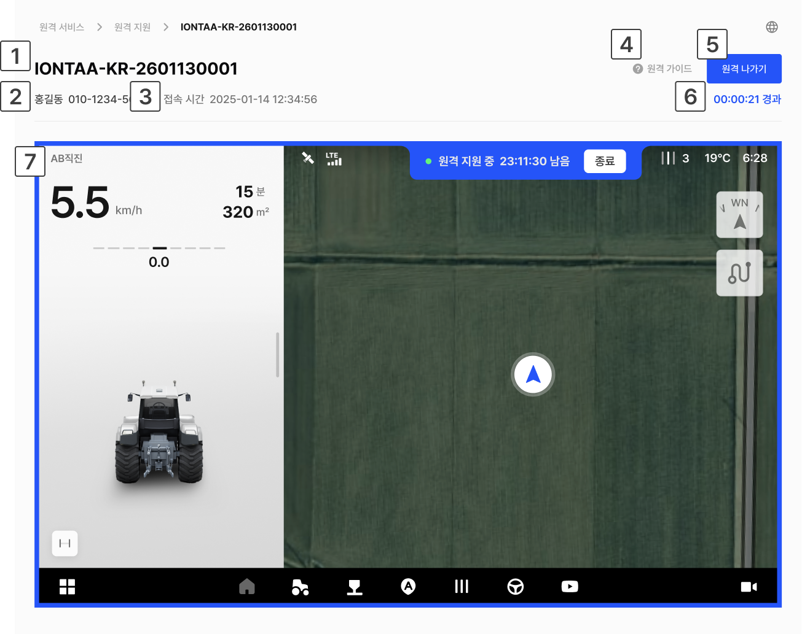
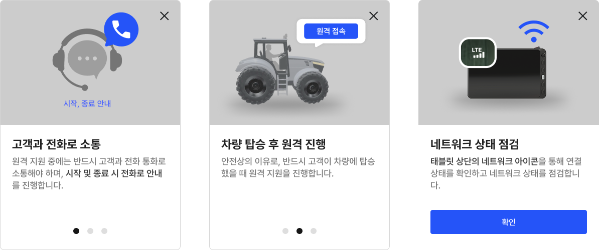

---
layout:
  width: default
  title:
    visible: false
  description:
    visible: false
  tableOfContents:
    visible: true
  outline:
    visible: true
  pagination:
    visible: true
  metadata:
    visible: true
  tags:
    visible: true
metaLinks:
  alternates:
    - https://app.gitbook.com/s/256Umh24fJVf6zNkZpSa/others/monitorning
---

# 원격 지원

### 원격 지원

원격 지원은 고객 태블릿 화면을 원격으로 확인하면서 직접 조작하거나 안내를 제공하는 기능입니다.\
고객이 앱에서 코드를 발급하면, 담당자가 어드민에서 해당 코드를 입력해 원격 지원을 시작합니다.

***

#### 원격 지원 진행 가이드

원격 지원 시 아래 사항을 준수합니다.


**전화 통화 유지**

* 원격 지원은 반드시 **고객과 통화를 유지**하며 진행합니다. **시작과 종료 시에도 고객에게 안내해야** 합니다.
* 원격으로 장비가 조작될 수 있는 만큼, 고객이 상황을 인지한 상태에서 안전하게 진행하는 것이 중요합니다.



**네트워크 확인 요청**

* 화면 멈춤이나 오류를 방지하기 위해 **고객의 네트워크 상태를 확인**합니다.&#x20;
* **셀룰러 또는 신호가 안정적인 환경에서 진행하는 것을 권장**합니다.



**차량 탑승 확인**

* 안전상의 이유로, **반드시 고객이 차량에 탑승한 상태에서만** 원격 지원을 진행합니다.


***

### 원격 지원 순서



고객으로부터 문의 전화를 받으면 상황을 청취합니다.



청취한 내용을 바탕으로 원격 지원이 필요한 상황인지 판단합니다.

* 원격 지원이 필요할 경우 다음 단계를 진행합니다.



고객에게 태블릿에서 원격 지원 코드를 발급하도록 안내합니다.

* 태블릿 경로
  * 좌측 하단 메뉴 버튼 클릭 > 고객 지원 > 원격 지원 > 원격 지원 코드 발급
* 고객 태블릿의 원격지원 화면

<figure><figcaption></figcaption></figure>


코드는 발급 시점으로부터 **24시간 동안 유효**합니다.



고객이 앱에서 \[원격 종료]를 누르면 코드가 즉시 무효화됩니다. 이 경우 코드를 다시 발급받아야 합니다.




어드민 로그인 후, 원격 지원 목록에서 해당 고객의 **\[원격 접속]** 버튼을 누릅니다.

<figure><figcaption></figcaption></figure>



고객에게 전달받은 원격 지원 코드를 입력하고 **\[입력 완료]**&#xB97C; 누릅니다.

<figure><figcaption></figcaption></figure>


접속이 되지 않는 경우 다음을 확인합니다.

1. **\[원격 접속] 버튼이 비활성화 됨**
   1. 원인: 코드가 발급되지 않았거나 만료됨
   2. 조치: 고객에게 코드 재발급 요청 
2. **중복 접속 안내 모달이 표시됨**
   1. 원인: 다른 담당자가 이미 원격 연결 중
   2. 조치: 이미 원격 중인 담당자가 지원을 계속하거나, 해당 담당자에게 \[원격 나가기]를 요청




접속 화면에 원격 가이드 팝업이 표시되면 내용을 확인하고 **\[확인]**&#xC744; 누릅니다.

<figure><figcaption></figcaption></figure>



태블릿과 연결이 완료되면 고객과 통화를 유지하며 태블릿 화면을 확인하고, 필요한 경우 직접 설정을 조작합니다.


**조작 시 아래 사항을 반드시 준수합니다.**

* 차량이 멈춘 상태에서 설정을 진행합니다. (오토스티어 보정 등 차량 이동이 필요한 설정 제외)
* 주행 시작, 정지 등 차량을 움직이는 조작은 반드시 고객이 직접 하도록 안내합니다.


<figure><figcaption></figcaption></figure>



조치가 완료되면 고객에게 종료를 알린 후 **\[원격 나가기]**&#xB97C; 누릅니다.

<figure><figcaption></figcaption></figure>

<figure><figcaption></figcaption></figure>


\[원격 나가기]를 눌러도 코드 발급 시점으로부터 24시간 이내에는 재접속이 가능합니다.

* 재접속 시 코드 입력 단계를 다시 거칩니다.



사후 모니터링이 필요한 경우, 종료 안내 시 24시간 이내에 재접속이 이루어질 수 있음을 고객에게 미리 알립니다.




#### 원격 접속 상태

1. **접속 가능**

* 고객이 원격 지원 코드를 발급한 상태입니다.
* **코드 발급 시점으로부터 24시간 이내 접속이 가능**합니다.

2. **접속 중**

* 담당자가 고객의 원격 지원 화면에 접속한 상태입니다.
* 접속 중에는 다른 담당자가 동시에 접속할 수 없습니다.


다른 담당자가 접속 중 상태에서 **\[원격 접속]** 버튼을 누르면 원격 중복 접속 안내 모달이 표시됩니다.

* 중복 접속은 불가능합니다. 접속이 필요할 경우 현재 접속 중인 담당자에게 원격 지원 나가기를 요청해야 합니다.



3. **접속 불가능**&#x20;

* 원격 지원 코드가 발급되지 않았거나 만료된 상태입니다.
* 이 상태에서는 **\[원격 접속]** 버튼이 비활성화됩니다.


원격 접속이 불가능한 상태에서 접속하려면, 고객에게 원격 지원 코드 발급을 요청해야 합니다.


***

### 원격 지원 화면 설명

#### PC 환경

<figure><figcaption></figcaption></figure>

&#x20; **태블릿 시리얼 넘버**: 원격 지원 중인 태블릿의 시리얼 넘버를 표시합니다.

&#x20; **고객 정보**: 원격 지원을 요청한 고객의 이름과 전화번호를 표시합니다.

&#x20; **접속 시간**: 원격 지원 화면에 접속한 시간을 표시합니다.

&#x20; **원격 가이드 버튼**: 원격 지원 시 유의사항과 기본 안내 내용을 확인할 수 있습니다.

*

    <figure><figcaption></figcaption></figure>

&#x20; **원격 나가기 버튼**: 현재 접속 중인 원격 지원 화면에서 나갑니다.

&#x20; **경과 시간**: 원격 지원 시작 후 경과한 시간을 표시합니다.

&#x20; **원격 진행 화면**: 현재 고객 태블릿 화면을 확인할 수 있습니다.

#### 모바일 환경

<figure><figcaption></figcaption></figure>

&#x20; **태블릿 시리얼 넘버**: 원격 지원 중인 태블릿의 시리얼 넘버를 표시합니다.

&#x20; **크게 보기 모드 버튼**: 원격 지원 화면을 가로로 전환해 더 크게 볼 수 있습니다.

<figure><figcaption></figcaption></figure>

&#x20; **원격 진행 화면**: 현재 고객 태블릿 화면을 확인할 수 있습니다.

&#x20; **경과 시간**: 원격 지원 시작 후 경과한 시간을 표시합니다.

&#x20; **원격 가이드 버튼**: 원격 지원 시 유의사항과 기본 안내 내용을 확인할 수 있습니다.

&#x20; **고객 정보**: 원격 지원을 요청한 고객의 이름과 전화번호를 표시합니다.

&#x20; **접속 시간**: 원격 지원 화면에 접속한 시간을 표시합니다.

&#x20; **원격 나가기 버튼**: 현재 접속 중인 원격 지원 화면에서 나갑니다.

