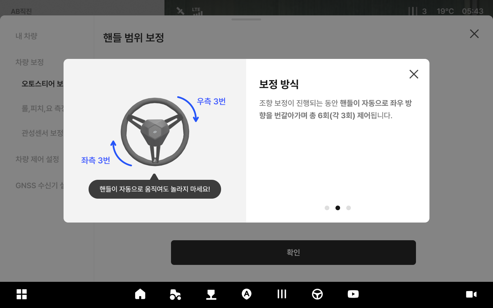
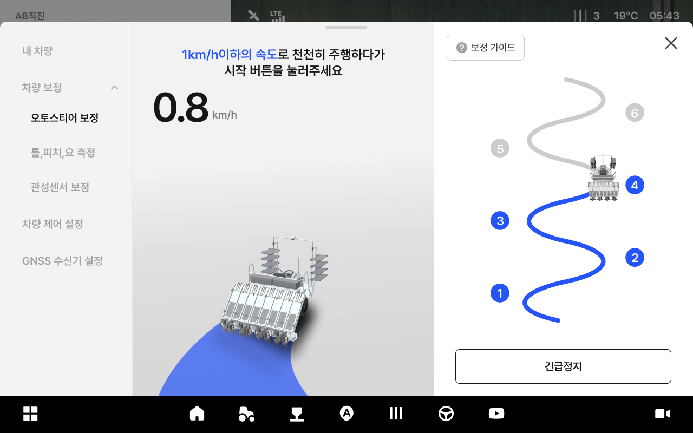

---
metaLinks:
  alternates:
    - >-
      https://app.gitbook.com/s/256Umh24fJVf6zNkZpSa/usage/vehicle-settings/autostere-calibration
---

# 오토스티어 보정

### 오토스티어 보정

오토스티어 보정은 설정된 경로를 안정적으로 추종할 수 있도록 조향 범위와 직진 기준값을\
보정하는 절차입니다. 트랙터는 2단계, 이앙기는 3단계로 진행됩니다.

**트랙터 (2단계)**

* 핸들 범위 보정 - 직진 조향 보정

<figure><figcaption></figcaption></figure>

**이앙기 (3단계)**

* 핸들 범위 보정 - 직진 조향 보정 - 조향 각도 보정

<figure><figcaption></figcaption></figure>

***

#### 오토스티어 보정 진입 방법



 \[차량] 버튼을 누릅니다.

<figure><figcaption></figcaption></figure>



차량 보정을 누릅니다.

<figure><figcaption></figcaption></figure>



오토스티어 보정을 누르면 진입이 완료됩니다.

<figure><figcaption></figcaption></figure>



***

#### 트랙터 오토스티어 보정

1. **핸들 범위 보정**



\[전체 한번에 진행] 버튼을 누르면 오토스티어 보정이 시작됩니다.

<figure><figcaption></figcaption></figure>


각 단계 시작 버튼을 누르면 해당 단계 보정만 진행할 수 있습니다.




안내에 따라 핸들을 왼쪽으로 끝까지 돌린 후 차량을 멈추고 \[확인] 버튼을 누릅니다.

<figure><figcaption></figcaption></figure>



안내에 따라 핸들을 오른쪽으로 끝까지 돌린 후 차량을 멈추고 \[확인] 버튼을 누릅니다.

<figure><figcaption></figcaption></figure>



안내에 따라 핸들을 이용하여 바퀴를 중앙에 위치시키고 차량을 멈추고 \[확인] 버튼을 누릅니다.

<figure><figcaption></figcaption></figure>



핸들 범위 보정 완료됩니다.

<figure><figcaption></figcaption></figure>



2. **직진 조향 보정**



직진 조향 보정에 필요한 설명을 읽은 후 \[확인]을 누릅니다.

<figure><figcaption></figcaption></figure>

<figure><figcaption></figcaption></figure>

<figure><figcaption></figcaption></figure>



안내에 따라 \[2km 시속]으로 주행하고 \[자동 보정 시작] 버튼을 누릅니다.

<figure><figcaption></figcaption></figure>


트랙터 제한 속도는 2km로 초과 시 버튼이 활성화 되지않습니다.



트랙터 정지 시 직진 조향 보정의 처음부터 다시 시작합니다.



직진 조향 보정 중에는 핸들이 자동으로 움직입니다. 자동 조작 중에는 핸들을 강제로 조작하지 마세요.




지속해서 2km 이하로 주행합니다.

<figure><figcaption></figcaption></figure>


보정 시 필요 면적이 확보되지않거나 주행이 불가능할 경우 긴급 정지를 누릅니다.




보정 과정이 끝나면 \[확인] 버튼이 활성화됩니다. 버튼을 눌러 보정을 완료하세요.

<figure><figcaption></figcaption></figure>



***

#### 이앙기 오토스티어 보정

1. **핸들 범위 보정**



\[전체 한번에 진행] 버튼을 누르면 오토스티어 보정이 시작됩니다.

<figure><figcaption></figcaption></figure>


각 단계 시작 버튼을 누르면 해당 단계 보정만 진행할 수 있습니다.




안내에 따라 핸들을 왼쪽으로 끝까지 돌린 후 차량을 멈추고 \[확인] 버튼을 누릅니다.

<figure><figcaption></figcaption></figure>



안내에 따라 핸들을 오른쪽으로 끝까지 돌린 후 차량을 멈추고 \[확인] 버튼을 누릅니다.

<figure><figcaption></figcaption></figure>



안내에 따라 핸들을 이용하여 바퀴를 중앙에 위치시키고 차량을 멈추고 \[확인] 버튼을 누릅니다.

<figure><figcaption></figcaption></figure>



핸들 범위 보정 완료됩니다.

<figure><figcaption></figcaption></figure>



2. **직진 조향 보정**



직진 조향 보정에 필요한 설명을 읽은 후 \[확인]을 누릅니다.

<figure><figcaption></figcaption></figure>

<figure><figcaption></figcaption></figure>

<figure><figcaption></figcaption></figure>

<figure><figcaption></figcaption></figure>



안내에 따라 \[1km 시속]으로 주행하고 \[자동 보정 시작] 버튼을 누릅니다.

<figure><figcaption></figcaption></figure>


이앙기 제한 속도는 1km로 초과 시 버튼이 활성화 되지않습니다.



이앙기 정지 시 직진 조향 보정의 처음부터 다시 시작합니다.



직진 조향 보정 중에는 핸들이 자동으로 움직입니다. 자동 조작 중에는 핸들을 강제로 조작하지 마세요.




지속해서 1km이하로 주행한다.

<figure><figcaption></figcaption></figure>


보정 시 필요 면적이 확보되지않거나 주행이 불가능할 경우 긴급 정지를 누릅니다.




보정이 완료되면 \[조향 각도 보정 시작] 버튼이 표시됩니다. 버튼을 눌러 다음 보정을 진행합니다.

<figure><figcaption></figcaption></figure>



3. **조향 각도 보정**



안내에 따라 \[1km 시속]으로 주행하고 \[자동 보정 시작] 버튼을 누릅니다.

<figure><figcaption></figcaption></figure>


이앙기 제한 속도는 1km로 초과 시 버튼이 활성화 되지않습니다.



이앙기 정지 시 직진 조향 보정의 처음부터 다시 시작합니다.



직진 조향 보정 중에는 핸들이 자동으로 움직입니다. 자동 조작 중에는 핸들을 강제로 조작하지 마세요.




지속해서 1km이하로 주행합니다.

<figure><figcaption></figcaption></figure>


보정 시 필요 면적이 확보되지않거나 주행이 불가능할 경우 긴급 정지를 누릅니다.




보정 과정이 끝나면 \[확인] 버튼이 활성화됩니다. 버튼을 눌러 보정을 완료하세요.

<figure><figcaption></figcaption></figure>


