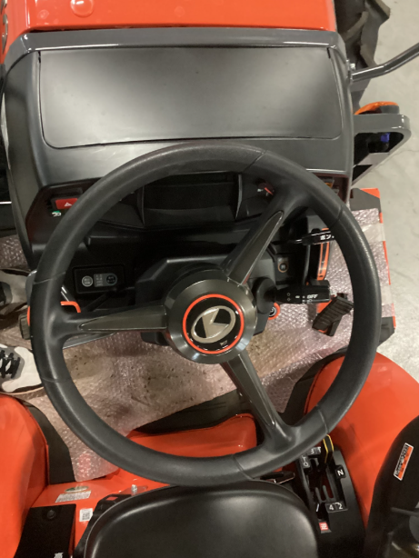
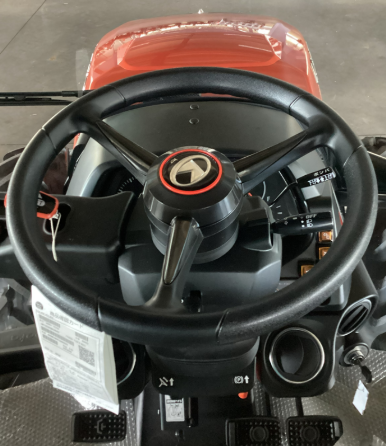
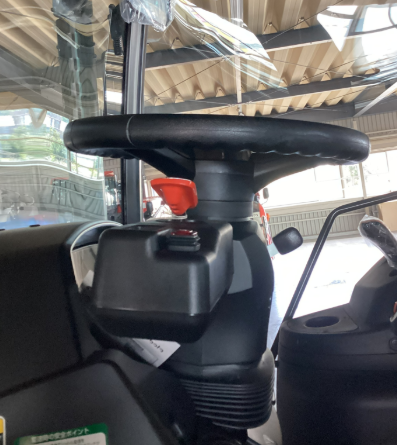
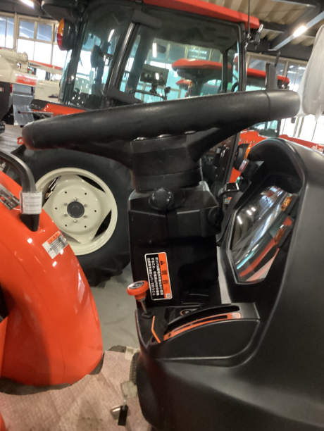
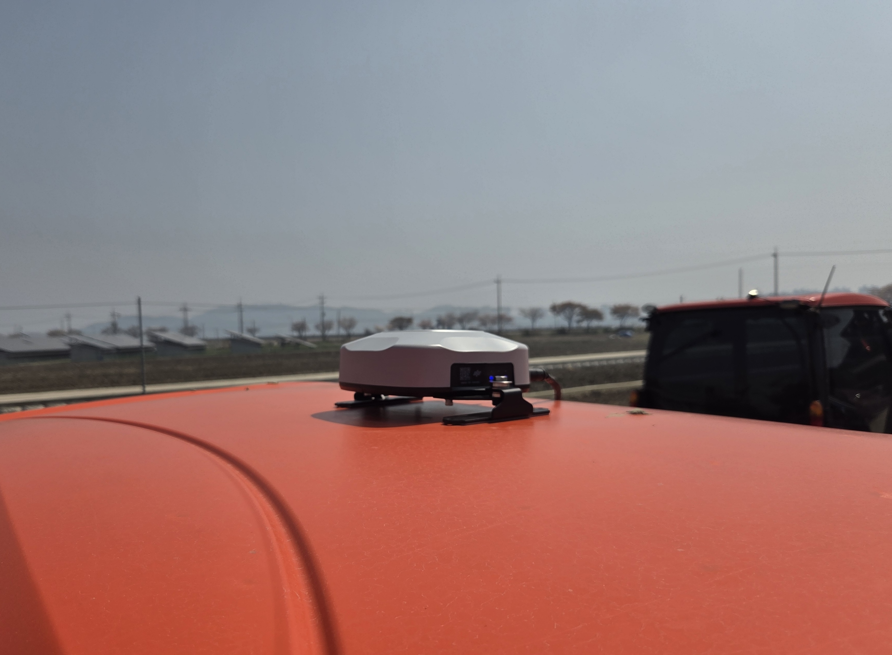
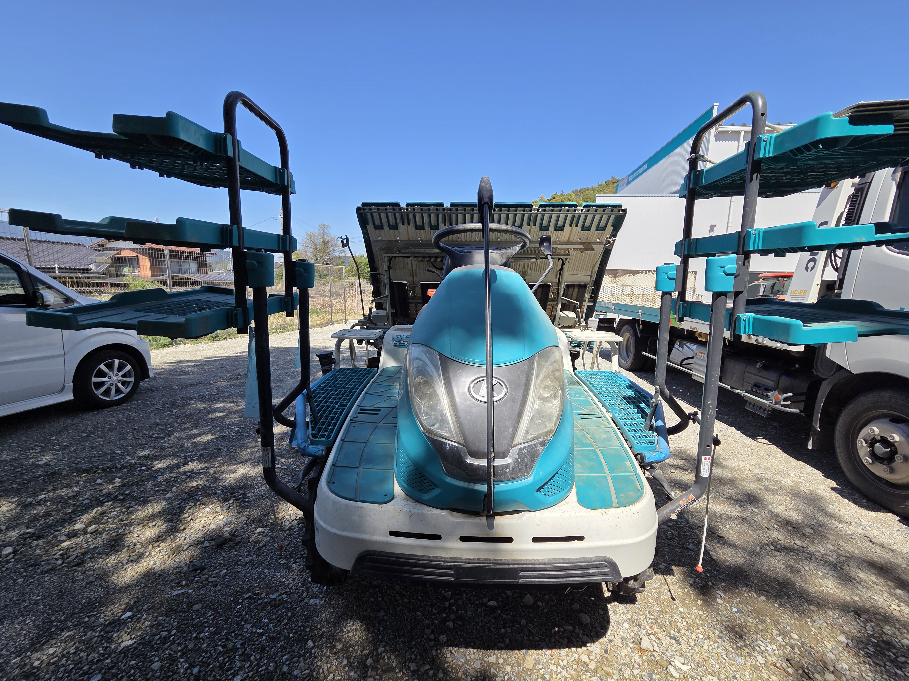
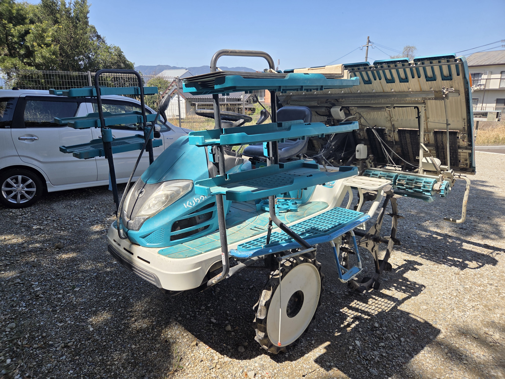

---
layout:
  width: default
  title:
    visible: true
  description:
    visible: false
  tableOfContents:
    visible: true
  outline:
    visible: true
  pagination:
    visible: true
  metadata:
    visible: true
  tags:
    visible: true
  actions:
    visible: true
tags:
  - tag: fkk
    primary: true
---

# 取り付け前の準備

現場に到着する前に、下記の項目を必ず確認し準備してください。事前準備が不足している場合、部品が合わなかったり、現地での加工が困難なため、取り付けスケジュールが延期となる恐れがあります。

***

### 取り付け前の準備プロセス



**日程及び現場情報の確認**

* **担当者の確認事項**: 取り付ける製品とお客様情報を事前に確認します。
* **位置の共有**: 圃場は、住所だけでは特定できない場合があるため、お客様から事前にグーグルマップ（Google Maps）のピン留めした位置を共有していただくことを推奨します。



**機種の互換性の確認及び写真の確保**

機種にあった部品（スプライン、ブラケットなど）を事前に用意するため、下記の写真をご訪問前に確保します。

**ハンドル周辺の写真**

正面: 操作部全体の構成がわかる写真

<figure><figcaption></figcaption></figure>

側面: ハンドル軸の角度及びスペースがわかる写真

<figure><figcaption></figcaption></figure>

<figure><figcaption></figcaption></figure>

<figure><figcaption></figcaption></figure>


**取り付けができない機種**

下記の機種は取り付けできません。ご訪問前に必ず型式を確認してください。

* フルクローラー機種
* ハンドル型のコンバイン




**GNSS受信機およびタブレットの取り付け位置を相談**

取り付け位置によって測位精度や作業の品質が変わることがあります。ご訪問前にお客様と相談して取り付け位置を決めます。

 **GNSS受信機の位置**

* **キャビンのある機種**: キャビンの上に取り付けます。メーカー純正のGNSS受信機があるかを予め確認します。

純正のGNSS受信機がない場合

* キャビンの屋根（トラクターの屋根、上部のパンネル）に取り付けます。
* 横方向（左右・横）: できる限り真ん中に取り付けます。
* 縦方向（前後・縦）: 下記の優先順位に従って取り付けます。
  1. 後方（後輪に近い位置）
  2. 中央（トップ面の中心）
  3. 前方（ステアリングホイールの近くの上部）

<figure><figcaption></figcaption></figure>

純正のGNSS受信機がある場合

* キャビンの屋根に取り付け・横方向の条件は上記と同様です。
* 縦方向は、純正の受信機のない位置（後方、または中央）に取り付けます。

* **オープン型（屋根なし）**: ボンネットの平らなところに取り付けます。

取り付け写真

<figure><figcaption></figcaption></figure>

 **タブレットの位置**

* 運転中に操作しやすく、しっかり固定できる位置をお客様と相談して決めます。



**穴あけ加工及び改造に関する事前同意の確保**

取り付け中に機体の一部を加工しなければならない場合があります。ご訪問前にお客様へ下記の内容をご案内し、必ず事前に同意を得てください。

* **クラクション**: スイッチの移設または配線作業の際、穴あけ加工が必要になる場合があります。
* **田植え機のハンドルカバー**: Uボルトブラケット装着のため、穴あけ加工が必要になる場合があります。
* **田植え機のGNSSステー**: 田植え機の場合、GNSS受信機を取り付けるためのステーが必要です。このステーは、取り付け担当者が訪問する前に、お客様の方で事前に用意していただく必要があります。ステーがない場合、訪問した日には受信機の取り付けができません。そのため、ご訪問前にステーを用意していただくようお客様に予め案内してください。

取り付けができない場合（ステーのない機種）

<figure><figcaption></figcaption></figure>

<figure><figcaption></figcaption></figure>

取り付け可能な場合

<figure><figcaption></figcaption></figure>




**通信環境およびアカウントのご用意**

* **インターネット接続**: 簡単セットアップとRTK測位のため、セルラー（LTE）接続が必要です。SIMカードを用意するか、スマホからのテザリングが可能であることを予めご確認ください。
* **ご使用予定のRTKの確認**: 簡単セットアップから位置補正方法を設定します。ご訪問前にお客様がどのRTKを使用する予定なのかを確認し、必要な情報をお客様から予め確保します。
  * **RTKの手動接続**: NTRIP方法で補正信号を受信します。ご訪問前に下記の情報を予め用意していただくようお客様に案内してください。
    * 基地局/サーバー住所及びポート
    * マウントポイント
    * アカウントID及びパスワード
  * **RTKのBluetooth接続**: 外部のRTK受信機とBluetoothで接続します。接続に必要なRTKアプリのアカウントID及びパスワードをご訪問前に予め用意していただくようお客様に案内してください。
* **pluvaの会員登録**: pluva ionを使用するためには、お客様のアカウントが必要です。取り付け前に会員登録が完了しているかをご確認ください。[お客様のアカウントのご用意](preparing-accounts.md)をご参照ください。


ソフトウェアアップデート（OTA）を行うと、約**300MB～500MB**のデータが消耗されます。お客様のデータ通信プランを予め確認の上、データが足りない場合に備えてWi-Fiやテザリングの用意をしてください。




**テスト走行およびオートキャリブレーションのためのスペース確保**

取り付け後には自動補正（オートキャリブレーション）のための走行が必要です。下記の条件にかなうスペースを予め用意していただくようお客様に要請してください。

* **地面の状態**: タイヤがスリップしない、平らで硬い場所（コンクリート、またはしっかりと固められた土）
* **必要な面積**:
  * 普通の機種: 少なくても**30m × 30m**以上
  * 倍速ターン付き機種: 少なくても**50m × 40m**以上


上記の事項をご準備いただけない場合、部品の不適合や現地での加工不可により、取り付けスケジュールが延期となる恐れがあります。ご準備の際にご不明な点がございましたら、(株)GINTまでお問い合わせください。




***

### ご訪問前の最終チェックリスト

出発する前に、下記の項目を一つずつご確認ください。

事前確認

* [ ] 担当者確認: 教育修了証の所持有無の確認
* [ ] 位置情報: 取り付けの住所およびグーグルマップのピン留めした位置を共有してもらう。
* [ ] 機種の互換性の最終確認:
  * トラクター/田植え機の正確な型式を確認（フルクローラー機種は取り付け不可）
  * ハンドル周辺の写真確認
  * 屋根（キャビン）の有無の確認（GNSS受信機のステーの有無を確認）
  * 構成品の取り付け位置の確認
  * クラクション取り付けのための穴あけ加工のご案内およびお客様への事前同意
  * 田植え機取り付けの際: GNSS受信機の取り付けステーの準備状況を確認する（ない場合は、受信機の取り付け不可）
  * 田植え機取り付けの際: Uボルトブラケットの装着のため、ハンドルカバーの穴あけ加工のご案内及びお客様への事前同意
* [ ] pluvaのアカウント: ユーザーのpluva会員登録が完了したかの確認
* [ ] 使用予定のRTKサービスの接続情報を確認する
* [ ] オートキャリブレーションのスペース確保: 自動補正（キャリブレーション）のための平らな作業スペース（30m × 30m 以上）の確保をお願いする

持ち物

* [ ] 教育修了証
* [ ] 製品（pluva ion kit / expansion kit）
* [ ] スプライン / ブラケット / Uボルトブラケット
* [ ] ワンタッチスイッチ
* [ ] SIMカード
* [ ] 穴あけ加工のための工具

