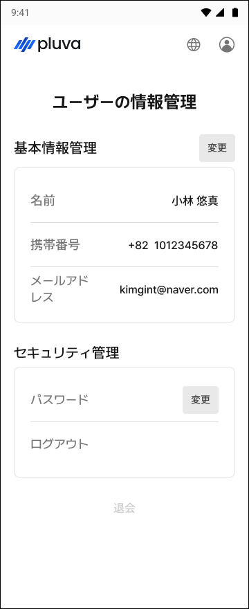
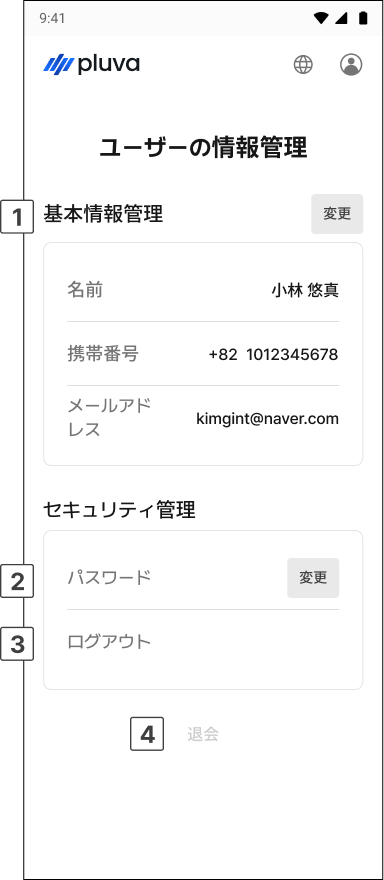

# お客様アカウント情報の修正

登録したお客様のアカウント情報を確認し、修正する方法をご案内します。

***

### アカウント情報の修正



ログイン後、ホームページ右上のプロフィール（アカウント）アイコンをタップします。

<figure><figcaption></figcaption></figure>



\[My情報管理]画面へアクセスし、情報を修正します。

<figure><figcaption></figcaption></figure>



***

### My情報管理の画面

<figure><figcaption></figcaption></figure>

 基本情報の管理

* お名前、携帯電話番号、メールアドレスを確認し\[変更]をタップして修正します。

 パスワード

* \[変更]をタップし、パスワードを変更します。

 ログアウト

* 現在のアカウントからログアウトします。

 退会

* アカウントを削除（退会）します。


退会すると、アカウントおよび保存された情報がすべて削除され、復元できません。退会前に必要な情報を予めご確認ください。

