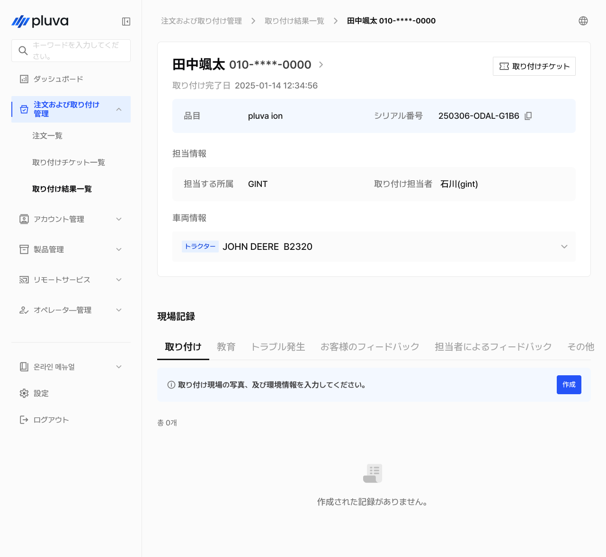
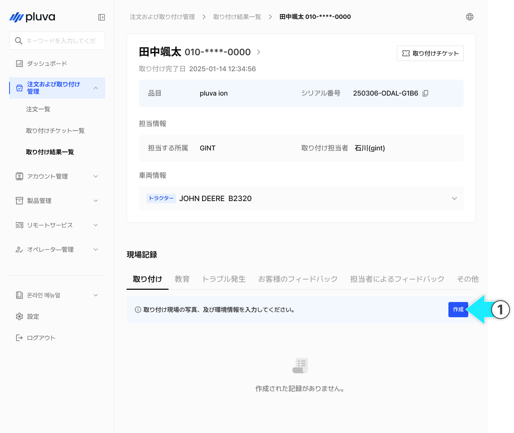
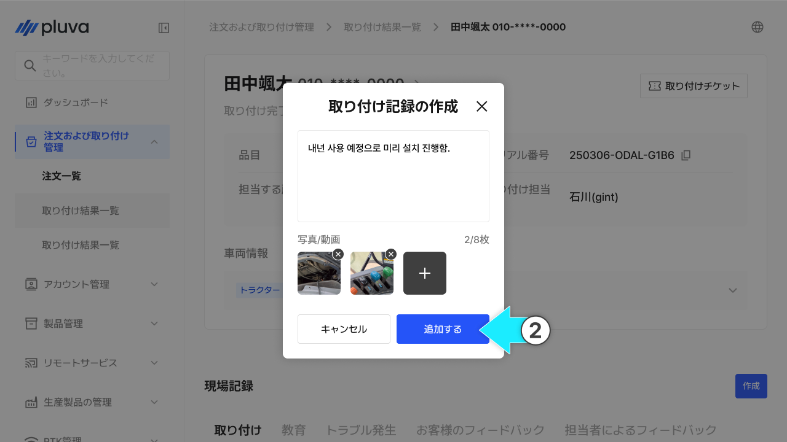
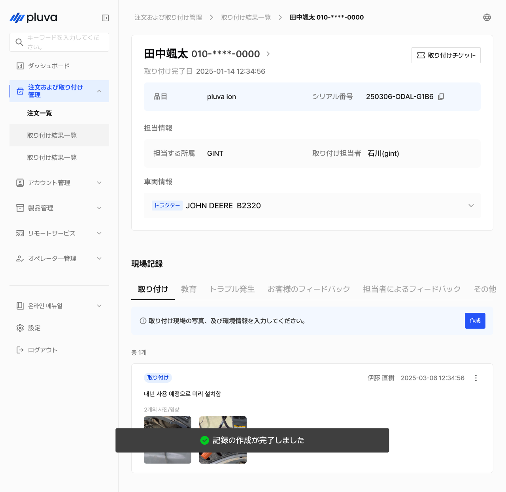
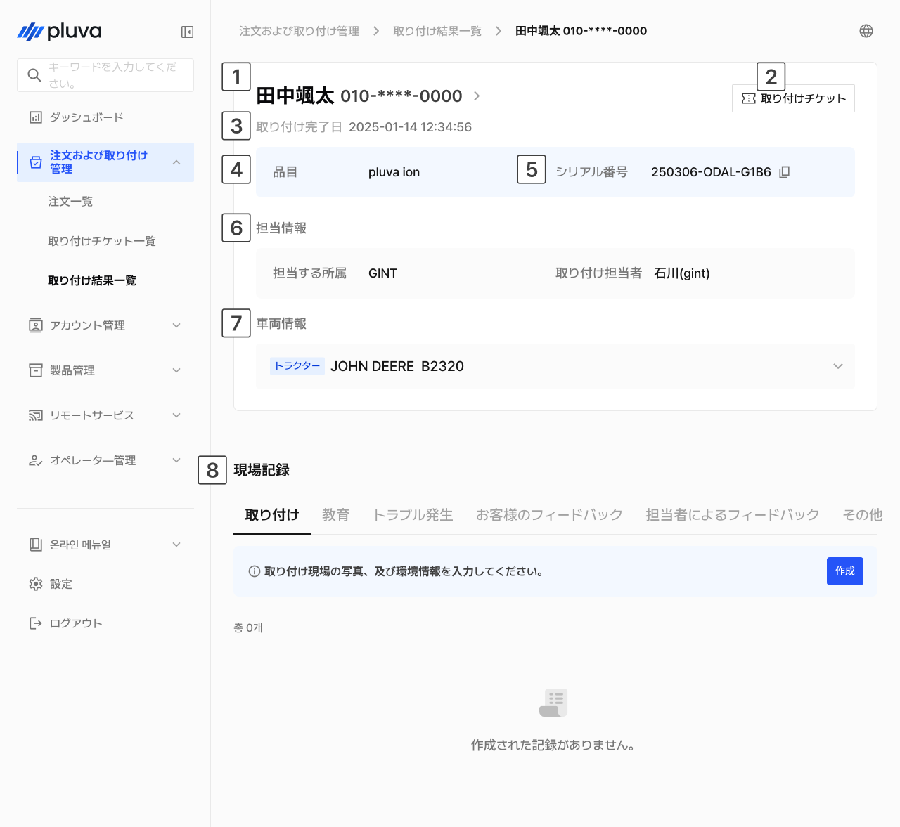
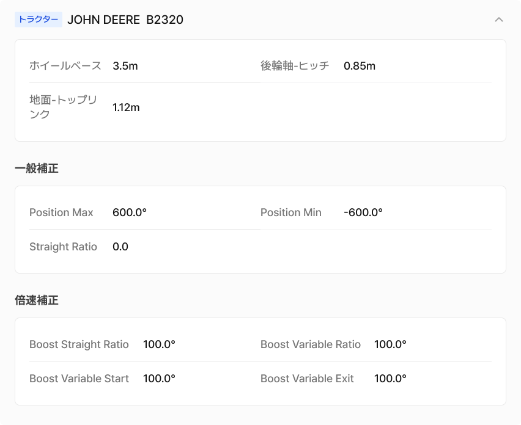
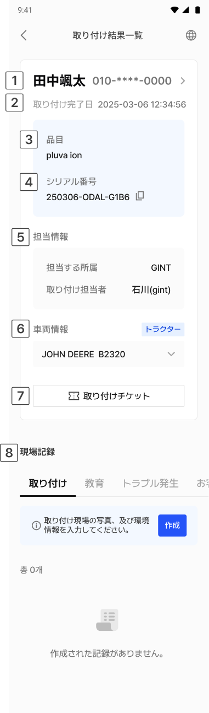
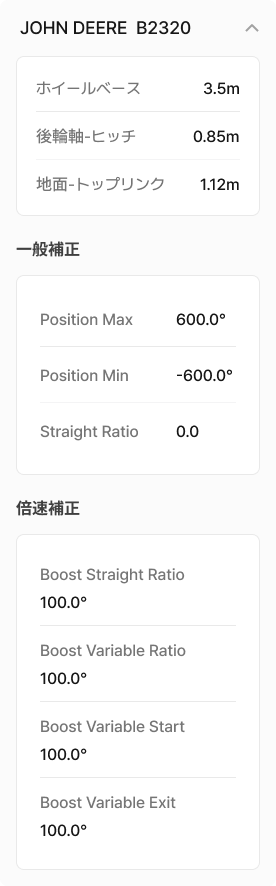

# 取り付け結果一覧

取り付け結果とは、「誰に・どの製品を・どの車両に・いつ取り付けたか」を確認するメニューです。取り付けチケットが完了されてから確認できます。現場の状況をテキストや写真、動画で入力し記録することができます。


取り付けチケットのステータスが「完了」と確認されている場合のみ表示されます。取り付け作業は終了していても、チケットが「完了」処理されていない場合は、一覧に表示されません。


***

### アクセス方法



サイドバーから\[注文および取り付け管理]をタップし、取り付け結果一覧をタップします。

<figure><figcaption></figcaption></figure>



取り付け結果一覧へアクセスできます。

<figure><figcaption></figcaption></figure>



***

### 作業報告の作成方法



作成するタブを選択し\[作成する]をタップします。

<figure><figcaption></figcaption></figure>



入力モーダルから内容を入力し、写真や動画を添付します。

<figure><figcaption></figcaption></figure>

* 画像のファイル形式: JPG, PNG, HEIC, WEBP
* 動画のファイル形式: MP4, MOV



\[追加する]をタップすると作成が完了されます。

<figure><figcaption></figcaption></figure>




作業報告は、取り付け結果が作成された後に入力及びアップロードできます。また、作成およびアップロードした担当者と日時が併せて記録されます。取り付け担当者以外でも入力できますが、修正は作成者本人しか行えません。


***

### 取り付け結果一覧に関するご案内

#### PC環境

<figure><figcaption></figcaption></figure>

 **お客様情報**

* 画面上部にお客様のお名前と携帯電話番号が表示されます。
* お客様名をクリックすると、お客様のアカウントの詳細へアクセスします。

 **取り付けチケットボタン**

* ボタンをクリックすると、この取り付け結果に紐づいた取り付けチケットへアクセスします。

 **取り付け完了日**

* 取り付けの完了日時が表示されます。

 **品目**

* 取り付けした製品が表示されます。

 **シリアル番号**

* タブレットのシリアル番号が表示されます。
* エクスパンションキットの場合、紐づいているタブレットのシリアル番号が表示されます。

 **担当情報**

* 担当する所属および取り付け担当者が表示されます。

 **車両情報**

* 取り付け車両のタイプ、メーカー、型式が表示されます。（例：トラクター・JOHN DEERE B2320）


**ご参考**

車両情報のドロップダウンをクリックすると、車両の寸法および取り付け当時の補正値を確認できます。



 **作業報告**

取り付け結果に関する作業報告をタブごとに作成及び確認します。各タブ上の作成内容は次の通りです。

* **取り付け** : 取り付け現場の写真と状況を作成します。
* **教育** : 教育内容やお客様の理解度を作成します。
* **不具合発生** : 発生した不具合および今後の対応事項を作成します。
* **お客様からのフィードバック** : お客様の反応や満足度、ご意見を作成します。
* **担当者によるフィードバック** : 担当者による性能評価および改善意見を作成します。
* **その他** : その他事項を作成します。

#### モバイル環境

<figure><figcaption></figcaption></figure>

 **お客様情報**

* 画面上部にお客様のお名前と携帯電話番号が表示されます。
* お客様名をクリックすると、お客様のアカウントの詳細へアクセスします。

 **取り付け完了日**

* 取り付けの完了日時が表示されます。

 **品目**

* 取り付けした製品が表示されます。

 **シリアル番号**

* タブレットのシリアル番号が表示されます。
* エクスパンションキットの場合、紐づいているタブレットのシリアル番号が表示されます。

 **担当情報**

* 担当する所属および取り付け担当者が表示されます。

 **車両情報**

* 取り付け車両のタイプ、メーカー、型式が表示されます。


**ご参考**

車両情報のドロップダウンをクリックすると、車両の寸法および取り付け当時の補正値を確認できます。



 **取り付けチケットボタン**

* ボタンをタップすると、この取り付け結果に紐づいた取り付けチケットへアクセスします。

 **作業報告**

* 取り付け結果に関する作業報告をタブごとに作成及び確認します。作成方法は、上記のPC環境をご確認ください。
