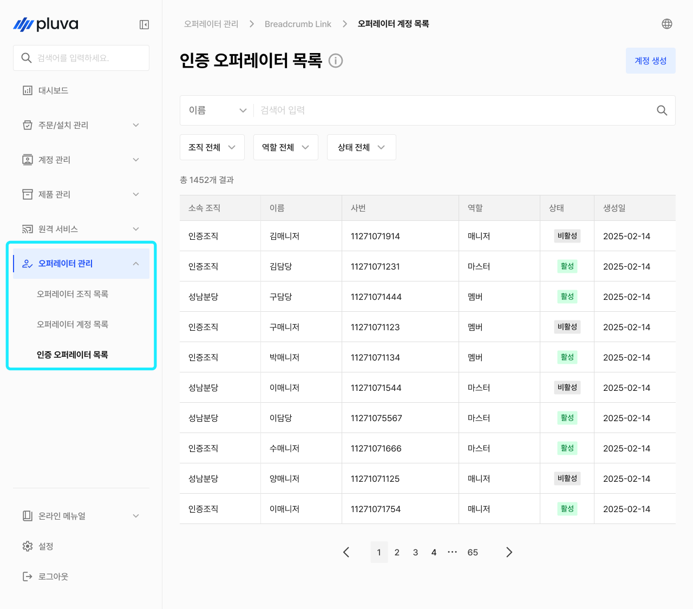
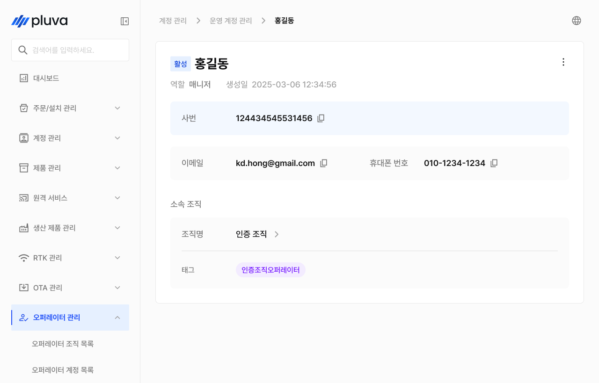
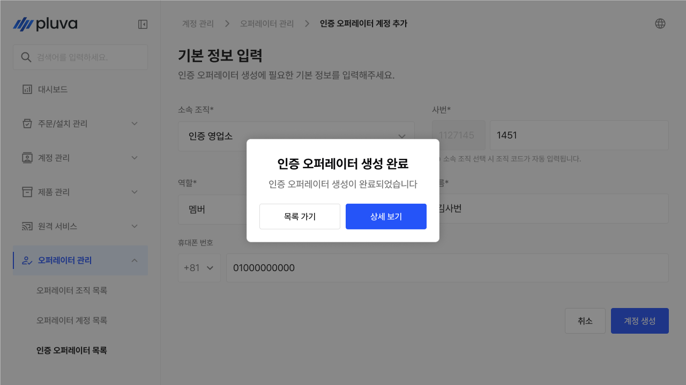
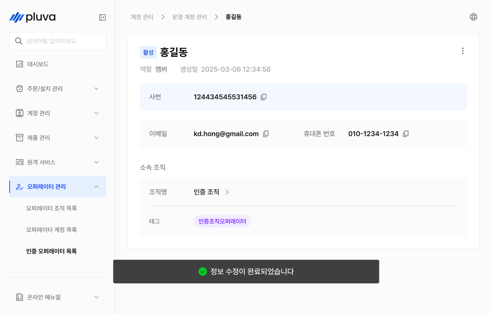
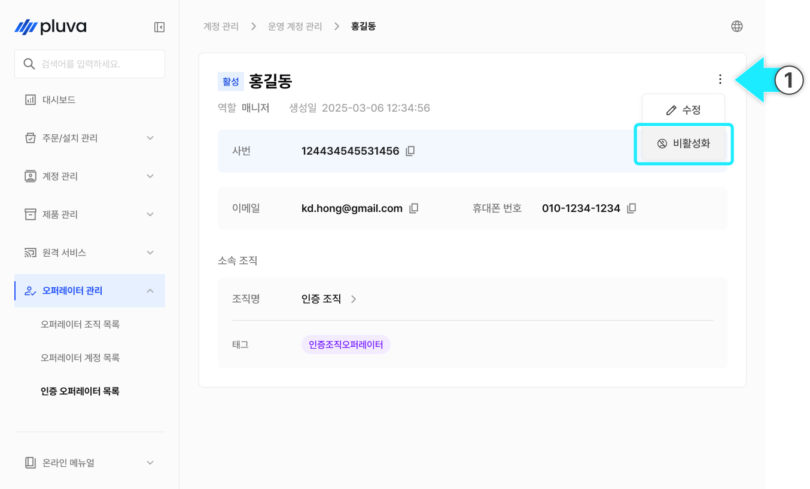
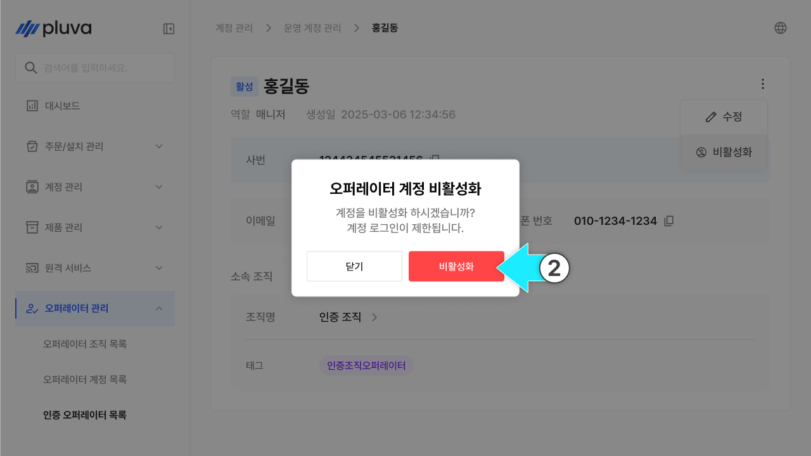
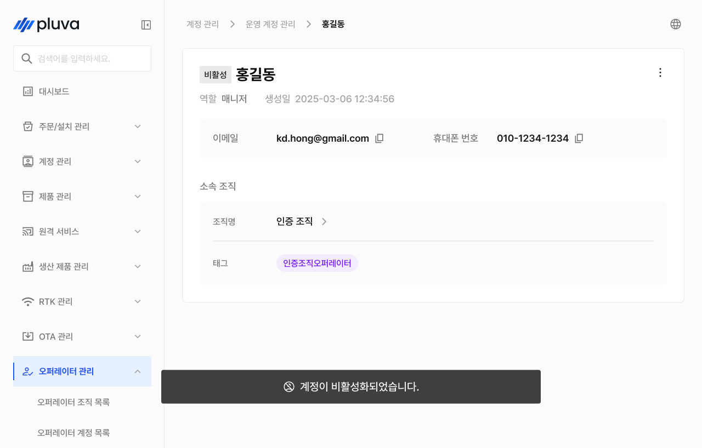
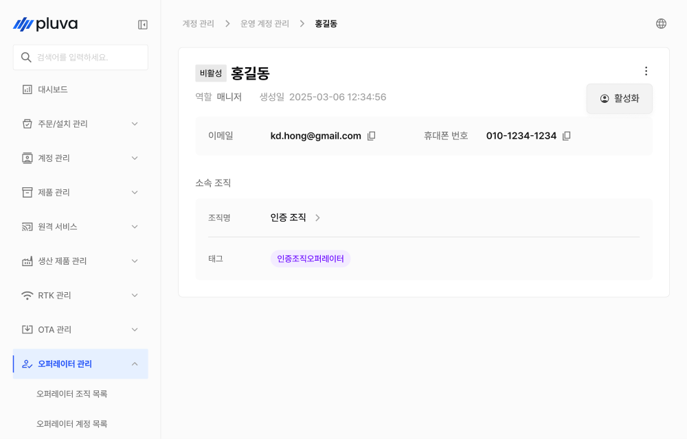
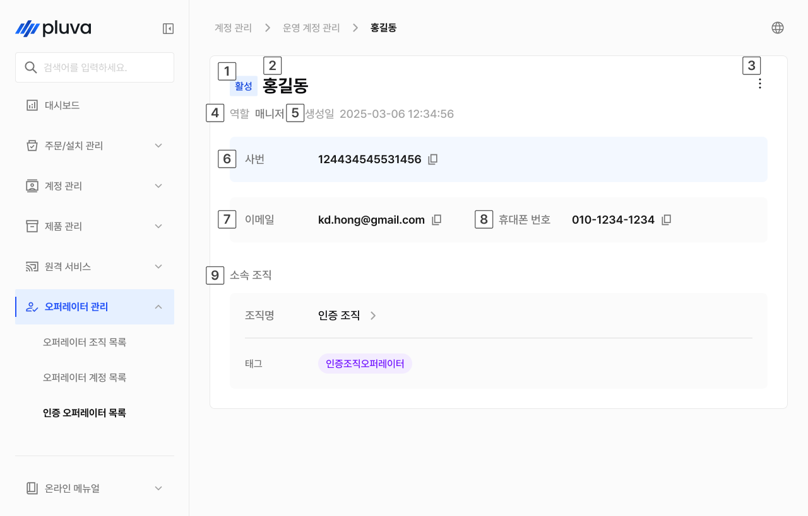
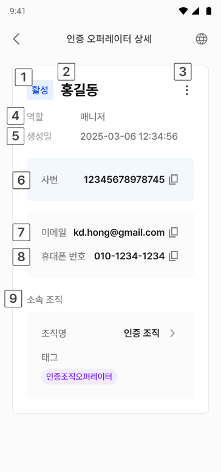

# 認証済みオペレーター管理

認証済みオペレーター管理は、現場で作業や取り付けをする、認証済みの担当者（認証済みオペレーター）を登録および管理するメニューです。役割に応じて権限が区分され、有効化・無効化に切り替えることで使用を制限できます。


このメニューは、パートナーアドミン以上の役割、或いはGINTアカウントでのみアクセスできます。


***

### アクセス方法



左のメニューから認証済みオペレーター一覧を選択します。

<figure><figcaption></figcaption></figure>



お探しの認証済みオペレーターを選択し、詳細へアクセスします。

<figure><figcaption></figcaption></figure>



***

### 認証済みオペレーターの登録


認証済みオペレーターは閲覧のみ可能です。登録・修正（作成・変更）は、GINTを通して進めてください。.




一覧画面の右上の\[アカウントの作成]を選択します。

<figure><figcaption></figcaption></figure>



全ての必須項目を入力し、アカウントの作成を選択します。

<figure><figcaption></figcaption></figure>


所属は、この認証済みオペレーターの管理範囲を決められます。所属に応じて閲覧・作業可能範囲が異なってきます。



**役割のご案内**

* **メンバー** : 現場作業・取り付けなどの実務を担当します。
* **マネージャー** : 所属組織の認証済みオペレーターを管理し、実務を統括します。




所属の作成が完了されます。

<figure><figcaption></figcaption></figure>



***

### 認証済みオペレーター情報の修正



認証済みオペレーターの詳細から「詳細」を選択し\[修正]をタップします。

<figure><figcaption></figcaption></figure>



内容を変更し\[修正完了]を選択します。

<figure><figcaption></figcaption></figure>



修正が完了します。

<figure><figcaption></figcaption></figure>



***

### 認証済みオペレーターの無効化 / 有効化활성화

認証済みオペレーターの使用を一時中断し、または再度有効にできます。


認証済みオペレーターは削除されず、無効にすることで使用を制限します。履歴はそのまま保存されます。




認証済みオペレーターの詳細から「詳細」を選択し\[無効化]をタップします。

<figure><figcaption></figcaption></figure>



確認のポップアップが表示されたら\[確認]を選択します。

<figure><figcaption></figcaption></figure>



無効になります。

<figure><figcaption></figcaption></figure>




無効の状態では、有効化オプションのみ表示されます。該当する項目を選択すると、再度有効になります。



***

### 認証済みオペレーターの詳細情報

一覧から項目を選択すると、該当する認証済みオペレーターの詳細情報画面へ移動します。

#### PC環境

<figure><figcaption></figcaption></figure>

.svg>) ステータス

* 有効 / 無効が表示されます。

.svg>) お名前

* 認証済みオペレーターの名前が表示されます。

.svg>) 詳細ボタン


ボタンを押すと\[修正]、\[無効化]（あるいは\[有効化]）を選択できます。


.svg>) 役割

* 付与された役割が表示されます。（例：マネージャー）

.svg>) 作成日

* 作成日時が表示されます。

.svg>) 社員番号

 メールアドレス

 携帯電話番号

 所属


所属名とタグが表示されます。所属名をクリックすると、該当する所属の詳細画面へ移動します。


#### モバイル環境

<figure><figcaption></figcaption></figure>

.svg>) ステータス

* 有効 / 無効が表示されます。

.svg>) お名前

* 認証済みオペレーターの名前が表示されます。

.svg>) 詳細ボタン


ボタンをタップすると\[修正]、\[無効化]（あるいは\[有効化]）を選択できます。


.svg>) 役割

* 付与された役割が表示されます。（例：マネージャー）

.svg>) 作成日

* 作成日時が表示されます。

.svg>) 社員番号

 メールアドレス

 携帯電話番号

 所属


所属名とタグが表示されます。所属名をタップすると、該当する所属の詳細画面へ移動します。

