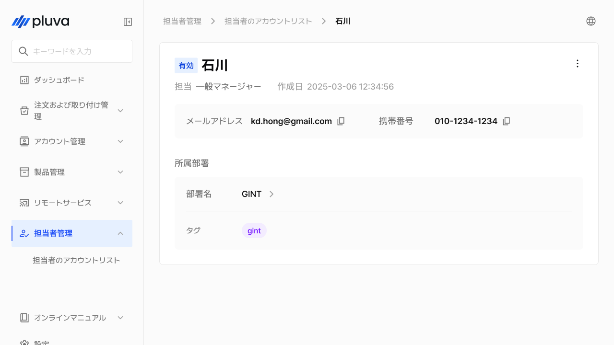
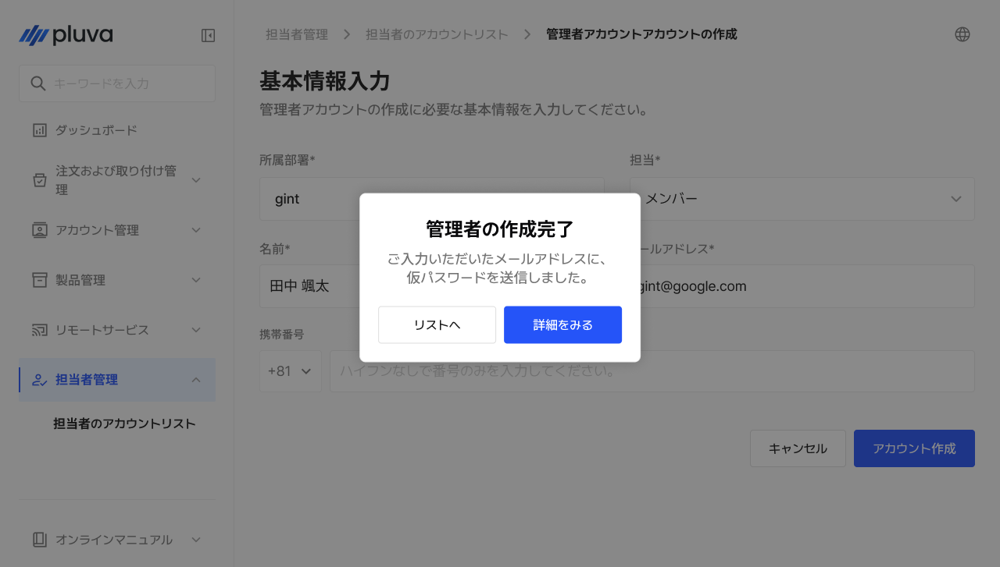
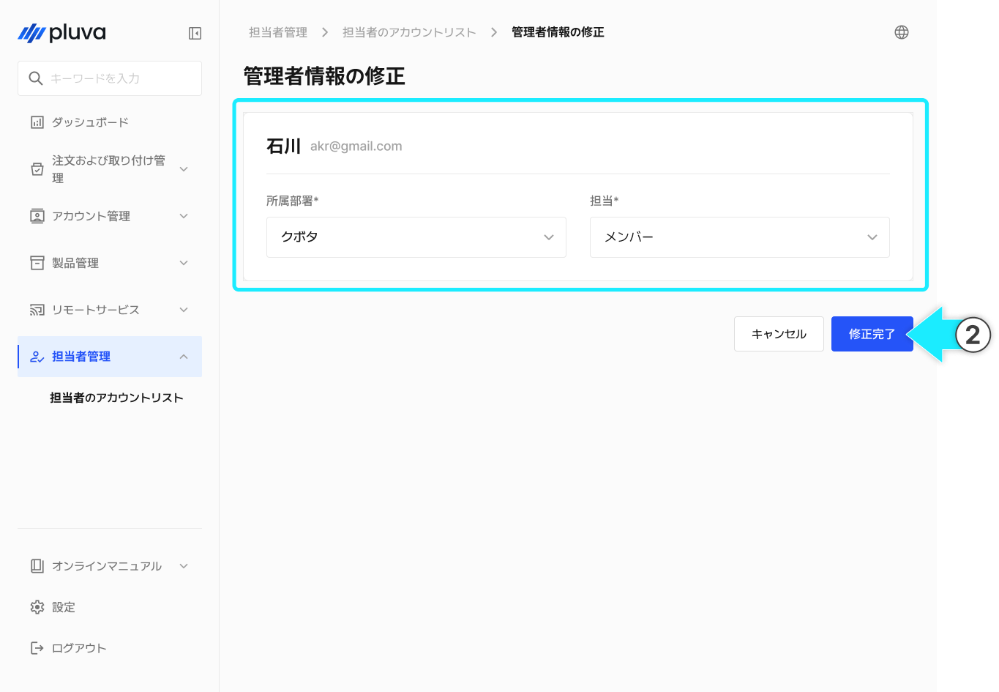
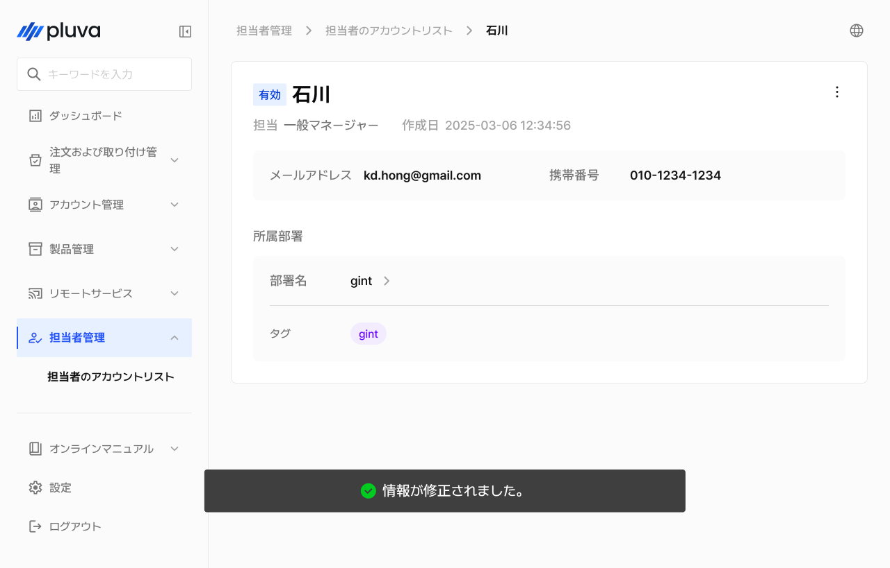
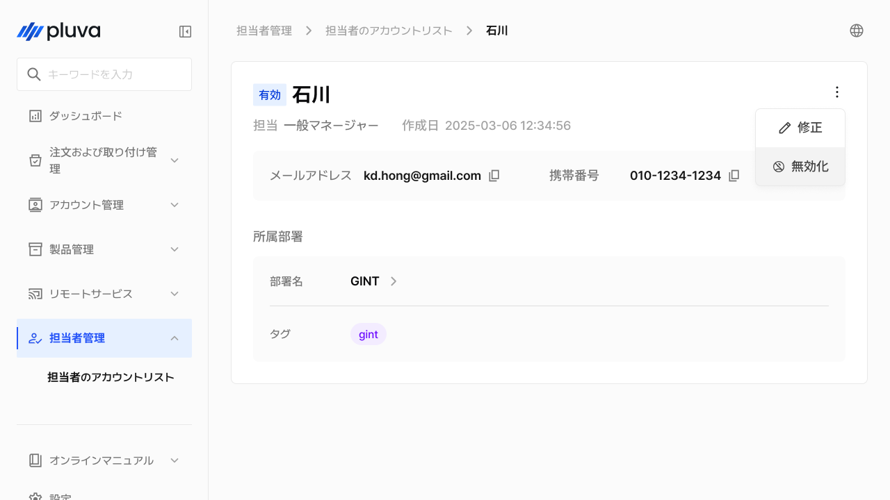
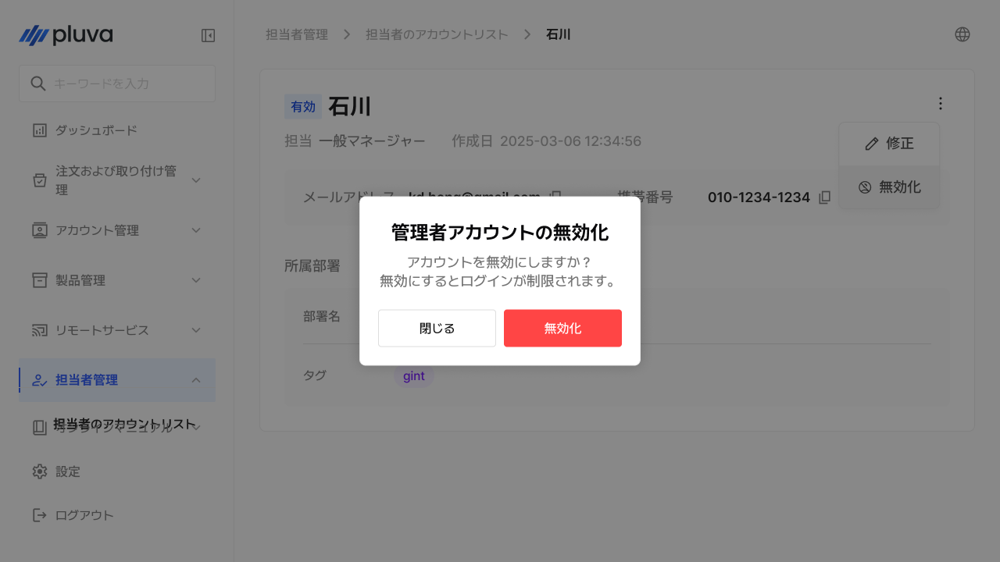
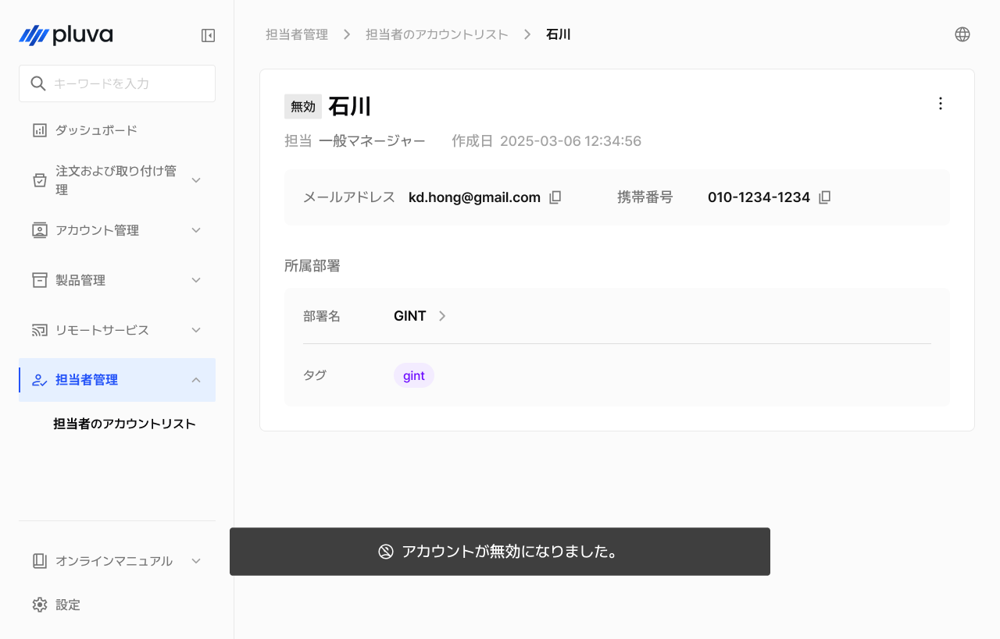
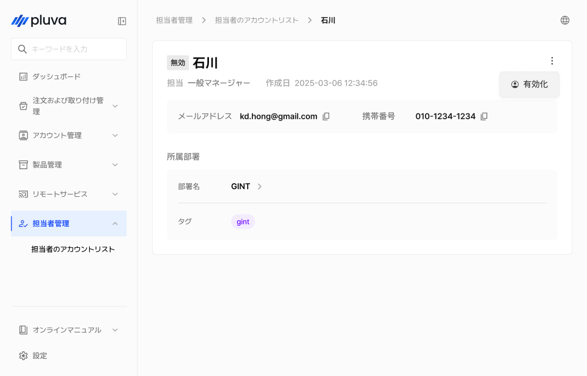
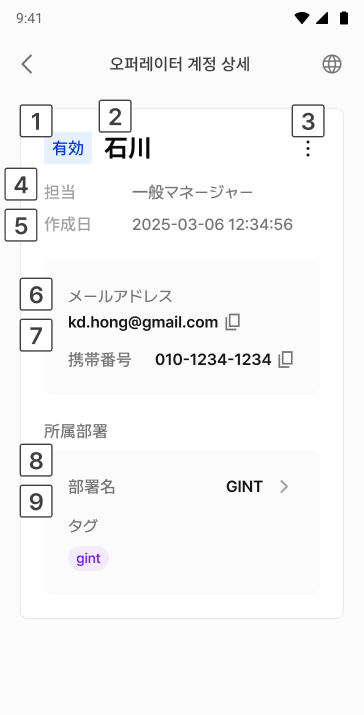

# オペレーターアカウントの管理

オペレーター管理は、アドミンにアクセスする運営担当者（オペレーター）のアカウントを作成および管理するメニューです。役割に応じた権限の付与や、アカウントの有効化・無効化によるアクセス制御が可能です。


このメニューは、パートナーアドミン以上の役割、またはGINTアカウントでのみアクセスできます。


***

### アクセス方法



左のメニューから「オペレーター管理」を選択します。

<figure><figcaption></figcaption></figure>



下部メニューから「オペレーターアカウント一覧」を選択すると、アカウント一覧画面へアクセスできます。

<figure><figcaption></figcaption></figure>



***

### オペレーターアカウントの作成



オペレーター一覧画面の右上の\[アカウントの作成]をタップします。

<figure><figcaption></figcaption></figure>



下記の項目を入力します。\*表示は入力必須です。

<figure><figcaption></figcaption></figure>


所属はこのアカウントの管理範囲を決定します。所属に応じて閲覧可能な製品・アカウント・履歴情報が異なります。



**役割ごとの権限一覧**

* **メンバー**
  * パートナー社に所属する一般社員に付与されます。注文の作成・閲覧、取り付けチケットの処理、お客様アカウントの閲覧など、現場サービス業務を行います。
* **パートナーアドミン**
  * パートナー社内のアカウントや組織を運営する担当者に付与されます。所属組織内におけるオペレーターアカウントの作成・無効化・役割の変更など、組織運営全般を担当します。
* **一般マネージャー**
  * GINT所属の運営担当者に付与されます。お客様アカウントの閲覧、リモートサポート、OTAリリース状況の確認など、運営実務を担当します。GINTマスターアカウントからのみ付与可能です。
* **アドミン**
  * GINT所属の運営管理者に付与されます。オペレーターアカウントの作成・管理、OTAリリースの作成、RTKアカウントの管理など、システム全般の統括を行います。GITNマスターアカウントからのみ付与可能です。




全ての必須項目を入力すると\[アカウントの作成]が有効になります。ボタンを選択し、アカウントの作成を完了させます。

<figure><figcaption></figcaption></figure>


**アカウントを作成すると、登録済みのメールアドレス宛に仮パスワードが送信されます。**\
メールアドレスが受信できない場合は、迷惑メールフォルダをご確認ください。




***

### オペレーター情報の修正



オペレーターの詳細から ボタンをタップし\[修正]を選択します。

<figure><figcaption></figcaption></figure>



内容を変更し\[修正完了]をタップします。

<figure><figcaption></figcaption></figure>



修正が完了します。

<figure><figcaption></figcaption></figure>



***

### オペレーターの無効化 / 有効化

アカウントの使用を一時中断、或いは再度有効化できます。


オペレーターアカウントは削除されず、無効化することでアクセスが遮断されます。無効になったアカウントはログイン不可となりますが、履歴はそのまま保存されます。




オペレーター詳細から をタップし\[無効化]を選択します。

<figure><figcaption></figcaption></figure>



確認ポップアップが表示されたら\[確認]をタップします。

<figure><figcaption></figcaption></figure>



アカウントが無効になります。

<figure><figcaption></figcaption></figure>




アカウントが無効の状態では、有効化オプションのみ表示されます。該当する項目を選択すると、アカウントが有効になります。


<figure><figcaption></figcaption></figure>

***

### オペレーターアカウントの詳細情報

アカウント一覧からお客様を選択すると、そのアカウントの詳細情報画面へ移動します。

#### PC環境

<figure><figcaption></figcaption></figure>

 ステータス

 お名前

 詳細ボタン


クリックすると\[修正]、\[無効化]（あるいは\[有効化]）を選択できます。


 役割

 作成日

 メールアドレス

 携帯電話番号

 所属


所属をクリックすると、該当する所属の詳細画面へ移動します。


 タグ

* 所属に関する情報が表示されます。

#### モバイル環境

<figure><figcaption></figcaption></figure>

 ステータス

 お名前

 詳細ボタン


タップすると\[修正]、\[無効化]（あるいは\[有効化]）を選択できます。


 役割

 作成日

 メールアドレス

 携帯電話番号

 所属


所属をタップすると、該当する所属の詳細画面へ移動します。


 タグ

* 所属に関する情報が表示されます。
