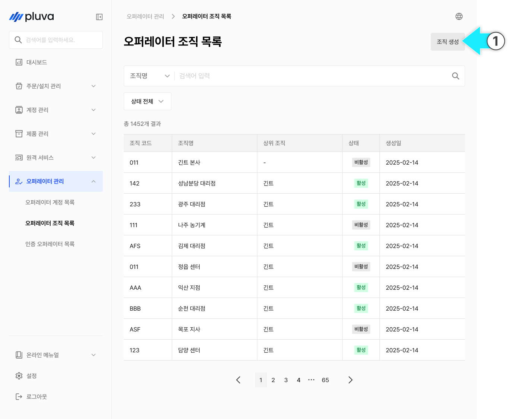
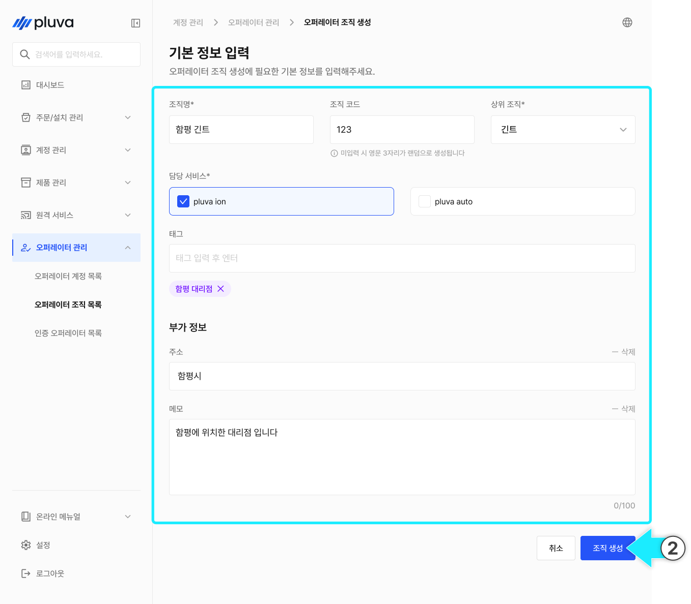
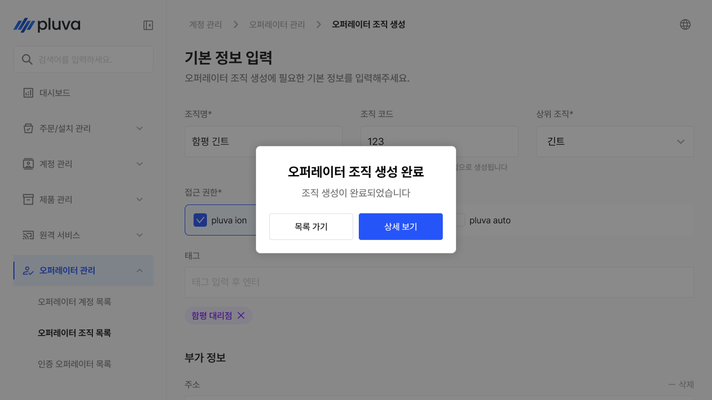
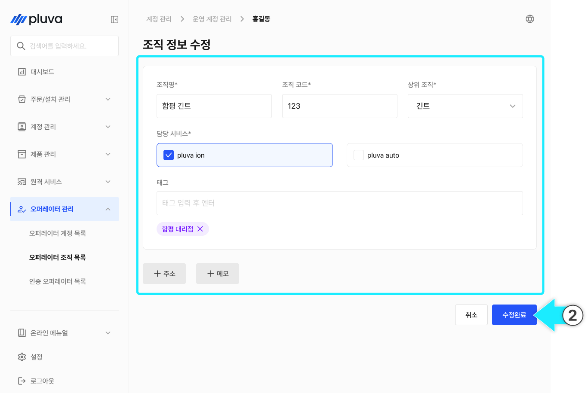
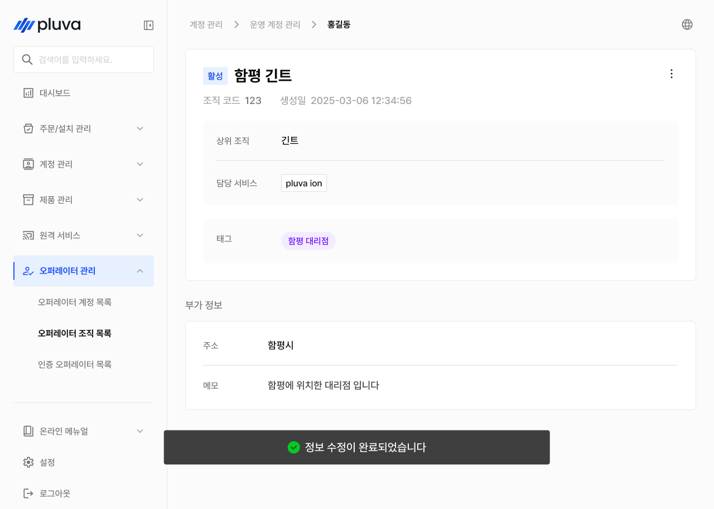
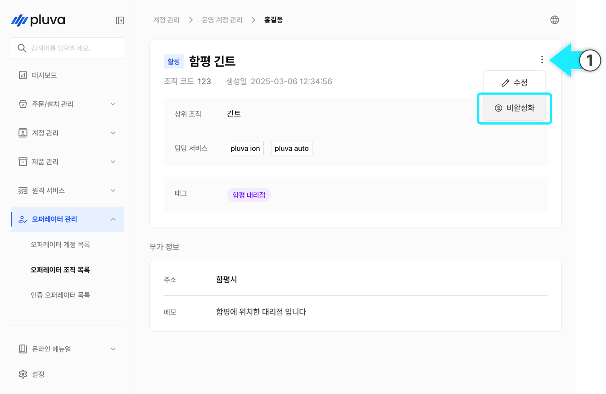
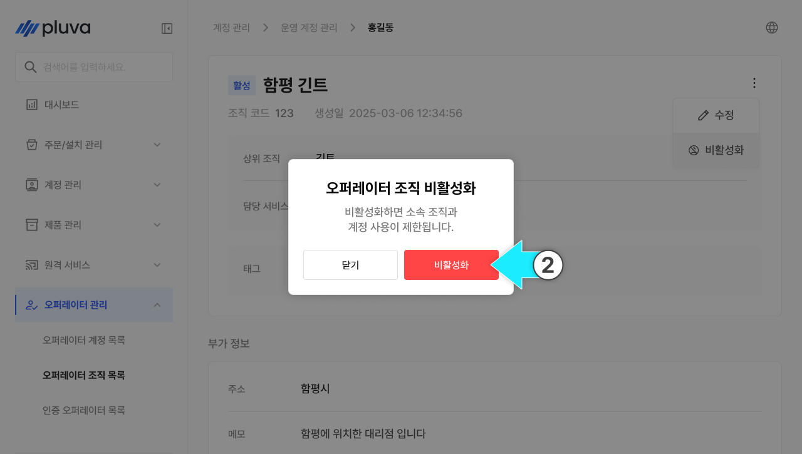
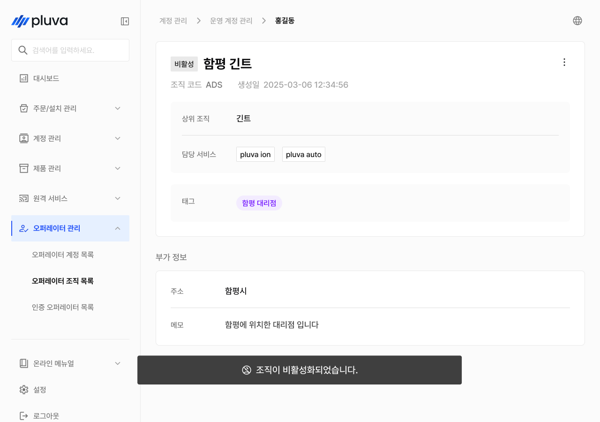
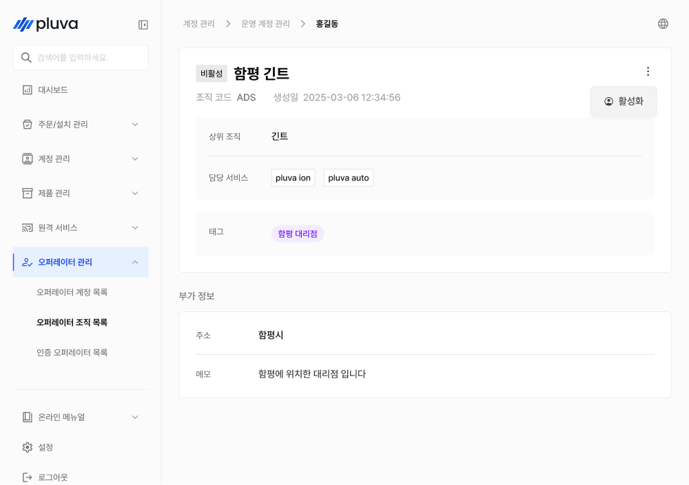
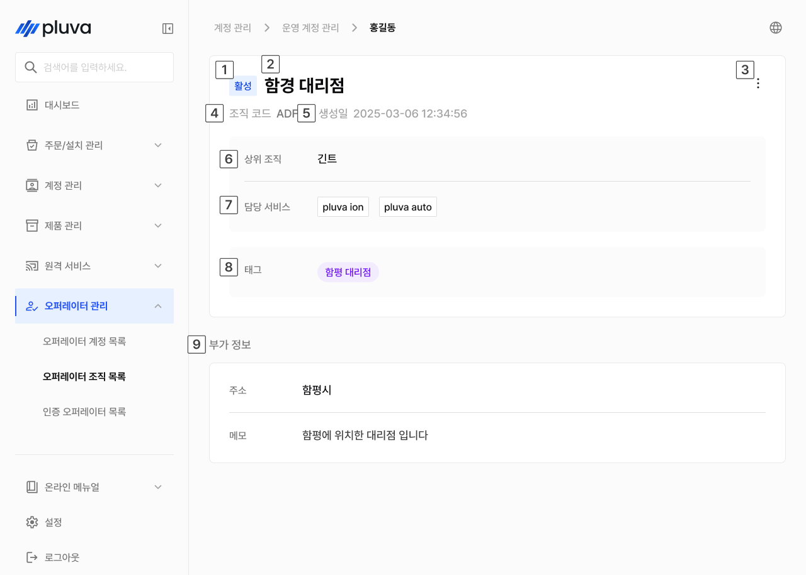

# オペレーター所属管理

オペレーター所属管理は、アドミンに属する組織（代理店・営業所など）を作成及び管理するメニューです。所属は親組織‐子組織で構成され、所属の有効化・無効化の切り替えによってアクセス制御を行うことができます。


このメニューは、パートナーアドミンのみアクセス可能です。


***

### オペレーター所属の作成



所属一覧画面の右上の\[所属の作成]をタップします。

<figure><figcaption></figcaption></figure>



全ての必須項目を入力し、所属の作成を選択します。

<figure><figcaption></figcaption></figure>


親組織を指定することで、組織の階層構造が形成されます。親組織は子組織のデータをすべて閲覧できます。




所属の作成が完了されます。

<figure><figcaption></figcaption></figure>



***

### オペレーター所属情報の修正


親組織を変更すると組織の階層構造が変わり、該当する組織に所属するオペレーターのアクセス権限が自動で再設定されます。

* 該当する組織および全ての子組織が、新しい親組織の配下へと移動します。
* 所属オペレーターのアクセス範囲は、新しい階層を基準に再計算され、それまで個別に付与されていた追加権限は初期化されます。必要に応じて追加権限の再設定を行ってください。




所属の詳細から「詳細」をタップし\[修正]を選択します。

<figure><figcaption></figcaption></figure>



内容を変更し\[修正完了]を選択します。

<figure><figcaption></figcaption></figure>



修正が完了されます。

<figure><figcaption></figcaption></figure>



***

### オペレーター所属の無効化 / 有効化

所属の使用を一時中断、または再度有効にできます。


所属は削除されず、無効化により使用が制限されます。履歴はそのまま保存されます。




所属の詳細より「詳細」をタップし\[無効化]を選択します。

<figure><figcaption></figcaption></figure>



\[確認]を選択します。

<figure><figcaption></figcaption></figure>



無効になります。

<figure><figcaption></figcaption></figure>




所属が無効の状態では、有効化オプションのみ表示されます。該当する項目を選択すると、所属が有効になります。



***

### オペレーター所属の詳細情報

所属一覧より所属を選択すると、該当する組織の詳細情報画面へ移動します。

#### PC環境

<figure><figcaption></figcaption></figure>

.svg>) ステータス

* 所属の有効 / 無効が表示されます。

.svg>) 所属名

* 所属名が表示されます。

.svg>) 詳細ボタン


ボタンを押すと\[修正]、\[無効化]（あるいは\[有効化]）を選択できます。


.svg>) 所属コード

* 所属コードが表示されます。

.svg>) 作成日

* 所属の作成日時が表示されます。

.svg>) 親組織

* 親組織が表示されます。

 担当サービス

* 該当する組織が担当するサービスが表示されます。（例： pluva ion、pluva auto）

 タグ

* 所属に関する情報がタグで表示されます。

 追加情報

* 住所やメモが表示されます。

#### モバイル環境

<figure><figcaption></figcaption></figure>

.svg>) ステータス

* 所属の有効 / 無効が表示されます。

.svg>) 所属名

* 所属名が表示されます。

.svg>) 詳細ボタン


ボタンをタップすると\[修正]、\[無効化]（あるいは\[有効化]）を選択できます。


.svg>) 所属コード

* 所属コードが表示されます。

.svg>) 作成日

* 所属の作成日時が表示されます。

.svg>) 親組織

* 親組織が表示されます。

 担当サービス

* 該当する組織が担当するサービスが表示されます。（例： pluva ion、pluva auto）

 タグ

* 所属に関する情報がタグで表示されます。

 追加情報

* 住所やメモが表示されます。
