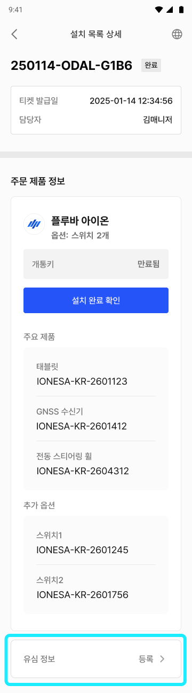
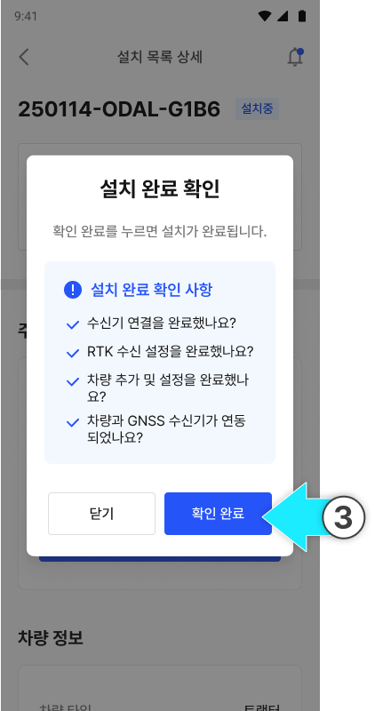
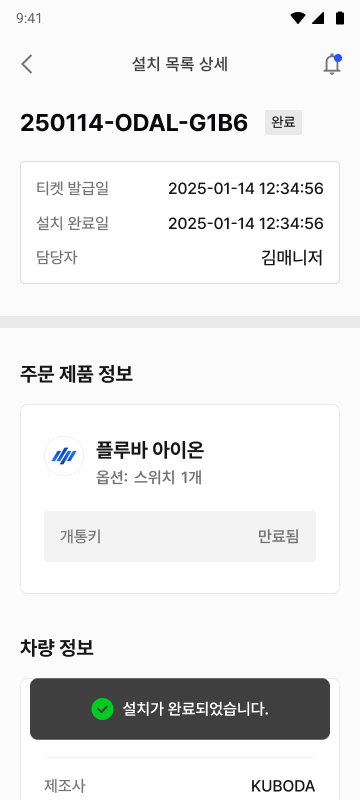
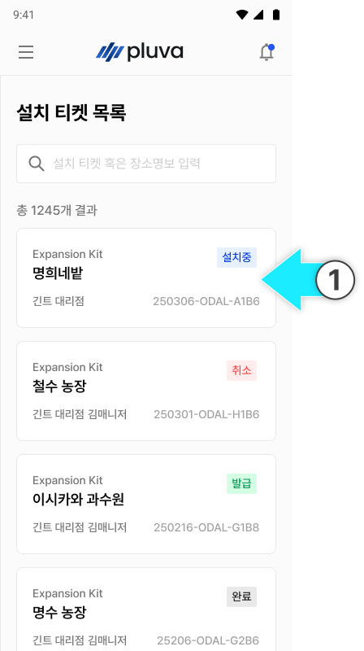
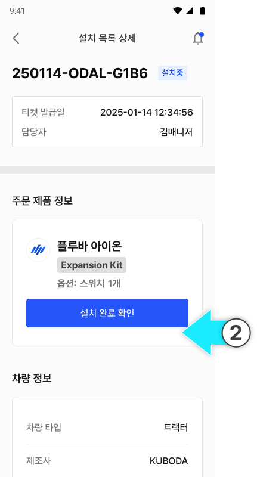
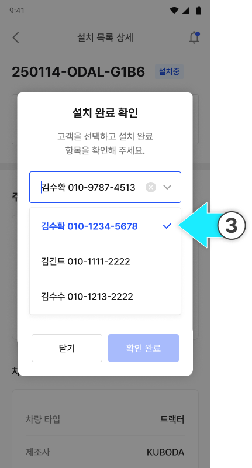
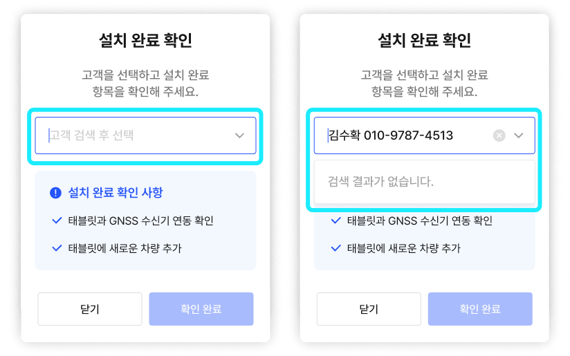
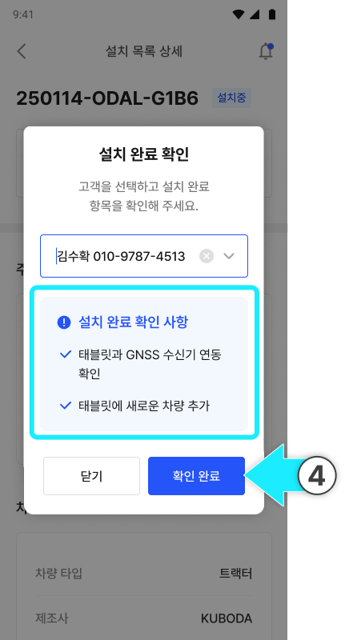
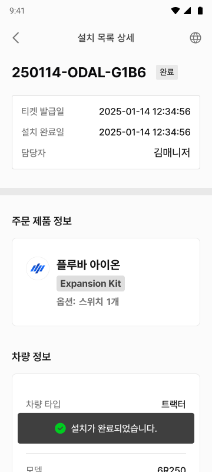

---
layout:
  width: default
  title:
    visible: true
  description:
    visible: false
  tableOfContents:
    visible: true
  outline:
    visible: true
  pagination:
    visible: true
  metadata:
    visible: true
  tags:
    visible: true
  actions:
    visible: true
  anchors:
    visible: true
tags:
  - tag: kr-jp
    primary: true
---

# 설치 완료 확인 - New

설치 및 원스톱 인스톨 작업 완료 항목을 점검하고, 태블릿에서 로그인을 완료하면 설치가 자동으로 완료됩니다.


**완료 확인 시 유심 등록 확인**

완료 확인 과정에서 유심이 등록되었는지 확인해 주세요. 미등록 상태에서는 제품을 사용할 수 없습니다.


### 플루바 아이온(완제품)의 경우



설치 티켓 목록에서 설치 완료한 설치 티켓을 누릅니다.

메뉴를 눌러&#x20;

<figure><figcaption></figcaption></figure>




설치한 제품을 누릅니다.

<figure><figcaption></figcaption></figure>


**설치 완료 처리 전 유심 정보를 반드시 등록해주세요.**

유심 정보는 유심 카드에 부착된 바코드를 스캔하면 등록할 수 있습니다.





설치한 제품을 누릅니다.

<figure><figcaption></figcaption></figure>


**설치 완료 처리 전 유심 정보를 반드시 등록해주세요.**

유심 정보는 유심 카드에 부착된 바코드를 스캔하면 등록할 수 있습니다.





설치 완료 확인 사항을 확인하고 \[확인 완료]를 누릅니다.

<figure><figcaption></figcaption></figure>



설치가 완료됩니다.

<figure><figcaption></figcaption></figure>



***

### 확장키트의 경우



설치 티켓 목록에서 설치 완료한 설치 티켓을 누릅니다.

<figure><figcaption></figcaption></figure>



\[설치 완료 확인]을 누릅니다.

<figure><figcaption></figcaption></figure>



제품을 설치한 고객 계정을 선택합니다.

<figure><figcaption></figcaption></figure>


고객 이름 또는 전화번호로 검색 시 고객 명단이 표시됩니다. 명단이 표시되지 않을 경우 검색어가 올바르게 입력되었는지 확인합니다.





설치 완료 확인 사항을 검토한 후 \[확인 완료]를 누릅니다.

<figure><figcaption></figcaption></figure>



설치가 완료됩니다.

<figure><figcaption></figcaption></figure>


