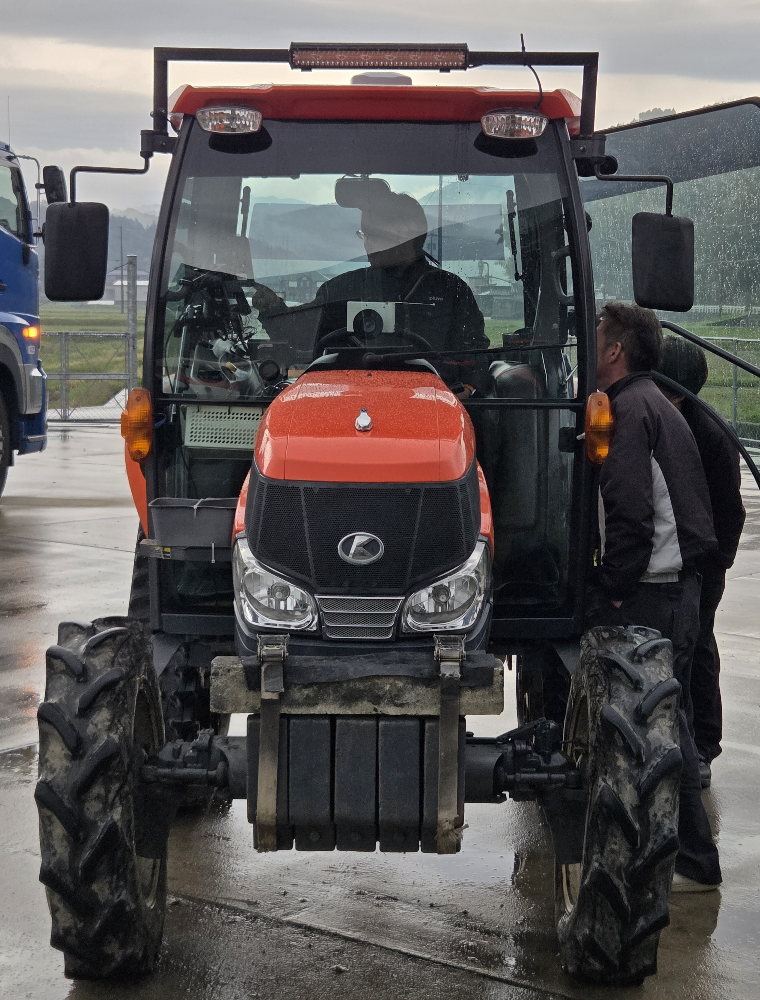
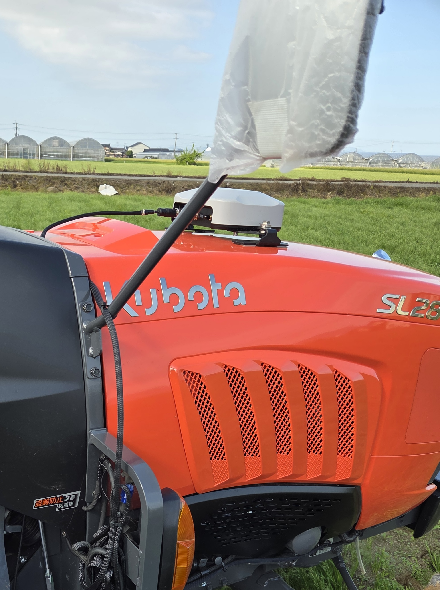
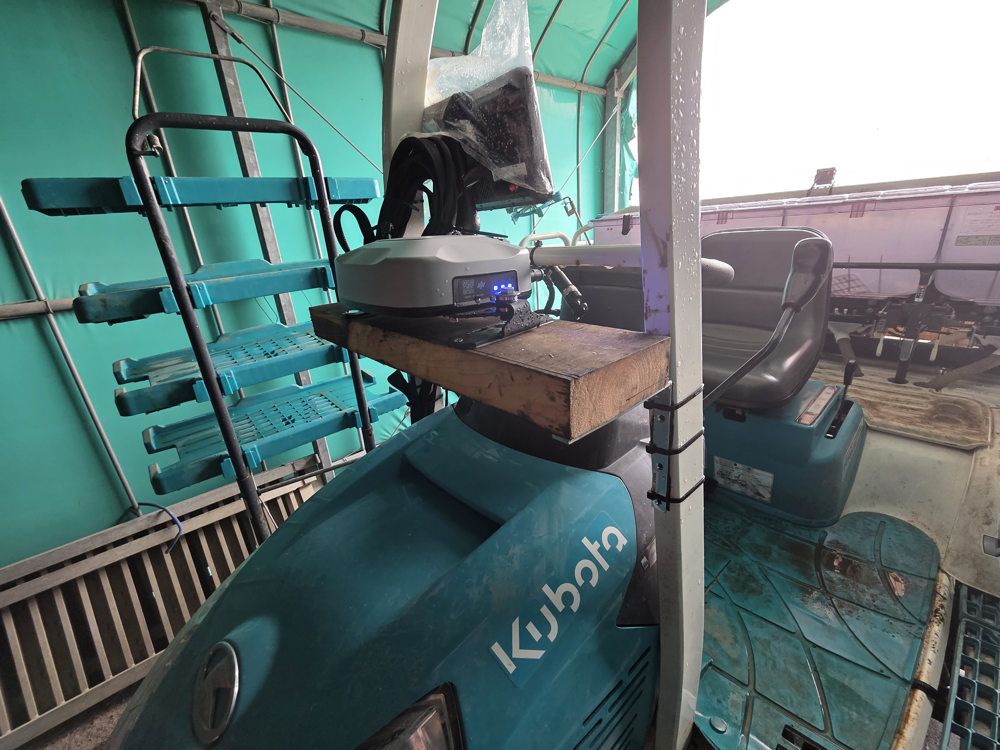

---
layout:
  width: default
  title:
    visible: true
  description:
    visible: false
  tableOfContents:
    visible: true
  outline:
    visible: true
  pagination:
    visible: true
  metadata:
    visible: true
  tags:
    visible: true
  actions:
    visible: true
tags:
  - tag: jp
    primary: true
---

# 설치 전 준비 사항

현장에 도착하기 전, 아래 항목을 꼭 확인하고 준비합니다. 사전 준비가 부족하면 부품이 맞지 않거나 현장에서 가공이 어려워 설치 일정이 미뤄질 수 있습니다.

***

### 방문 전 준비 단계



**일정 및 현장 정보 확인**

* **담당자 확인**: 설치할 고객과 제품 정보를 미리 확인합니다.
* **위치 공유**: 농경지는 주소만으로 찾기 어려운 경우가 많으니 고객에게 구글맵(Google Maps) 위치 핀을 공유 받는 것을 권장합니다.



**기종 호환성 확인 및 사진 자료 확보**

적합한 부품(스플라인, 브래킷 등)을 사전에 준비하기 위해 아래 사진 자료를 방문 전에 확보합니다.

**필요 사진**

* **정면**: 핸들 조작부 전체 구성 확인
* **측면**: 핸들 축 각도 및 주변 공간 확인


**설치 불가 기종**

타이어형과 하프 크롤러는 설치가 가능하지만, **풀 크롤러(Full Crawler) 모델은 설치할 수 없습니다.** 방문 전에 모델명을 반드시 확인합니다.




**GNSS 수신기 및 태블릿 설치 위치 협의**

설치 위치에 따라 측위 정밀도와 작업 품질이 달라집니다. 방문 전에 고객과 미리 상의합니다.

* **캐빈(Cabin) 모델**: 캐빈 위에 장착합니다. 제조사 순정 GNSS 수신기가 이미 있는지 미리 확인합니다.

순정 GNSS 수신기가 없는 경우

* 캐빈 루프(트랙터 지붕, 상부 판넬)에 장착합니다.
* 횡방향(좌우·가로): 최대한 가운데에 위치시킵니다.
* 종방향(앞뒤·세로): 아래 우선순위로 장착합니다.
  1. 후면부 (후륜 바퀴에 가까운 곳)
  2. 중앙부 (Top 면의 중심)
  3. 앞면부 (스티어링 휠 근처 상부)

<figure><figcaption></figcaption></figure>

<figure><figcaption></figcaption></figure>

순정 GNSS 수신기가 있는 경우

* 캐빈 루프 장착·횡방향 조건은 위와 동일합니다.
* 종방향은 순정 수신기가 차지하지 않은 위치(후면부 또는 중앙부)에 장착합니다.

ROPS 트랙터 (캐빈이 없는 경우)

* 본네트의 평평한 곳에 장착합니다.

<figure><figcaption></figcaption></figure>

* **오픈형(지붕 없음)**: 수신기를 고정할 별도 스테이(거치대)가 있는지 확인합니다.
* **태블릿**: 운전 중 조작하기 편하고 단단히 고정할 수 있는 위치를 고객과 함께 정합니다.



**타공 및 개조 사전 동의 확보**

설치 중에 기체 일부를 가공해야 할 수 있습니다. 방문 전에 고객에게 아래 내용을 안내하고 동의를 받습니다.

* **클락션(경적)**: 스위치 이식 또는 배선 작업 시 타공이 필요할 수 있습니다.
* **이앙기 핸들 커버**: U볼트 브래킷 장착을 위해 타공이 필요할 수 있습니다.
* **이앙기 GNSS 거치대**: 이앙기는 GNSS 수신기를 장착할 거치대가 필요합니다. 이 거치대는 설치 담당자가 방문하기 전에 고객이 미리 준비해야 하며, 준비되어 있지 않으면 방문 당일 수신기를 설치할 수 없습니다. 따라서 방문 전에 거치대 준비를 고객에게 미리 안내합니다.

장착 불가 예시 (거치대가 없는 모델)

<figure><figcaption></figcaption></figure>

<figure><figcaption></figcaption></figure>

장착 가능 예시

<figure><figcaption></figcaption></figure>




**통신 환경 및 계정 준비**

* **인터넷 연결**: 퀵셋업과 RTK 측위를 위해 셀룰러(LTE) 연결이 필요합니다. USIM 카드를 준비하거나, 휴대폰 테더링이 가능한지 미리 확인합니다.
* **사용 예정인 RTK 방식 확인**: 퀵셋업에서 위치 보정 방식을 설정합니다. 방문 전에 고객이 어떤 RTK를 사용할지 확인하고 고객에게 필요 정보를 확보합니다.
  * **RTK 직접 수신 연결**: NTRIP 방식으로 보정 신호를 수신합니다. 방문 전에 고객이 아래 정보를 미리 준비할 수 있도록 안내합니다.
    * 기지국/서버 주소 및 포트
    * 마운트포인트
    * 계정 ID 및 비밀번호
  * **RTK 블루투스 연결**: 외부 RTK 수신기와 블루투스로 연결합니다. 연결에 사용하는 RTK 앱의 계정 ID 및 비밀번호를 방문 전에 고객이 미리 준비할 수 있도록 안내합니다.
* **PLUVA 회원가입**: PLUVA 아이온 사용을 위해 고객 계정이 필요합니다. 설치 전에 가입이 완료되어 있는지 확인합니다. [고객 계정 준비](preparing-accounts.md) 참고


소프트웨어 업데이트(OTA)를 진행하면 약 **300MB \~ 500MB**의 데이터가 소모됩니다. 고객의 데이터 요금제를 미리 확인하고, 데이터가 부족할 경우 Wi-Fi나 테더링 환경을 준비합니다.




**시운전 및 오토 캘리브레이션 공간 확보**

설치 후에는 자동 보정(오토 캘리브레이션)을 위한 주행이 필요합니다. 아래 조건에 맞는 공간을 방문 전에 고객에게 요청합니다.

* **지면 상태**: 바퀴가 미끄러지지 않는 평평하고 단단한 곳 (콘크리트 또는 잘 다져진 흙)
* **필요 면적**:
  * 일반 기종: 최소 **30m × 30m** 이상
  * 퀵턴 기종: 최소 **50m × 40m** 이상


위 사항이 준비되지 않으면 부품 불일치나 현장 가공 불가로 설치 일정이 미뤄질 수 있습니다. 준비 중 궁금한 점은 (주)긴트에 문의합니다.




***

### 방문 전 최종 체크리스트

출발 전에 아래 항목을 하나씩 확인합니다.

사전 확인

* [ ] 위치 정보: 설치 주소 및 구글 맵 위치 핀 공유
* [ ] 기종 호환성 최종 확인:
  * 트랙터/이앙기의 정확한 모델명 확인 (풀 크롤러 기종은 설치 불가)
  * 핸들 주변 사진 확인
  * 캐빈 유무 확인 (수신기 거치대 유무 확인)
  * 구성품 설치 위치 확인
  * 클락션 설치를 위한 타공 안내 및 고객 사전 동의
  * 이앙기 설치 시: GNSS 수신기 거치대 준비 상황 확인 (미준비 시 수신기 설치 불가)
  * 이앙기 설치 시: U볼트 브래킷 장착을 위한 핸들 커버 타공 안내 및 고객 사전 동의
* [ ] PLUVA 계정: 사용자의 PLUVA 회원가입 완료 여부
* [ ] 사용 예정인 RTK 서비스의 접속 정보 확인
* [ ] 오토 캘리브레이션 공간 확보: 자동 보정(캘리브레이션)을 위한 평탄한 작업 공간 (30m × 30m 이상) 확보 요청

지참 물품

* [ ] 제품 (PLUVA iON KIT / EXPANSION KIT)
* [ ] 스플라인 / 브래킷 / U볼트
* [ ] 원터치 스위치
* [ ] USIM 카드
* [ ] 타공 도구

